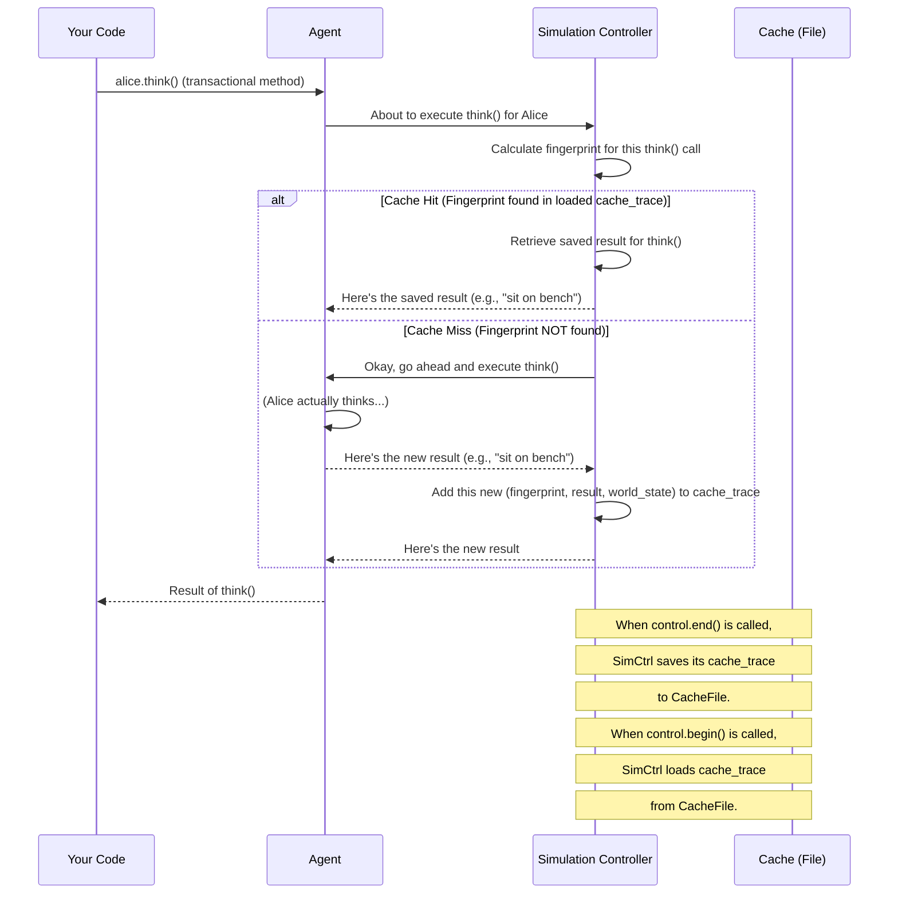

# Chapter 1: Simulation (Controller)

Welcome to the TinyTroupe project! If you've ever wanted to create your own little worlds with tiny, thinking characters, you're in the right place. This series of tutorials will guide you through building such simulations.

In this very first chapter, we'll meet the most important part of any simulation: the **Simulation Controller**.

## What's a Simulation Controller? And Why Do We Need One?

Imagine you're the director of a movie. You decide when the movie starts ("Action!"), when it ends ("Cut!"), and you keep track of all the actors, the movie sets, and even the props. If you need to re-shoot a scene, you'd want to make sure everything is set up exactly as it was before, right?

The **Simulation Controller** in TinyTroupe is just like that movie director. It's the "boss" or "game engine" that manages everything happening in our tiny digital world.

**Here's a simple problem it solves:**

Let's say you have a tiny person, "Alice," in a tiny "Park."
1.  Alice decides to think about what to do next. This takes some (simulated) time and effort.
2.  You run your simulation, and Alice decides to "sit on a bench."
3.  Now, you want to add another tiny person, "Bob," to the Park and re-run the simulation. You want Alice to *still* make the same decision to "sit on a bench" (if the conditions are the same) without your computer having to re-calculate her thoughts from scratch.

The Simulation Controller helps us do this efficiently and reliably!

## Key Ideas of the Simulation Controller

Our Simulation Controller has a few main jobs:

1.  **Orchestration:** It starts and stops the entire simulation.
2.  **Tracking:** It keeps a list of all the important pieces of our world:
    *   The characters, which we'll call [TinyPerson (Agent)](02_tinyperson__agent__.md).
    *   The places they live in, like the [TinyWorld (Environment)](03_tinyworld__environment__.md).
    *   Special "factories" that can create new characters or items, which we'll learn about in [TinyFactory (Entity Creation)](05_tinyfactory__entity_creation__.md).
3.  **Caching (Smart Saving):** This is a super cool feature! "Caching" means the controller can save the results of things that have already happened. If the same situation occurs again, instead of re-doing all the work, it just uses the saved result. This makes your simulations run much faster, especially if you re-run them often!
4.  **Transactional Execution (Reliable Replay):** The controller makes sure that actions happen in a step-by-step, orderly way. Think of these as "transactions." This, combined with caching, ensures that if you run the same sequence of events with the same starting conditions, you'll get the exact same outcome. This is called reproducibility, and it's very important for understanding and debugging your simulations.

## How to Use the Simulation Controller

Let's see how you'd typically use the controller. We'll use simple Python code. Don't worry if you don't understand every detail yet; the main idea is to see the controller in action.

The controller functions are usually found in `tinytroupe.control`.

**1. Starting a Simulation:**

To begin, you tell TinyTroupe to start a simulation. You can also tell it where to save its "memories" (the cache).

```python
import tinytroupe.control as control

# Let's start our simulation!
# We'll tell it to save cached data in "my_world.cache.json"
control.begin(cache_path="my_world.cache.json")

print("Our tiny world simulation has begun!")
```

When you run this:
*   A new simulation officially starts.
*   If a file named `my_world.cache.json` exists from a previous run, the controller will try to load it. This means it might already "remember" some things!
*   If it's the first time, it prepares to create a new cache file.

**2. Doing Things in the Simulation (Conceptual):**

This is where you'd create your [TinyPerson (Agent)](02_tinyperson__agent__.md) characters, put them in a [TinyWorld (Environment)](03_tinyworld__environment__.md), and let them interact. We'll cover these in later chapters. For now, just imagine that these actions are happening. Each significant action (like an agent thinking or moving) will be handled as a "transaction" by the controller.

```python
# ... imagine code here where you:
# 1. Create a TinyPerson named Alice using a TinyFactory
# 2. Create a TinyWorld called Park
# 3. Add Alice to the Park
# 4. Tell Alice to perform an action (e.g., think)
# control.add_agent(alice) # The controller keeps track of Alice
# control.add_environment(park) # and the Park
# alice.think() # This would be a 'transactional' action
```

**3. Ending a Simulation:**

When you're done with the current run of your simulation (or want to save its current state), you end it.

```python
# (Continuing from the previous example)

# Now, let's end the simulation for today.
control.end()

print("Simulation ended. All progress (cache) saved to my_world.cache.json!")
```

When you run `control.end()`:
*   The simulation officially stops.
*   Crucially, it saves the current state and all the "transactions" that happened into the `my_world.cache.json` file (or whatever path you specified). This is called a `checkpoint`.

**What if we run it again?**

If you run the `control.begin(cache_path="my_world.cache.json")` part again, and then ask Alice to do the *exact same* thinking process she did before (with everything else in the world being identical up to that point), the controller will likely find that action in its `my_world.cache.json` file. Instead of re-calculating, it will use the saved result! This is a "cache hit." If it's a new action or something changed, it's a "cache miss," and it will calculate it and then save it.

## Under the Hood: How Does It Work?

Let's peek behind the curtain a bit. You don't *need* to know all this to use it, but it can be interesting!

**The `Simulation` Class:**

The core of the controller is a Python class called `Simulation` (found in `tinytroupe/control.py`). When you call `control.begin()`, it creates an instance of this `Simulation` class (or uses an existing one if you're managing multiple simulations, though we usually stick to one "default" simulation).

```python
# Inside tinytroupe/control.py (simplified)
class Simulation:
    def __init__(self, id="default", cached_trace:list=None):
        self.id = id  # A name for this simulation
        self.agents = [] # List of all agents
        self.environments = [] # List of all environments
        # ... other lists for factories ...
        self.status = "stopped" # Initially, it's not running
        self.cached_trace = [] # This will store the history of saved states
        self.cache_path = f"./tinytroupe-{id}.cache.json"
        # ... and more ...

    def begin(self, cache_path:str=None, auto_checkpoint:bool=False):
        # ... (checks if already started) ...
        self.status = "started"
        if cache_path is not None:
            self.cache_path = cache_path
        self._load_cache_file(self.cache_path) # Important: tries to load saved data!
        # ... (resets some internal counters and lists) ...

    def end(self):
        # ... (checks if it was started) ...
        self.status = "stopped"
        self.checkpoint() # Important: saves the data!

    def checkpoint(self):
        # This is where it saves the self.cached_trace to the cache_path file
        self._save_cache_file(self.cache_path)

    def _load_cache_file(self, cache_path:str):
        try:
            # Tries to open and read the JSON cache file
            self.cached_trace = json.load(open(cache_path, "r"))
            logger.info(f"Cache loaded from {cache_path}.")
        except FileNotFoundError:
            logger.info(f"Cache file not found at {cache_path}.")
            self.cached_trace = [] # Start with an empty history
        # ... (error handling) ...

    def _save_cache_file(self, cache_path:str):
        # Writes self.cached_trace to a JSON file
        # ... (implementation using temporary files for safety) ...
        logger.info(f"Cache saved to {cache_path}.")
```

**Transactional Magic:**

How does it know *what* to cache and when to use it? This is where "transactions" come in. Many functions on your agents or environments (like `agent.think()` or `agent.move()`) are wrapped with a special Python thing called a "decorator," specifically `@transactional`.

```python
# Conceptual example of a transactional function
# (from tinytroupe/agent.py, but the decorator is in control.py)

# @transactional # This decorator is key!
# def think(self):
#     # ... agent's thinking logic ...
#     return "I will sit on the bench."
```

When a function marked `@transactional` is called:

1.  A `Transaction` object is created (also in `tinytroupe/control.py`). This object knows which function was called, on which object (e.g., Alice), and with what arguments.
2.  The `Simulation` controller calculates a unique "fingerprint" (a hash) for this specific function call and its context.
3.  It checks its `cached_trace` (the list of saved steps): "Have I seen this exact fingerprint before, coming after the same previous step?"

Here's a simplified flow:



The `cached_trace` isn't just the function result; it also stores a snapshot of the entire simulation's state at that point (using `_encode_simulation_state` and `_decode_simulation_state` methods). This ensures that when a cached result is used, the simulation is restored to the exact state it was in when that result was first generated.

**The `Transaction` Class (Simplified Gist):**

```python
# Inside tinytroupe/control.py (very simplified concept)
class Transaction:
    def __init__(self, obj, simulation, function, *args, **kwargs):
        self.obj_under_transaction = obj
        self.simulation = simulation
        self.function_name = function.__name__
        self.args = args
        # ... and so on ...

    def execute(self):
        if self.simulation is None or self.simulation.status == "stopped":
            # No simulation or not started? Just run the function.
            return self.function(*self.args, **self.kwargs)

        event_hash = self.simulation._function_call_hash(self.function_name, ...)

        if self.simulation._is_transaction_event_cached(event_hash):
            # Cache Hit!
            self.simulation.cache_hits += 1
            # ... load state from cache ...
            # ... return cached output ...
        else:
            # Cache Miss!
            self.simulation.cache_misses += 1
            # ... run the actual function ...
            output = self.function(*self.args, **self.kwargs)
            # ... save current state and output to cache_trace ...
            return output
```

This careful management of state and function calls is what gives TinyTroupe its power for reproducibility and efficient re-runs.

## Conclusion

Phew! That was a lot, but you've just learned about the most fundamental piece of TinyTroupe: the **Simulation Controller**.

You now know:
*   It's like the director of your simulation movie.
*   It starts, stops, and keeps track of everything.
*   Its **caching** feature saves previous computations, making re-runs faster.
*   Its **transactional execution** ensures that if you replay steps, you get consistent results.
*   You use `control.begin()` to start and `control.end()` to stop (and save the cache).

The Simulation Controller sets the stage for everything else we'll build. Without it, our tiny world would be chaotic and forgetful!

Now that we know how to manage the "world" itself, are you ready to meet its inhabitants? In the next chapter, we'll dive into [TinyPerson (Agent)](02_tinyperson__agent__.md) and see how these little digital beings come to life!

---

Generated by [AI Codebase Knowledge Builder](https://github.com/The-Pocket/Tutorial-Codebase-Knowledge)