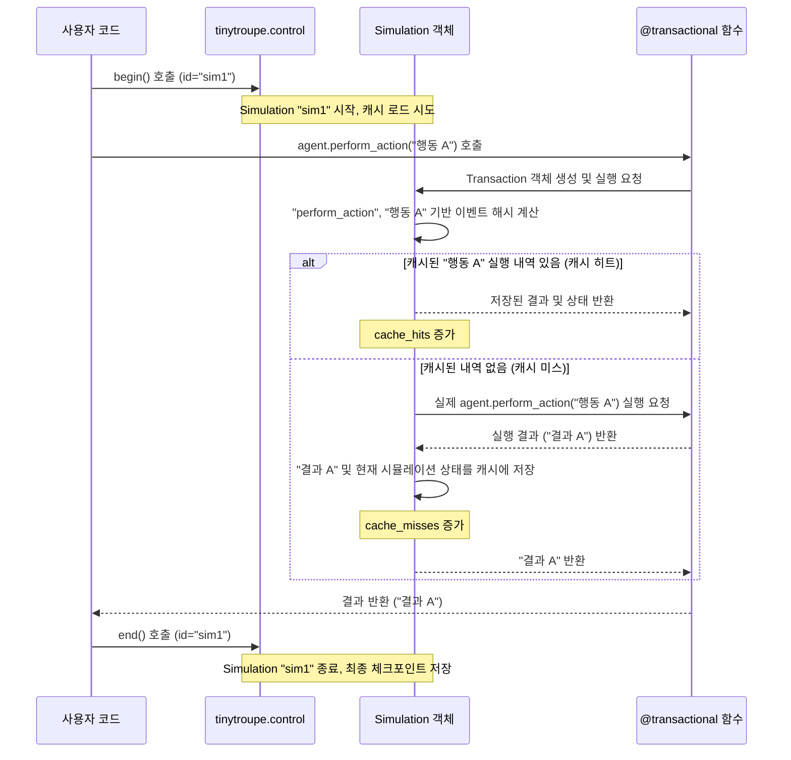

# Chapter 1: 시뮬레이션 제어 (Simulation Control)


TinyTroupe 프로젝트에 오신 것을 환영합니다! 이 튜토리얼 시리즈를 통해 여러분은 자신만의 작은 에이전트 기반 시뮬레이션을 만들고 실행하는 방법을 배우게 될 것입니다. 첫 번째 장에서는 시뮬레이션 전체를 지휘하는 오케스트라의 지휘자와 같은 `시뮬레이션 제어`에 대해 알아보겠습니다.

## 시뮬레이션 제어는 왜 필요할까요?

여러분만의 작은 세상을 만들고, 그 안에서 지능을 가진 캐릭터(에이전트)들이 서로 상호작용하며 이야기를 만들어가는 모습을 상상해 보세요. 멋지지 않나요? 하지만 이런 시뮬레이션을 만들고 실행하는 것은 생각보다 복잡할 수 있습니다.

**핵심 사용 사례:** 여러분이 몇 시간 동안 공들여 만든 가상 마을 시뮬레이션을 실행 중이라고 가정해 봅시다. 캐릭터들이 대화하고, 물건을 만들고, 마을을 돌아다니고 있습니다. 그런데 갑자기 컴퓨터가 꺼지거나 프로그램에 오류가 발생하면 어떻게 될까요? 처음부터 모든 것을 다시 시작해야 할까요? 만약 시뮬레이션의 특정 지점을 저장해두고 거기서부터 다시 시작할 수 있다면 정말 편리할 것입니다.

또한, 시뮬레이션에서 캐릭터들이 생각하고 결정을 내릴 때, 특히 복잡한 언어 모델(LLM)을 사용한다면 많은 시간과 비용이 소요될 수 있습니다. 만약 동일한 상황에서 동일한 결정을 내리는 과정을 반복해야 한다면, 이전에 계산했던 결과를 재사용하여 시간과 비용을 아낄 수 있다면 더욱 효율적이겠죠.

바로 이런 문제들을 해결하기 위해 `시뮬레이션 제어`가 필요합니다. `tinytroupe.control` 모듈은 다음과 같은 중요한 역할들을 수행합니다:

*   **시뮬레이션의 시작과 종료:** 언제 시뮬레이션이 시작되고 끝나는지 명확하게 정의합니다.
*   **중간 상태 저장 (체크포인트):** 시뮬레이션 진행 상황을 저장하여 나중에 그 지점부터 다시 시작할 수 있게 합니다. 마치 게임에서 세이브 포인트를 만드는 것과 같습니다.
*   **결과 캐싱:** LLM 호출 결과나 특정 계산 결과를 저장해두었다가 동일한 요청이 있을 때 다시 계산하지 않고 저장된 값을 사용합니다. 이를 통해 시간과 비용을 절약할 수 있습니다.

이 장을 통해 여러분은 `tinytroupe.control`을 사용하여 시뮬레이션을 효율적으로 관리하고, 실험 과정을 더욱 편리하게 만드는 방법을 배우게 될 것입니다.

## 시뮬레이션 제어의 핵심 요소

`tinytroupe.control` 모듈은 주로 `Simulation` 클래스를 통해 시뮬레이션의 흐름을 관리합니다. 이 클래스가 제공하는 주요 기능들을 하나씩 살펴보겠습니다.

### 1. 시뮬레이션의 시작과 종료: `begin()` 과 `end()`

모든 시뮬레이션은 명확한 시작점과 끝점이 있어야 합니다. `tinytroupe.control` 모듈은 이를 위해 `begin()` 함수와 `end()` 함수를 제공합니다.

*   `begin()`: 시뮬레이션의 시작을 알립니다. 이때 캐시 파일을 어디에 저장할지, 자동으로 체크포인트를 할지 등을 설정할 수 있습니다.
*   `end()`: 시뮬레이션의 종료를 알립니다. 종료 시점에는 보통 현재까지의 진행 상황을 마지막으로 저장합니다.

```python
import tinytroupe.control as control

# 시뮬레이션 시작 (기본 설정 사용)
control.begin()

# ... 여기에 여러분의 시뮬레이션 로직이 들어갑니다 ...
# 예를 들어, 에이전트 생성, 환경 설정 등

# 시뮬레이션 종료
control.end()
```

위 코드는 가장 기본적인 시뮬레이션의 생애주기를 보여줍니다. `begin()`이 호출되면 `control` 모듈은 "이제부터 시뮬레이션을 기록하고 관리할 준비가 되었어!"라고 선언하는 것과 같습니다. 그리고 `end()`가 호출되면 "자, 이제 시뮬레이션은 끝났고, 모든 것을 정리하고 저장할 시간이야!"라고 말하는 것과 같습니다.

### 2. 중간 상태 저장: `checkpoint()`

긴 시뮬레이션을 실행하다 보면 중간중간 진행 상황을 저장하고 싶을 때가 있습니다. 이때 `checkpoint()` 함수를 사용합니다.

```python
import tinytroupe.control as control

control.begin(cache_path="./my_simulation.cache.json") # 캐시 파일 경로 지정

# ... 시뮬레이션 초기 단계 진행 ...
print("초기 단계 완료, 체크포인트 생성!")
control.checkpoint() # 현재까지의 상태를 파일에 저장

# ... 시뮬레이션 중기 단계 진행 ...
# 만약 여기서 프로그램이 중단되어도,
# 다음 실행 시 my_simulation.cache.json 파일을 통해
# 이전 체크포인트부터 이어갈 수 있습니다.

control.end()
```

`checkpoint()`를 호출하면 현재 시뮬레이션의 모든 상태 (예: 에이전트들의 상태, 환경의 상태 등)가 `begin()`에서 지정한 캐시 파일에 저장됩니다.

#### 자동 체크포인트

매번 `checkpoint()`를 수동으로 호출하는 것이 번거로울 수 있습니다. `begin()` 함수에서 `auto_checkpoint=True` 옵션을 설정하면, 시뮬레이션의 중요한 변경(트랜잭션)이 발생할 때마다 자동으로 상태를 저장해줍니다.

```python
import tinytroupe.control as control

# 자동 체크포인트 활성화
control.begin(auto_checkpoint=True)

# ... 시뮬레이션 로직 ...
# 이제 중요한 변화가 있을 때마다 자동으로 체크포인트가 저장됩니다.

control.end()
```
자동 체크포인트는 편리하지만, 너무 잦은 저장으로 인해 약간의 성능 저하가 발생할 수도 있으니 상황에 맞게 사용하는 것이 좋습니다.

### 3. 캐싱: 똑똑하게 결과 재사용하기

시뮬레이션에서 가장 비용이 많이 드는 부분 중 하나는 LLM(대규모 언어 모델) 호출입니다. 캐릭터가 복잡한 생각을 하거나 대화를 생성할 때 LLM이 사용되는데, 이는 시간도 오래 걸리고 API 사용료가 발생할 수도 있습니다.

`tinytroupe.control`의 캐싱 기능은 이러한 LLM 호출을 포함한 특정 작업(이를 "트랜잭션"이라고 부릅니다)의 입력과 출력을 기억해둡니다. 나중에 똑같은 입력으로 동일한 작업을 다시 수행해야 할 경우, 실제 작업을 실행하는 대신 저장된 출력을 즉시 반환합니다.

예를 들어, "알렉스"라는 캐릭터가 "오늘 날씨 어때?"라고 물어보는 상황을 생각해 봅시다.
1.  처음 이 질문을 처리할 때: LLM을 호출하여 답변("맑고 화창해!")을 생성하고, 이 질문과 답변 쌍을 캐시에 저장합니다.
2.  나중에 시뮬레이션을 재실행하거나, 동일한 상황이 반복될 때: "알렉스"가 다시 "오늘 날씨 어때?"라고 물어보면, `tinytroupe.control`은 캐시에서 이 질문을 찾아 저장된 답변 "맑고 화창해!"를 즉시 반환합니다. LLM을 다시 호출할 필요가 없는 것이죠!

캐싱은 `Simulation` 객체 내부의 `cached_trace`라는 곳에 기록됩니다.

```python
# (개념 설명 코드 - 실제 LLM 호출은 다음 장들에서 다룹니다)
# tinytroupe.control은 특정 함수 호출을 자동으로 캐싱할 수 있습니다.

# 시뮬레이션이 시작되면...
# control.begin()

# 어떤 함수가 호출될 때 (예: agent.think())
# 1. 이전에 같은 입력으로 호출된 적 있는지 캐시에서 확인
# 2. 있다면 -> 캐시된 결과 바로 사용 (cache hit!)
# 3. 없다면 -> 함수 실제 실행, 결과를 캐시에 저장 (cache miss!)

# control.end()
```

캐시 히트(cache hits)와 캐시 미스(cache misses) 횟수는 `control.cache_hits()`와 `control.cache_misses()` 함수를 통해 확인할 수 있어, 캐싱이 얼마나 효과적으로 작동하는지 파악하는 데 도움이 됩니다.

### 4. 트랜잭션 (Transaction)

캐싱의 기본 단위는 "트랜잭션"입니다. 트랜잭션은 시뮬레이션에서 하나의 논리적인 작업 단위를 의미합니다. 예를 들어, 에이전트가 특정 행동을 결정하거나, 환경이 변화하는 것 등이 트랜잭션이 될 수 있습니다.

`tinytroupe`에서는 특정 함수들을 `@transactional` 데코레이터로 감싸서 해당 함수 호출 전체를 하나의 트랜잭션으로 만들 수 있습니다. 이렇게 하면 `Simulation` 객체는 해당 함수의 호출 정보(함수 이름, 인자 등)와 그 결과를 자동으로 캐싱하고 관리합니다.

```python
from tinytroupe.control import transactional, begin, end

class MyAgent:
    def __init__(self, name):
        self.name = name
        self.simulation_id = None # 시뮬레이션 제어를 위해 필요

    @transactional # 이 함수는 트랜잭션으로 처리됩니다!
    def perform_action(self, action_description):
        print(f"{self.name}이(가) '{action_description}' 행동을 수행합니다.")
        # 실제로는 여기서 복잡한 계산이나 LLM 호출이 있을 수 있습니다.
        return f"'{action_description}' 행동 완료!"

# 시뮬레이션 시작
begin()

agent_alice = MyAgent("앨리스")
result1 = agent_alice.perform_action("정원 가꾸기") # 첫 호출: 실제 실행 및 캐싱
print(result1)

result2 = agent_alice.perform_action("정원 가꾸기") # 두 번째 호출: 캐시된 결과 사용
print(result2)

end()
```
위 예제에서 `perform_action` 함수는 `@transactional`로 표시되어 있습니다.
첫 번째 호출 시에는 함수 내부의 `print`문이 실행되고 결과가 캐싱됩니다.
두 번째 호출 시에는 동일한 입력("정원 가꾸기")이므로, 함수 내부 로직을 다시 실행하지 않고 캐시된 결과("정원 가꾸기 행동 완료!")가 바로 반환됩니다. (실제 `tinytroupe`에서는 `print`문 같은 부수 효과는 캐싱으로 건너뛰지 않고, 함수의 반환값과 시뮬레이션 상태 변경을 캐싱합니다. 여기서는 개념 설명을 위한 단순화된 예입니다.)

## 내부 동작 살짝 엿보기

`tinytroupe.control`이 어떻게 마법처럼 시뮬레이션을 관리하고 캐싱을 수행하는지 궁금할 수 있습니다. 내부적으로 어떤 일이 일어나는지 간단히 살펴보겠습니다.

### 트랜잭션 처리 과정 (간략화)

여러분이 `@transactional`로 장식된 함수를 호출하면 다음과 같은 과정이 진행됩니다:

1.  **`Transaction` 객체 생성:** 함수 호출 정보(어떤 객체의 어떤 함수가 어떤 인자들로 호출되었는지)를 담은 `Transaction` 객체가 만들어집니다.
2.  **이벤트 해시 계산:** `Simulation` 객체는 이 함수 호출을 고유하게 식별할 수 있는 "지문" (해시값)을 계산합니다.
3.  **캐시 확인:**
    *   `Simulation` 객체는 자신의 `cached_trace` (과거 트랜잭션 기록부)를 살펴봅니다.
    *   현재 실행 지점과 동일한 "이전 상태"에서 동일한 "이벤트 해시"를 가진 기록이 있는지 확인합니다.
4.  **분기 처리:**
    *   **캐시 히트 (Cache Hit):** 일치하는 기록을 찾았다면?
        *   와우! 예전에 이미 했던 작업이네요. `Simulation` 객체는 저장된 결과와 그때의 시뮬레이션 상태를 불러옵니다.
        *   실제 함수를 실행하지 않고, 저장된 결과를 반환합니다. 시간과 자원 절약!
        *   `cache_hits` 카운터가 1 증가합니다.
    *   **캐시 미스 (Cache Miss):** 일치하는 기록이 없다면?
        *   아, 이건 처음 보는 작업이거나 이전 상황이 달라졌군요. `Simulation` 객체는 실제 함수를 실행시킵니다.
        *   함수가 실행되고 나면, 그 결과와 현재 시뮬레이션의 전체 상태를 `cached_trace`와 `execution_trace` (현재 실행 기록부)에 새로 기록합니다.
        *   `cache_misses` 카운터가 1 증가합니다.
5.  **결과 반환:** 캐시된 결과든 새로 계산된 결과든, 호출한 곳으로 최종 결과가 전달됩니다.
6.  **자동 체크포인트 (설정된 경우):** 트랜잭션이 끝나고 `auto_checkpoint`가 활성화되어 있다면, 변경된 `cached_trace`를 파일에 저장합니다.

이 과정을 그림으로 표현하면 다음과 같습니다:



### 코드에서의 모습

실제 코드에서는 `Simulation` 클래스의 여러 메서드들이 이 과정을 담당합니다. 몇 가지 핵심적인 부분을 살펴보겠습니다. (코드는 이해를 돕기 위해 단순화되었을 수 있습니다.)

`tinytroupe/control.py` 파일 내의 `Simulation` 클래스:

```python
# tinytroupe/control.py 일부

class Simulation:
    def __init__(self, id="default", cached_trace:list=None):
        # ... 다른 초기화 코드 ...
        self.id = id # 시뮬레이션 고유 ID
        self.cached_trace = [] if cached_trace is None else cached_trace # 과거 실행 기록 (캐시)
        self.execution_trace = [] # 현재 실행 추적
        self.cache_path = f"./tinytroupe-{id}.cache.json" # 기본 캐시 파일 경로
        # ...

    def begin(self, cache_path:str=None, auto_checkpoint:bool=False):
        # ...
        if cache_path is not None:
            self.cache_path = cache_path
        self.auto_checkpoint = auto_checkpoint
        if self.cache_path is not None:
            self._load_cache_file(self.cache_path) # 시작 시 캐시 파일 로드
        # ...

    def checkpoint(self):
        if self.has_unsaved_cache_changes:
            self._save_cache_file(self.cache_path) # 캐시 파일 저장

    def _is_transaction_event_cached(self, event_hash) -> bool:
        # 현재 실행 위치 다음에 캐시된 기록이 있고,
        # 이전 노드 해시와 이벤트 해시가 일치하는지 확인하는 로직
        # ... (상세 로직은 원본 코드 참조) ...
        return False # 단순 예시

    def _add_to_cache_trace(self, state: dict, event_hash: int, event_output):
        # (이전 캐시 노드 해시, 이벤트 해시, 이벤트 결과, 현재 상태) 튜플을 cached_trace에 추가
        self.cached_trace.append((previous_hash, event_hash, event_output, state))
        self.has_unsaved_cache_changes = True
```

그리고 `Transaction` 클래스의 `execute` 메서드가 캐시 확인 및 실행 로직의 중심입니다:

```python
# tinytroupe/control.py 일부

class Transaction:
    def __init__(self, obj_under_transaction, simulation, function, *args, **kwargs):
        # ... 초기화 ...
        self.simulation = simulation
        self.function = function
        # ...

    def execute(self):
        output = None
        if self.simulation is None or self.simulation.status == Simulation.STATUS_STOPPED:
            output = self.function(*self.args, **self.kwargs) # 시뮬레이션 없으면 그냥 실행
        elif self.simulation.status == Simulation.STATUS_STARTED:
            event_hash = self.simulation._function_call_hash(self.function_name, *self.args, **self.kwargs)

            if self.simulation._is_transaction_event_cached(event_hash): # 캐시 확인!
                self.simulation.cache_hits += 1
                # 캐시에서 상태 복원 및 결과 로드
                # ... (상세 로직은 원본 코드 참조) ...
                output = self._decode_function_output(encoded_output)
            else: # 캐시 미스!
                self.simulation.cache_misses += 1
                # 실제 함수 실행
                output = self.function(*self.args, **self.kwargs)
                # 결과와 상태를 캐시에 추가
                # ... (상세 로직은 원본 코드 참조) ...
        # ...
        return output
```

마지막으로, `@transactional` 데코레이터는 함수를 `Transaction` 객체로 감싸 실행을 위임하는 편리한 방법입니다:

```python
# tinytroupe/control.py 일부

def transactional(func):
    def wrapper(*args, **kwargs):
        obj_under_transaction = args[0] # 보통 self
        simulation = current_simulation() # 현재 활성화된 Simulation 객체 가져오기
        
        transaction = Transaction(obj_under_transaction, simulation, func, *args, **kwargs)
        result = transaction.execute()
        return result
    return wrapper
```

이처럼 `Simulation` 객체와 `Transaction` 객체, 그리고 `@transactional` 데코레이터가 협력하여 시뮬레이션의 제어, 상태 저장, 캐싱을 효율적으로 처리합니다. 사용자 입장에서는 `control.begin()`, `control.end()`, `control.checkpoint()`를 적절히 사용하고, 캐싱하고 싶은 함수에 `@transactional`만 붙여주면 되는 것이죠!

## 정리 및 다음 단계

이번 장에서는 `TinyTroupe`의 `시뮬레이션 제어 (Simulation Control)` 기능에 대해 배웠습니다. `tinytroupe.control` 모듈이 어떻게 시뮬레이션의 시작과 끝을 관리하고, 체크포인트를 통해 진행 상황을 저장하며, 캐싱을 통해 반복적인 계산을 피해 효율성을 높이는지 살펴보았습니다.

핵심 요약:
*   `control.begin()`과 `control.end()`로 시뮬레이션의 범위를 정의합니다.
*   `control.checkpoint()` (또는 `auto_checkpoint` 옵션)로 시뮬레이션 상태를 저장하여 나중에 이어할 수 있습니다.
*   `@transactional` 데코레이터는 함수 호출을 캐싱 단위로 만들어, LLM 호출과 같은 비용이 큰 작업의 결과를 재사용하여 시간과 비용을 절약합니다.

이제 시뮬레이션 전체를 어떻게 지휘하고 관리하는지에 대한 기본적인 이해를 갖추셨습니다. 다음 장에서는 이 시뮬레이션 세계를 살아가는 작은 주인공들, 바로 [타이니퍼슨 (TinyPerson)](02_타이니퍼슨__tinyperson__.md)에 대해 자세히 알아보겠습니다.

---

Generated by [AI Codebase Knowledge Builder](https://github.com/The-Pocket/Tutorial-Codebase-Knowledge)