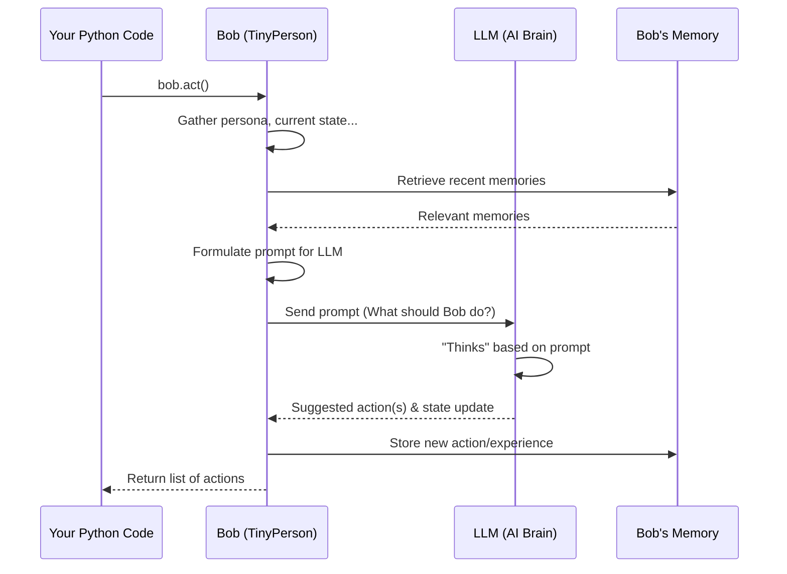

# Chapter 2: TinyPerson (Agent)

Welcome back to TinyTroupe! In [Chapter 1: Simulation (Controller)](01_simulation__controller__.md), we met the "director" of our tiny worlds – the `Simulation Controller` – which manages the overall simulation, keeps track of everything, and even cleverly remembers past events to speed things up.

Now that we have a director and a stage, it's time to introduce the stars of our show: the **`TinyPerson` (or Agent)**!

## What's a TinyPerson? And Why Are They Special?

Imagine you're creating a story, a play, or a mini video game. You'd need characters, right? Characters who have their own personalities, who can see what's happening around them, think their own thoughts, remember things, and then *do* things like talk, move, or use objects.

A **`TinyPerson`** in TinyTroupe is exactly that: an individual character or entity within your simulation. They are the primary actors that drive the story and the action in your digital world.

**Here's a simple idea:**

Let's say we want to create a character named "Bob."
1.  We want Bob to have a bit of a personality – maybe he's a "friendly gardener."
2.  We want to tell Bob something, like, "Bob, it's a sunny morning!"
3.  Then, we want Bob to *think* about this and decide to do something, perhaps "water the plants."

The `TinyPerson` abstraction helps us create and manage characters like Bob, giving them these life-like qualities.

## Key Aspects of a TinyPerson

Every `TinyPerson` has several key aspects that make them behave like a little individual:

1.  **Persona:** This is *who* the `TinyPerson` is. It includes their personality (e.g., grumpy, cheerful), background story, skills they possess (like knowing how to cook or code), and even their relationships with other `TinyPerson` instances.
2.  **Perception:** `TinyPerson` instances aren't blind! They can "perceive" their surroundings. This means they can "hear" things said to them, "see" (descriptions of) what's around them, or even "feel" (simulated) emotions.
3.  **Thinking & Decision Making:** This is like their "brain." Based on their persona, what they perceive, and what they remember, a `TinyPerson` can think and make decisions about what to do next. This "brain" is often powered by a Large Language Model (LLM), which we'll learn more about in [LLM Interaction (AI Brain Interface)](04_llm_interaction__ai_brain_interface__.md).
4.  **Memory:** Just like us, `TinyPerson` instances can remember past events, conversations, and facts. This memory influences their future thoughts and actions. We'll explore this amazing feature in detail in [TinyMemory (Agent Memory)](07_tinymemory__agent_memory__.md).
5.  **Actions:** Based on their thoughts, `TinyPerson` instances can perform actions. They can talk to other agents, move to different places, use tools (see [TinyTool (Agent Capability Extenders)](08_tinytool__agent_capability_extenders__.md)), or even just express their current thoughts.

These agents are the heart of your simulation, making your tiny worlds dynamic and interesting!

## Creating Your First TinyPerson: Meet Bob!

Let's bring our first `TinyPerson`, Bob, to life. We'll give him a simple persona and see how he reacts to a situation.

**1. Setting Up the Simulation (A Quick Recap)**

Remember from [Chapter 1: Simulation (Controller)](01_simulation__controller__.md), every TinyTroupe session starts with initializing the simulation controller.

```python
import tinytroupe.control as control

# Start our simulation (or load it if it exists)
control.begin(cache_path="my_first_story.cache.json")

print("Simulation is ready for our characters!")
```
This tells TinyTroupe to get ready and use `my_first_story.cache.json` to save and load any "memories" of what happens.

**2. Creating Bob**

Now, let's create Bob. `TinyPerson` objects are found in `tinytroupe.agent`.

```python
from tinytroupe.agent import TinyPerson

# Let's make sure we see Bob's actions printed to the screen
TinyPerson.communication_display = True

# Create our first TinyPerson named Bob!
bob = TinyPerson(name="Bob")

print(f"Meet {bob.name}!")
```
When you run this, you've just created an "empty" `TinyPerson` named Bob. He exists, but he doesn't have much of a personality yet. The line `TinyPerson.communication_display = True` tells TinyTroupe to print out what Bob "says" or "does" as it happens, which is helpful for us to see!

**3. Giving Bob a Persona**

Let's make Bob a friendly gardener. We can use the `define()` method to add details to his persona.

```python
# Give Bob some characteristics
bob.define("age", 35)
bob.define("occupation", {"title": "Gardener"})
bob.define("personality_traits", ["friendly", "loves plants", "a bit quiet"])

print(f"{bob.name} is now a {bob.get('age')} year old {bob.get('occupation')['title']}.")
```
Here, `bob.define("key", value)` adds information to Bob's internal persona. We've told him his age, his job, and a few personality traits. You can use `bob.get("key")` to peek at these details.

**4. Making Bob Perceive (Listen)**

Let's tell Bob something. We'll use the `listen()` method for this.

```python
# Bob "hears" something
bob.listen("It's a beautiful, sunny morning, Bob!")

print(f"{bob.name} heard the good news about the morning.")
```
When Bob `listen()`s, this information is stored in his memory and will influence his next thoughts and actions. If `TinyPerson.communication_display` is `True`, you'll see a formatted output indicating Bob received this stimulus.

**5. Making Bob Act (and Think!)**

Now for the exciting part! Let's see what Bob decides to do after hearing about the sunny morning. We'll use the `act()` method.

```python
print(f"What will {bob.name} do now?")

# Bob thinks and then decides on an action (or a series of actions)
actions_bob_took = bob.act(return_actions=True)

# Let's look at the primary action Bob decided on
if actions_bob_took:
    last_action_details = actions_bob_took[-1]['action']
    action_type = last_action_details['type']
    action_content = last_action_details.get('content', '') # content might be empty
    print(f"\nBob's final action: [{action_type}] {action_content}")
else:
    print("Bob didn't decide on any specific actions this time.")
```
When you call `bob.act()`, a few things happen:
*   Bob "thinks" about his current situation (his persona, what he just heard, his memories).
*   He decides on one or more actions. Common actions include `TALK`, `THINK` (internally), or `USE_TOOL`.
*   The `act()` method can return a list of these actions. We're looking at the `type` and `content` of the last action in the sequence.
*   Because `TinyPerson.communication_display` is `True`, you'll also see a more detailed, formatted play-by-play of Bob's "thoughts" and actions printed to your console. This can be quite verbose but is very useful for understanding what the agent is doing!

Bob might decide to `TALK` back, or `THINK` about what to do, or perhaps something directly related to being a gardener on a sunny day!

**6. Don't Forget to End!**

Finally, when you're done with this part of the story:
```python
# End the simulation and save the cache
control.end()
print("Simulation ended. Bob's morning adventure is saved!")
```

## How Does Bob "Work"? (A Peek Under the Hood)

It might seem like magic that Bob can "think" and "act." Let's demystify it a bit.

**A Day in the Life of Bob's Brain (Simplified Flow)**

When you call a method like `bob.act()`:

1.  **Gathering Intel:** Bob collects all relevant information:
    *   His `_persona` (who he is: gardener, friendly, etc.).
    *   His recent experiences from `episodic_memory` (like hearing "It's a sunny morning!").
    *   His general knowledge from `semantic_memory` (facts he knows).
    *   His current goals and emotional state.
    *   The capabilities provided by his [TinyMentalFaculty (Agent Cognitive Abilities)](06_tinymentalfaculty__agent_cognitive_abilities__.md) (these define what actions he *can* consider).

2.  **Formulating a "Question":** All this information is compiled into a special message (a "prompt"). This prompt is like asking a very smart helper, "Given all this, what would a person like Bob do or say next?"

3.  **The "Brain" Thinks:** This prompt is sent to an [LLM Interaction (AI Brain Interface)](04_llm_interaction__ai_brain_interface__.md). The LLM (Large Language Model) acts as Bob's "brain," processing the prompt and generating a response.

4.  **Receiving the "Answer":** The LLM's response contains the action(s) Bob should take (e.g., "TALK: 'What a lovely day for gardening!'") and possibly updates to his internal state (like his goals or emotions).

5.  **Taking Action & Remembering:** Bob's `TinyPerson` object receives this response.
    *   The specified actions are recorded.
    *   His internal state and [TinyMemory (Agent Memory)](07_tinymemory__agent_memory__.md) are updated with this new experience.

Here's a simplified diagram of what happens when Bob acts:



**Key Code Components Inside `TinyPerson`**

The `TinyPerson` class (mainly in `tinytroupe/agent/tiny_person.py`) has several important parts:

*   **`__init__(self, name, ...)`:** When you create `bob = TinyPerson(name="Bob")`, this constructor initializes Bob. It sets up his name and prepares his internal structures like:
    *   `self._persona`: A dictionary holding all his defined traits (age, occupation, etc.).
    *   `self.episodic_memory`: For remembering sequences of events. (More in [TinyMemory (Agent Memory)](07_tinymemory__agent_memory__.md))
    *   `self.semantic_memory`: For remembering facts and general knowledge. (More in [TinyMemory (Agent Memory)](07_tinymemory__agent_memory__.md))
    *   `self._mental_faculties`: A list of special abilities or skills Bob has. These define the range of actions Bob knows how to perform. We'll learn more about these in [TinyMentalFaculty (Agent Cognitive Abilities)](06_tinymentalfaculty__agent_cognitive_abilities__.md).

*   **`define(self, key, value)`:**
    ```python
    # Simplified from tinytroupe/agent/tiny_person.py
    # @transactional # This method is also transactional!
    # def define(self, key, value, ...):
    #     # ... (stores the value in self._persona dictionary) ...
    #     self._persona[key] = value
    #     self.reset_prompt() # Important: updates Bob's internal "view" of himself
    ```
    This method updates Bob's `_persona` dictionary. Crucially, it then calls `reset_prompt()`.

*   **`reset_prompt(self)`:** This internal method is very important. It rebuilds the main "system message" or core instructions that define Bob to the LLM. It takes Bob's `_persona`, his current `_mental_state` (like location, goals, emotions), and information about his `_mental_faculties` to create the foundational prompt. Any memories are added after this base prompt when communicating with the LLM.

*   **`listen(self, speech, ...)`:**
    ```python
    # Simplified from tinytroupe/agent/tiny_person.py
    # @transactional
    # def listen(self, speech, source=None, ...):
    #     stimulus = {"type": "CONVERSATION", "content": speech, "source": ...}
    #     self._observe(stimulus) # Calls an internal method
    #     return self
    ```
    When Bob listens, the speech is packaged as a "stimulus" and passed to `_observe()`.

*   **`_observe(self, stimulus, ...)`:**
    ```python
    # Simplified from tinytroupe/agent/tiny_person.py
    # @transactional
    # def _observe(self, stimulus, ...):
    #     content = {"stimuli": [stimulus]}
    #     # Stores this observation in Bob's episodic memory
    #     self.store_in_memory({'role': 'user', 'content': content, ...})
    #     # ... (optional display to console) ...
    ```
    This method takes the stimulus, wraps it, and calls `store_in_memory()` to add it to Bob's `episodic_memory`. The "role" is 'user' because it's like an external input to Bob.

*   **`act(self, ...)`:**
    ```python
    # Simplified from tinytroupe/agent/tiny_person.py
    # @transactional
    # def act(self, until_done=True, ...):
    #     # ... (loop to get one or more actions until "DONE")
    #     role, content_dict = self._produce_message() # Gets thought/action from LLM
    #     
    #     action_details = content_dict['action']
    #     cognitive_state_update = content_dict['cognitive_state']
    #
    #     # Store this action in Bob's memory
    #     self.store_in_memory({'role': role, 'content': content_dict, 'type': 'action', ...})
    #     
    #     self._actions_buffer.append(action_details) # Buffer for environment to pick up
    #     self._update_cognitive_state(**cognitive_state_update) # Update internal state
    #     
    #     # ... (process action with mental faculties, optional display) ...
    #     return actions_taken_list
    ```
    The `act()` method is where Bob "thinks" (via `_produce_message()`, which interfaces with the LLM) and then processes the LLM's response. The response is expected in a specific format (an `Action` and a `CognitiveState`). The action is stored in memory, and Bob's internal cognitive state (goals, emotions, attention) is updated.

Many of these methods, like `define`, `listen`, and `act`, are marked with `@transactional`. As we learned in [Chapter 1: Simulation (Controller)](01_simulation__controller__.md), this means the `Simulation Controller` can cache their results, making your simulations faster and reproducible!

## Conclusion

You've now met the **`TinyPerson`**, the core actor in your TinyTroupe simulations!

You've learned:
*   A `TinyPerson` is like a character in a story, with a persona, perceptions, thoughts, memory, and actions.
*   How to create a `TinyPerson` (e.g., `bob = TinyPerson(name="Bob")`).
*   How to define their persona using `bob.define("trait", "value")`.
*   How to make them "listen" to information using `bob.listen("something happened")`.
*   How to make them "act" (which includes thinking) using `bob.act()`.
*   A simplified idea of how a `TinyPerson` uses its persona, memory, and an AI "brain" (LLM) to decide what to do.

`TinyPerson` instances are the beings that will populate the worlds you create. But where do these `TinyPerson` characters live and interact? That's where our next topic comes in!

Get ready to explore the places and spaces for your agents in [Chapter 3: TinyWorld (Environment)](03_tinyworld__environment__.md)!

---

Generated by [AI Codebase Knowledge Builder](https://github.com/The-Pocket/Tutorial-Codebase-Knowledge)