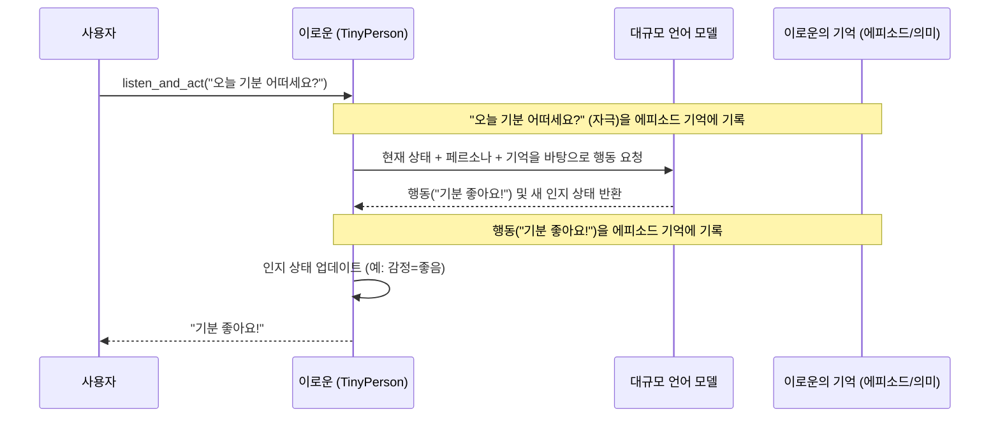

# Chapter 2: 타이니퍼슨 (TinyPerson)


이전 [제1장: 시뮬레이션 제어 (Simulation Control)](01_시뮬레이션_제어__simulation_control__.md)에서는 시뮬레이션의 전반적인 흐름을 계획하고, 중간 과정을 저장하며, 반복적인 작업을 효율적으로 처리하는 '지휘자' 역할에 대해 배웠습니다. 이제 시뮬레이션이라는 무대 위에서 실제로 연기할 배우, 바로 '타이니퍼슨(TinyPerson)'에 대해 자세히 알아볼 시간입니다.

## 타이니퍼슨은 무엇일까요? 왜 필요할까요?

여러분이 직접 만든 가상의 세계에 마치 살아있는 듯한 캐릭터들이 돌아다니며 각자의 이야기를 만들어간다면 정말 멋지지 않을까요? 타이니퍼슨은 바로 그런 역할을 하는 시뮬레이션의 핵심 배우입니다. 각 타이니퍼슨은 자신만의 독특한 성격, 목표, 그리고 기억을 가진 가상의 사람을 나타냅니다.

**핵심 사용 사례:** 여러분이 새로운 교육용 소프트웨어를 개발했다고 상상해 보세요. 이 소프트웨어가 "호기심 많고 활동적인 초등학생"에게는 얼마나 재미있을지, 반대로 "신중하고 조용한 중학생"에게는 어떤 반응을 보일지 궁금할 수 있습니다. 실제 학생들을 많이 모아 테스트하는 것은 시간과 비용이 많이 들 수 있습니다. 이때 타이니퍼슨을 사용하면, 다양한 성격과 학습 스타일을 가진 가상의 학생들을 만들고, 그들이 소프트웨어와 어떻게 상호작용하는지 시뮬레이션해 볼 수 있습니다. 이를 통해 소프트웨어를 개선할 귀중한 아이디어를 얻을 수 있습니다.

타이니퍼슨은 다음과 같은 특징을 가집니다:

*   시뮬레이션의 **핵심 배우**입니다.
*   각자 고유한 **성격, 목표, 기억**을 가집니다.
*   마치 연극의 등장인물처럼, 주어진 환경 및 다른 캐릭터들과 **상호작용**하며 자신만의 이야기를 만들어갑니다.
*   실험자는 이들의 행동과 반응을 관찰하며 다양한 **통찰**을 얻을 수 있습니다.

이 장을 통해 여러분은 타이니퍼슨을 만들고, 그들에게 개성을 부여하며, 간단한 상호작용을 시키는 방법을 배우게 될 것입니다.

## 타이니퍼슨 만들기: 첫걸음

타이니퍼슨을 만드는 것은 `TinyPerson` 클래스를 사용하는 것부터 시작합니다. 가장 먼저 필요한 것은 타이니퍼슨의 '이름'입니다.

```python
from tinytroupe.agent import TinyPerson

# '이로운'이라는 이름의 타이니퍼슨 생성
rowoon = TinyPerson(name="이로운")

# 생성된 타이니퍼슨 객체 정보 출력
print(rowoon)
```

위 코드를 실행하면 `TinyPerson(name='이로운')`과 같이 출력될 것입니다. 이것은 '이로운'이라는 이름표를 단 아주 기본적인 타이니퍼슨 배우가 준비되었다는 의미입니다. 아직 구체적인 역할(성격이나 배경)은 정해지지 않았지만, 이제 곧 무대에 오를 수 있습니다!

## 페르소나 정의하기: 타이니퍼슨에게 생명 불어넣기

타이니퍼슨의 진정한 매력은 각자에게 고유한 '페르소나(Persona)'를 부여할 때 나타납니다. 페르소나는 타이니퍼슨의 나이, 직업, 성격, 관심사, 말투 등 그 캐릭터를 특징짓는 모든 정보를 포함합니다. `define()` 메서드를 사용하면 이러한 페르소나 속성들을 하나씩 추가할 수 있습니다.

예를 들어, 방금 만든 '이로운'에게 좀 더 구체적인 설정을 추가해 보겠습니다.

```python
# '이로운'에게 페르소나 정보 추가
rowoon.define("age", 28) # 나이는 28세
rowoon.define("occupation", {"title": "유치원 교사"}) # 직업 정의
rowoon.define("personality", {
    "traits": ["긍정적임", "아이들을 좋아함", "창의적임"]
}) # 성격 특성 정의

# 정의된 정보 확인
print(f"{rowoon.name}의 나이: {rowoon.get('age')}")
print(f"{rowoon.name}의 직업: {rowoon.get('occupation')['title']}")
print(f"{rowoon.name}의 성격 특성: {rowoon.get('personality')['traits']}")
```

이제 '이로운'은 단순히 이름만 있는 존재가 아니라, 28세의 긍정적이고 창의적인 유치원 교사라는 구체적인 캐릭터가 되었습니다. 이렇게 정의된 페르소나 정보는 타이니퍼슨이 앞으로 어떻게 생각하고, 말하고, 행동할지를 결정하는 중요한 기준이 됩니다.

**JSON으로 페르소나 정의하기**

Python 코드로 하나씩 `define`하는 것 외에도, 페르소나 정보가 많거나 복잡할 경우 JSON 파일을 사용하여 한 번에 정의할 수도 있습니다. 이는 특히 특정 소비자 유형이나 전문가 집단처럼 매우 상세한 설정이 필요한 캐릭터를 만들 때 유용합니다. JSON 파일을 사용하는 방법은 이 튜토리얼의 뒷부분이나 [제5장: 타이니퍼슨 팩토리 (TinyPerson Factory)](05_타이니퍼슨_팩토리__tinyperson_factory__.md)에서 더 자세히 다룰 것입니다. 지금은 `define` 메서드로도 충분히 다양한 캐릭터를 만들 수 있다는 점만 기억해주세요!

## 타이니퍼슨과의 상호작용: 듣고 말하기

페르소나를 갖춘 타이니퍼슨은 이제 외부 세계와 소통할 준비가 되었습니다. 타이니퍼슨은 주변의 소리나 정보를 "듣고(`listen`)", 그에 따라 자신의 생각과 페르소나에 기반하여 "행동(`act`)"할 수 있습니다.

가장 흔하게 사용되는 상호작용 방식은 `listen_and_act()` 메서드입니다. 이 메서드는 타이니퍼슨에게 특정 말을 전달하면(듣게 하면), 타이니퍼슨이 그 말에 대해 즉시 반응하여 행동하도록 합니다.

**예시: 간단한 대화**

'이로운' 선생님과 간단한 대화를 나눠볼까요?

```python
# 시뮬레이션 제어를 위해 import (이전 장에서 배운 내용)
import tinytroupe.control as control

# 시뮬레이션 시작 (LLM 호출 결과 등을 캐싱할 수 있도록)
control.begin()

# 사용자(실험자)가 이로운에게 말을 겁니다.
user_input = "안녕하세요, 이로운 선생님! 오늘 기분 어떠세요?"
print(f"사용자: {user_input}")

# 이로운이 사용자의 말을 듣고 반응합니다.
rowoon.listen_and_act(user_input)
# 이로운의 응답은 LLM을 통해 생성되며, 콘솔에 출력됩니다.
# 예시 응답: 이로운 acts: [TALK] > 안녕하세요! 오늘 기분 아주 좋아요. 아이들과 즐거운 하루를 보낼 생각에 설레네요!

# 시뮬레이션 종료
control.end()
```

위 코드에서 `rowoon.listen_and_act(user_input)` 부분이 실행되면, '이로운'은 "안녕하세요, 이로운 선생님! 오늘 기분 어떠세요?"라는 말을 듣게 됩니다. 그리고 자신이 설정된 페르소나(28세, 긍정적인 유치원 교사)를 바탕으로 응답을 생성합니다.

실제 응답 내용은 대규모 언어 모델(LLM)에 의해 만들어지기 때문에 실행할 때마다 조금씩 달라질 수 있지만, '긍정적이고 아이들을 좋아하는 유치원 교사'라는 페르소나에 어울리는 답변을 하려고 노력할 것입니다.

여기서 `control.begin()`과 `control.end()`는 [제1장: 시뮬레이션 제어 (Simulation Control)](01_시뮬레이션_제어__simulation_control__.md)에서 배운 내용입니다. 이를 사용하면 타이니퍼슨이 LLM을 호출하여 생성한 응답 결과를 저장해두었다가, 나중에 동일한 상황에서 다시 실행할 때 저장된 결과를 재사용하여 시간과 API 비용을 절약할 수 있습니다.

## 타이니퍼슨의 내부 들여다보기

타이니퍼슨은 어떻게 우리가 입력한 말을 이해하고, 자신의 성격에 맞는 대답을 할 수 있는 걸까요? 마치 작은 뇌와 마음을 가진 것처럼 행동하는 타이니퍼슨의 내부를 간략하게 살펴보겠습니다.

**주요 구성 요소:**

타이니퍼슨은 여러 내부 구성요소를 통해 생각하고 행동합니다.

*   `_persona` (페르소나 정보): `define()` 메서드를 통해 설정한 이름, 나이, 직업, 성격, 목표 등 타이니퍼슨의 모든 정의를 담고 있는 핵심 딕셔너리입니다. 타이니퍼슨의 정체성과 같습니다.
*   `episodic_memory` (에피소드 기억): 타이니퍼슨이 경험한 사건들을 시간 순서대로 저장하는 기억 공간입니다. 예를 들어, "방금 사용자가 '오늘 기분 어떠세요?'라고 물었다"와 같은 최근 경험들이 여기에 기록됩니다. (자세한 내용은 [제7장: 기억 (Memory)](07_기억__memory__.md)에서 다룹니다.)
*   `semantic_memory` (의미 기억): 일반적인 지식, 사실, 학습된 정보들을 저장하는 기억 공간입니다. 예를 들어, "나는 이로운이고, 직업은 유치원 교사이다"와 같은 정보가 여기에 해당될 수 있습니다. (역시 [제7장: 기억 (Memory)](07_기억__memory__.md)에서 자세히 설명합니다.)
*   `_mental_state` (정신 상태): 현재 타이니퍼슨의 목표, 주의를 기울이고 있는 것, 느끼는 감정 등을 나타냅니다. 이 상태는 상호작용을 통해 계속 변합니다.
*   `_mental_faculties` (정신 능력): 기억을 회상하거나, 특정 도구를 사용하는 등 타이니퍼슨이 가진 특별한 능력들을 의미합니다. (이는 [제6장: 정신 능력 (Mental Faculties)](06_정신_능력__mental_faculties__.md)에서 더 알아봅니다.)

**상호작용 흐름 (간략화):**

타이니퍼슨이 사용자와 상호작용할 때 대략 다음과 같은 과정을 거칩니다.

1.  **자극 수신 (예: `listen` 또는 내부적으로 `_observe` 메서드 호출):** 사용자가 말을 걸면, 이 말(자극)은 먼저 타이니퍼슨의 `episodic_memory`에 "이런 일이 있었음"하고 기록됩니다.
2.  **행동 결정 (예: `act` 또는 내부적으로 `_produce_message` 메서드 호출):**
    *   타이니퍼슨은 현재 자신의 `_mental_state`(지금 기분이나 목표 등), `_persona` 정보(자신의 성격이나 직업 등), 그리고 `episodic_memory`와 `semantic_memory`에 저장된 관련 기억들을 모두 종합적으로 고려합니다.
    *   이 모든 정보를 바탕으로, "자, 이런 상황에서는 어떻게 말하고 행동해야 할까?"라는 질문을 대규모 언어 모델(LLM)에게 던집니다. (이때 [제4장: OpenAI 유틸리티 (OpenAI Utilities)](04_openai_유틸리티__openai_utilities__.md)가 사용됩니다.)
    *   LLM은 타이니퍼슨의 다음 행동(예: "TALK" - 말하기)과 그로 인해 변하게 될 인지 상태(새로운 목표, 주의, 감정 등)를 제안합니다. 이 정보는 `CognitiveActionModel`이라는 정해진 형식으로 전달됩니다.
3.  **행동 수행 및 상태 업데이트:**
    *   타이니퍼슨은 LLM이 제안한 행동(예: "안녕하세요! 오늘 기분 아주 좋아요!")을 실제로 수행합니다. 이 행동 역시 `episodic_memory`에 기록됩니다 ("내가 이렇게 행동했음").
    *   또한, LLM이 알려준 새로운 인지 상태로 자신의 `_mental_state`를 업데이트합니다. (예: 기분이 '좋음'으로 바뀜).

이 과정을 그림으로 표현하면 다음과 같습니다.



**관련 코드 살펴보기 (`tinytroupe/agent/tiny_person.py`):**

실제 코드에서는 이러한 과정이 어떻게 구현되어 있는지 몇 가지 핵심 부분을 살펴보겠습니다. (코드는 이해를 돕기 위해 단순화되었을 수 있습니다.)

*   **타이니퍼슨 생성 (`__init__` 및 `_post_init`):**
    타이니퍼슨 객체가 처음 만들어질 때, 기본적인 설정들이 준비됩니다.

    ```python
    # tinytroupe/agent/tiny_person.py 일부
    class TinyPerson(JsonSerializableRegistry):
        def __init__(self, name:str=None, 
                     episodic_memory=None, # 에피소드 기억
                     semantic_memory=None, # 의미 기억
                     mental_faculties:list=None): # 정신 능력
            # 이름은 필수!
            assert name is not None, "타이니퍼슨은 이름이 있어야 합니다."
            self.name = name
            # ... 다른 초기화 ...
            # @post_init 데코레이터가 _post_init 메서드를 나중에 호출해줍니다.

        def _post_init(self, **kwargs): # __init__ 실행 후 호출됨
            # 페르소나 기본 구조 (이름 등)
            if not hasattr(self, '_persona'):          
                self._persona = {"name": self.name, "age": None, ...} 
            # 에피소드 기억 기본 설정
            if not hasattr(self, 'episodic_memory'):
                self.episodic_memory = EpisodicMemory()
            # ... 기타 등등 ...
    ```
    `__init__`에서 이름 같은 필수 정보가 설정되고, `_post_init` (특별한 데코레이터에 의해 `__init__` 직후 자동으로 호출됨)에서 페르소나 정보를 담을 `_persona` 딕셔너리, 기억을 담당할 `episodic_memory` 등의 내부 구조들이 기본값으로 초기화됩니다.

*   **페르소나 정의 (`define`):**
    타이니퍼슨의 성격, 직업 등을 설정하는 `define` 메서드는 내부적으로 `_persona` 딕셔너리를 업데이트합니다.

    ```python
    # tinytroupe/agent/tiny_person.py 일부
    @transactional # 이 표시는 시뮬레이션 제어와 관련됨 (캐싱 등)
    def define(self, key, value, merge=True, overwrite_scalars=True):
        # ... 값의 형태에 따라 처리 (문자열, 딕셔너리, 리스트 등) ...
        if isinstance(value, dict) or isinstance(value, list): # 값이 딕셔너리나 리스트면
            if merge: # 기존 값에 병합할지, 덮어쓸지 결정
                self._persona = utils.merge_dicts(self._persona, {key: value})
            else:
                self._persona[key] = value
        elif overwrite_scalars or (key not in self._persona): # 단순 값이면
            self._persona[key] = value
        # ...
            
        self.reset_prompt() # 페르소나가 변경되었으니 LLM에 전달할 기본 프롬프트도 업데이트
    ```
    `@transactional` 표시는 이 `define` 작업이 [제1장: 시뮬레이션 제어 (Simulation Control)](01_시뮬레이션_제어__simulation_control__.md)의 관리하에 있으며, 그 결과가 캐싱될 수 있음을 나타냅니다. 페르소나가 변경되면 `reset_prompt()`가 호출되어 LLM에게 전달될 기본 정보(시스템 프롬프트)가 최신 상태로 갱신됩니다.

*   **자극 처리 (`_observe`):**
    타이니퍼슨이 외부 세계로부터 정보를 받아들이는 과정입니다. `listen()`, `see()` 같은 메서드들이 내부적으로 이 `_observe()` 메서드를 사용합니다.

    ```python
    # tinytroupe/agent/tiny_person.py 일부
    @transactional
    def _observe(self, stimulus, max_content_length=default["max_content_display_length"]):
        stimuli_list = [stimulus] # 자극 목록 (보통 하나)
        content_to_store = {"stimuli": stimuli_list}

        # 자극 내용을 에피소드 기억에 저장
        self.store_in_memory({
            'role': 'user', # 외부 자극은 보통 'user' 역할로 간주
            'content': content_to_store, 
            'type': 'stimulus', # '자극' 타입으로 저장
            'simulation_timestamp': self.iso_datetime() # 현재 시뮬레이션 시간
        })

        # ... 화면에 자극 내용 표시하는 로직 ...
        return self # 다른 메서드를 연달아 호출할 수 있도록 self 반환
    ```
    여기서 `stimulus` (자극)는 그 내용과 함께 현재 시각 등의 정보와 함께 `store_in_memory` 함수를 통해 `episodic_memory`에 차곡차곡 쌓입니다.

*   **행동 생성 (`act`와 `_produce_message`):**
    타이니퍼슨이 실제로 생각하고 행동을 만들어내는 핵심 부분입니다.

    ```python
    # tinytroupe/agent/tiny_person.py 일부
    @transactional
    def act(self, until_done=True, n=None, ...): # 특정 횟수만큼 또는 'DONE' 액션까지 행동
        # ... 루프를 돌며 행동 생성 ...
        # role은 보통 'assistant'(LLM 응답), content는 LLM이 생성한 내용
        role, content_json = self._produce_message() # LLM 호출하여 행동과 인지 상태 얻기
        
        action_detail = content_json['action'] # 실제 행동 내용
        cognitive_state_update = content_json["cognitive_state"] # 업데이트될 인지 상태

        # 생성된 행동을 에피소드 기억에 저장
        self.store_in_memory({'role': role, 'content': content_json, 'type': 'action', ...})
        self._actions_buffer.append(action_detail) # 환경에서 사용할 수 있도록 행동 버퍼에 추가
        # 인지 상태 업데이트 (목표, 감정 등)
        self._update_cognitive_state(goals=cognitive_state_update['goals'], ...)
        # ... 화면에 행동 내용 표시 및 루프 제어 ...

    def _produce_message(self): # LLM과 소통하는 부분
        self.reset_prompt() # 항상 최신 페르소나와 기억 상태로 프롬프트 준비
        
        # LLM에게 전달할 메시지 목록 준비 (시스템 프롬프트 + 이전 대화 기록 등)
        messages_for_llm = [
            {"role": msg["role"], "content": json.dumps(msg["content"])}
            for msg in self.current_messages # current_messages는 reset_prompt에서 준비됨
        ]
        
        # openai_utils를 통해 LLM API 호출 (응답 형식은 CognitiveActionModel로 지정)
        llm_response = openai_utils.client().send_message(messages_for_llm, 
                                                            response_format=CognitiveActionModel)
        
        # LLM 응답에서 역할(role)과 내용(content) 추출하여 반환
        return llm_response["role"], utils.extract_json(llm_response["content"])
    ```
    `act` 메서드는 `_produce_message`를 호출하여 LLM으로부터 행동 지침을 받습니다. `_produce_message`는 타이니퍼슨의 현재 페르소나, 기억, 정신 상태 등을 모두 모아 LLM에게 전달할 프롬프트를 구성하고, [제4장: OpenAI 유틸리티 (OpenAI Utilities)](04_openai_유틸리티__openai_utilities__.md)를 사용해 LLM API를 호출합니다. LLM은 `CognitiveActionModel`이라는 약속된 JSON 형식(행동 정보 + 다음 인지 상태 정보)으로 응답하며, 타이니퍼슨은 이 응답을 바탕으로 실제 행동을 기록하고 자신의 내부 상태(`_mental_state`)를 업데이트합니다.

이렇게 타이니퍼슨은 페르소나, 기억, 그리고 LLM의 도움을 받아 마치 스스로 생각하고 행동하는 것처럼 시뮬레이션 세계에서 살아갑니다.

## 정리 및 다음 단계

이번 장에서는 TinyTroupe 시뮬레이션의 핵심 배우인 `타이니퍼슨 (TinyPerson)`에 대해 깊이 알아보았습니다. 타이니퍼슨 객체를 생성하고, `define` 메서드를 사용해 각자의 개성(페르소나)을 부여하며, `listen_and_act`와 같은 메서드를 통해 간단한 상호작용을 하는 기본적인 방법을 익혔습니다. 또한, 타이니퍼슨이 내부적으로 어떻게 외부 정보를 받아들이고(듣고), 자신의 페르소나와 기억을 바탕으로 어떻게 행동을 결정하는지에 대한 간략한 그림도 그려보았습니다.

**핵심 요약:**

*   `TinyPerson`은 TinyTroupe 시뮬레이션의 지능을 가진 에이전트(배우)입니다.
*   `define()` 메서드를 사용하여 이름, 나이, 성격, 직업, 관심사 등 다양한 페르소나 정보를 설정할 수 있습니다.
*   `listen()`, `act()`, 그리고 이 둘을 합친 `listen_and_act()` 등의 메서드를 통해 외부 세계 및 다른 에이전트와 상호작용합니다.
*   타이니퍼슨은 자신의 페르소나, [기억 (Memory)](07_기억__memory__.md), 현재 정신 상태를 종합적으로 고려하고, 대규모 언어 모델(LLM)의 도움을 받아 다음 행동을 결정합니다.

이제 여러분은 자신만의 독특한 타이니퍼슨들을 만들 수 있게 되었습니다. 하지만 이 사랑스러운 타이니퍼슨들이 혼자서는 외롭겠죠? 그들이 서로 만나 대화하고, 함께 무언가를 경험하며 살아갈 수 있는 '세상'이 필요합니다.

다음 [제3장: 타이니월드 (TinyWorld)](03_타이니월드__tinyworld__.md)에서는 바로 이 타이니퍼슨들이 살아가는 환경, 즉 '타이니월드'를 만들고 그 안에서 여러 타이니퍼슨들이 어떻게 함께 어울려 살아가는지 알아보겠습니다. 기대해 주세요!

---

Generated by [AI Codebase Knowledge Builder](https://github.com/The-Pocket/Tutorial-Codebase-Knowledge)