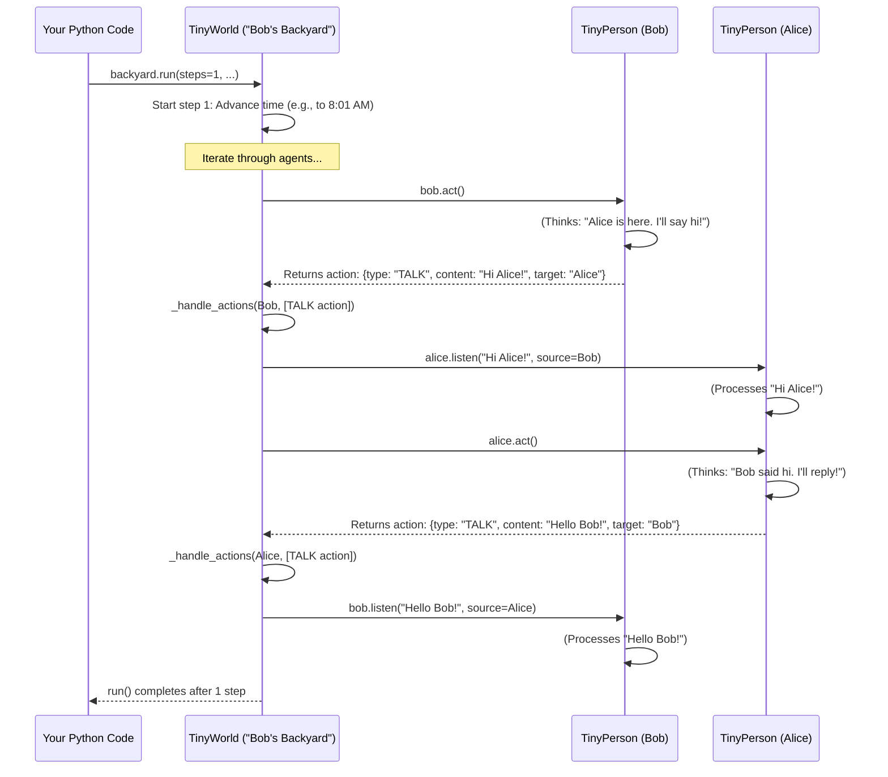

# Chapter 3: TinyWorld (Environment)

Welcome back! In [Chapter 2: TinyPerson (Agent)](02_tinyperson__agent__.md), we learned how to create our little characters, the `TinyPerson` agents, like Bob the gardener. We saw how they can have personas, "listen" to things, and "act" based on their thoughts.

But where do these `TinyPerson` characters live? If Bob wants to garden, he needs a garden! If we introduce another character, Alice, how do Bob and Alice exist in the same place and interact with each other? This is where the **`TinyWorld` (or Environment)** comes into play!

## What's a TinyWorld? The Stage for Your Story!

Imagine you're putting on a play. You have your actors (our `TinyPerson` agents), but they need a stage to perform on, right? The stage sets the scene – is it a bustling city, a quiet park, or a cozy living room?

A **`TinyWorld`** in TinyTroupe is exactly like that stage. It's the **setting or context** where your `TinyPerson` agents exist, move around, and interact.

**Here's a simple problem it solves:**

Let's say Bob the gardener is in his "Backyard."
1.  The Backyard needs to "know" that Bob is there.
2.  If it's morning in the Backyard, Bob might decide to water his plants. The Backyard helps manage this flow of time.
3.  If another `TinyPerson`, Alice, enters the Backyard and Bob says "Hello!", the Backyard makes sure Alice can "hear" Bob.

The `TinyWorld` is the container and manager for your agents and their shared reality.

## Key Ideas of the TinyWorld

A `TinyWorld` has a few important jobs:

1.  **The Setting:** It defines the place. Is it "Bob's Backyard," "The Office," or "Lunar Base Alpha"? It can have a name and even a current date and time.
2.  **Agent Management:** It keeps a list of all the `TinyPerson` agents currently present in it. So, it knows who's on stage.
3.  **Time Control:** It can manage the simulation's clock. You can tell the world to run for a few minutes, hours, or days, and it will keep track of the current time within that simulated environment.
4.  **Interaction Hub:** This is crucial! When one agent performs an action that should affect others (like talking), the `TinyWorld` helps deliver that message. If Bob shouts in the Backyard, the Backyard determines who hears it.
5.  **Rules & Events (Advanced):** While we won't dive deep now, a `TinyWorld` can also define overarching rules or trigger events that affect all its inhabitants (e.g., "a sudden rain shower starts").

Think of it as the mini-universe where your agents' lives unfold.

## Setting the Scene: Creating and Using a TinyWorld

Let's create a simple `TinyWorld` for Bob and his new friend, Alice.

**1. A Quick Recap: Simulation & Agents**

Remember, we always start by initializing the [Simulation (Controller)](01_simulation__controller__.md). And we'll assume Bob (our friendly gardener) and a new `TinyPerson`, Alice, have been created as we learned in [Chapter 2: TinyPerson (Agent)](02_tinyperson__agent__.md).

```python
import tinytroupe.control as control
from tinytroupe.agent import TinyPerson
from tinytroupe.environment import TinyWorld # Import TinyWorld
from datetime import datetime, timedelta # For managing time

# Start our simulation
control.begin(cache_path="my_backyard_story.cache.json")

# Assume Bob and Alice are created (from Chapter 2 examples)
# Make sure we can see what they and the world "say"
TinyPerson.communication_display = True # For agent's detailed output
TinyWorld.communication_display = True  # For world's step output

bob = TinyPerson(name="Bob")
bob.define("occupation", {"title": "Gardener"})
bob.define("personality_traits", ["friendly", "loves plants"])

alice = TinyPerson(name="Alice")
alice.define("personality_traits", ["curious", "likes meeting new people"])

print("Bob and Alice are ready!")
```
This sets up our simulation and creates Bob and Alice. The `communication_display` lines help us see what's happening during the simulation.

**2. Creating "Bob's Backyard"**

Now, let's create a `TinyWorld` for them. `TinyWorld` objects are found in `tinytroupe.environment`.

```python
# Create a TinyWorld named "Bob's Backyard"
# Let's say it's 8:00 AM on July 15, 2024
initial_time = datetime(2024, 7, 15, 8, 0, 0)
backyard = TinyWorld(name="Bob's Backyard", initial_datetime=initial_time)

print(f"Welcome to {backyard.name}!")
print(f"The current time in the backyard is: {backyard.current_datetime.strftime('%I:%M %p')}")
```
We've just created our stage! `Bob's Backyard` now exists, and it even knows the starting time.

**3. Adding Agents to the Backyard**

A world isn't very interesting without inhabitants. Let's add Bob and Alice to the `backyard`.

```python
backyard.add_agent(bob)
backyard.add_agent(alice)

print(f"{bob.name} and {alice.name} are now in {backyard.name}.")
# You can see who's in the world:
# for agent in backyard.agents:
#     print(f"- {agent.name} is here.")
```
Now, `Bob's Backyard` knows that Bob and Alice are present. The `add_agent` method does this.

**4. Running the Simulation in the Backyard**

Let's see what happens if we let time pass in the `backyard`. We can use the `run()` method of the `TinyWorld`.

```python
print(f"\nLet's run the simulation in {backyard.name} for 1 minute.")

# The world will run for 1 step, and each step will advance time by 1 minute
backyard.run(steps=1, timedelta_per_step=timedelta(minutes=1))

print(f"\nAfter 1 minute, the time is: {backyard.current_datetime.strftime('%I:%M %p')}")
```
When you run this:
*   You'll see a message like "Bob's Backyard step 1 of 1 (08:00 AM)" because `TinyWorld.communication_display` is `True`.
*   The `backyard` tells Bob and Alice (one by one) to `act()`.
*   You'll see Bob's and Alice's thoughts/actions printed (because `TinyPerson.communication_display` is `True`). They might just `THINK` for now, or maybe greet each other if they "notice" one another!
*   The time in `backyard` advances by one minute.

**5. Facilitating Interaction: Bob Talks, Alice Hears**

What if Bob decides to talk to Alice? How does the `TinyWorld` help?

Let's first inform Bob that Alice is present, so he has a reason to interact. (Agents perceive through methods like `listen()` or by observing their environment, which the world facilitates).

```python
# Bob "notices" Alice. The backyard (as a source) tells Bob.
bob.listen(f"You notice Alice has just entered the {backyard.name}.", source=backyard)

print(f"\nBob noticed Alice. Let's run for another minute.")
backyard.run(steps=1, timedelta_per_step=timedelta(minutes=1)) # Time advances to 8:02 AM
```
Now, when `backyard.run()` is executed:
1.  The world might tell Bob to `act()`.
2.  Bob, having "listened" about Alice and based on his friendly persona, might decide to `TALK` to "Alice". His `act()` method would generate an action like: `{type: "TALK", content: "Good morning, Alice!", target: "Alice"}`.
3.  The `backyard` (our `TinyWorld`) receives this action from Bob.
4.  The `backyard` sees the action is `TALK` and the `target` is "Alice".
5.  It finds Alice in its list of agents.
6.  It then calls `alice.listen("Good morning, Alice!", source=bob)`.
7.  Alice "hears" Bob! You'd see this in the output if `TinyPerson.communication_display` is on for Alice.

The `TinyWorld` acts as the messenger or the medium through which interactions happen!

**6. Don't Forget to End!**
```python
# End the simulation and save the cache
control.end()
print("Backyard story simulation ended and saved!")
```

## How Does a TinyWorld "Work"? A Peek Inside

It's not magic! The `TinyWorld` has code that makes all this happen.

**A Day in the Life of the `TinyWorld` (Simplified Flow)**

When you call `backyard.run(steps=1, ...)`:

1.  **Loop Through Steps:** The `run` method starts a loop for the number of steps you specified.
2.  **Advance Time (in `_step`):** For each step, it first updates its `current_datetime` based on `timedelta_per_step`.
3.  **Agents' Turn (in `_step`):** It then goes through its list of `agents` (e.g., Bob, then Alice).
    *   For each agent, it calls their `agent.act()` method. This lets the agent think and decide on actions.
4.  **Handle Actions (in `_step` via `_handle_actions`):** The agent returns a list of actions. The `TinyWorld` looks at these actions.
    *   If an action is something like `TALK` to another agent, the `_handle_actions` method (and specifically `_handle_talk`) will:
        *   Identify the target agent (e.g., Alice).
        *   Call the target agent's `listen()` method, passing the message and who sent it.
    *   Other actions might be handled differently or just noted.
5.  **Repeat:** The loop continues for the specified number of steps.

Here's a diagram showing this flow:



**Key Code Components Inside `TinyWorld`**

The `TinyWorld` class is defined in `tinytroupe/environment/tiny_world.py`. Here are some important simplified snippets:

*   **`__init__(self, name, agents=[], initial_datetime=...)`**:
    When you create `backyard = TinyWorld(...)`, this runs:
    ```python
    # Simplified from tinytroupe/environment/tiny_world.py
    # def __init__(self, name: str="A TinyWorld", agents=[], ...):
    #     self.name = name
    #     self.current_datetime = initial_datetime
    #     self.agents = [] # List to store agent objects
    #     self.name_to_agent = {} # For quickly finding agents by name
    #     # ... other initializations ...
    #     self.add_agents(agents) # Add any initial agents
    ```
    It sets the world's name, time, and prepares to store agents.

*   **`add_agent(self, agent: TinyPerson)`**:
    ```python
    # Simplified from tinytroupe/environment/tiny_world.py
    # def add_agent(self, agent: TinyPerson):
    #     if agent not in self.agents:
    #         if agent.name not in self.name_to_agent:
    #             agent.environment = self # Tell agent which world it's in
    #             self.agents.append(agent)
    #             self.name_to_agent[agent.name] = agent
    #         # ... else: error, name already exists ...
    #     # ... else: warning, agent already in list ...
    ```
    This method adds a `TinyPerson` to the world's internal lists and also tells the agent which world it now belongs to.

*   **`run(self, steps: int, timedelta_per_step=None, ...)`**:
    This is the main loop you call.
    ```python
    # Simplified from tinytroupe/environment/tiny_world.py
    # @transactional # This whole run can be cached!
    # def run(self, steps: int, timedelta_per_step=None, ...):
    #     for i in range(steps):
    #         # ... (display step communication if TinyWorld.communication_display is True) ...
    #         self._step(timedelta_per_step=timedelta_per_step)
    #     # ... (return actions if requested) ...
    ```
    It loops for the given number of `steps`, calling `_step()` each time. Notice it's `@transactional`, meaning the [Simulation (Controller)](01_simulation__controller__.md) can cache the results of running the world!

*   **`_step(self, timedelta_per_step=None)`**:
    This method performs one unit of simulation time.
    ```python
    # Simplified from tinytroupe/environment/tiny_world.py
    # @transactional
    # def _step(self, timedelta_per_step=None):
    #     self._advance_datetime(timedelta_per_step) # Update world time
    #
    #     # ... (handle any world-level 'interventions' here) ...
    #
    #     for agent in self.agents: # For each agent in the world
    #         actions = agent.act(return_actions=True) # Agent thinks and decides actions
    #         self._handle_actions(agent, agent.pop_latest_actions()) # World processes these actions
    #     # ... (return actions for this step) ...
    ```
    It advances time, then lets each agent `act()`, and then processes those `actions` using `_handle_actions()`.

*   **`_handle_actions(self, source: TinyPerson, actions: list)`**:
    This looks at what an agent decided to do.
    ```python
    # Simplified from tinytroupe/environment/tiny_world.py
    # @transactional
    # def _handle_actions(self, source: TinyPerson, actions: list):
    #     for action in actions:
    #         action_type = action["type"]
    #         content = action.get("content")
    #         target_name = action.get("target") # Name of the target agent
    #
    #         if action_type == "TALK":
    #             self._handle_talk(source, content, target_name)
    #         # ... (elif other action_types like "MOVE", "USE_TOOL", etc.) ...
    ```
    It checks the `type` of each action. If it's "TALK", it calls `_handle_talk`.

*   **`_handle_talk(self, source_agent: TinyPerson, content: str, target_name: str)`**:
    This delivers a spoken message.
    ```python
    # Simplified from tinytroupe/environment/tiny_world.py
    # @transactional
    # def _handle_talk(self, source_agent: TinyPerson, content: str, target_name: str):
    #     target_agent = self.get_agent_by_name(target_name) # Find agent object by its name
    #
    #     if target_agent is not None:
    #         target_agent.listen(content, source=source_agent) # Target agent "hears" it
    #     elif self.broadcast_if_no_target: # If no specific target, or target not found
    #         self.broadcast(content, source=source_agent) # Tell everyone (except source)
    ```
    It finds the `target_agent` by their name and then calls their `listen()` method. If no specific target is found, it might `broadcast` the message to all other agents in the world.

These methods work together to create the illusion of a living, interactive world for your agents.

## Conclusion

You've now explored the **`TinyWorld`**, the essential environment where your `TinyPerson` agents live and interact!

You've learned:
*   A `TinyWorld` is like the stage or setting for your simulation (e.g., "Bob's Backyard").
*   It manages the agents within it, controls simulation time, and facilitates interactions.
*   How to create a `TinyWorld`: `my_world = TinyWorld(name="My Place")`.
*   How to add agents: `my_world.add_agent(bob)`.
*   How to run the simulation within the world: `my_world.run(steps=...)`.
*   How the `TinyWorld` processes agent actions, like `TALK`, to allow agents to affect each other.

With `TinyPerson` agents and a `TinyWorld` for them to inhabit, we have the actors and the stage. But how do these agents *really* think? What gives them their "intelligence"? That's where the "brain" of our agents comes in.

Next up, we'll uncover the magic behind agent decision-making in [Chapter 4: LLM Interaction (AI Brain Interface)](04_llm_interaction__ai_brain_interface__.md)!

---

Generated by [AI Codebase Knowledge Builder](https://github.com/The-Pocket/Tutorial-Codebase-Knowledge)