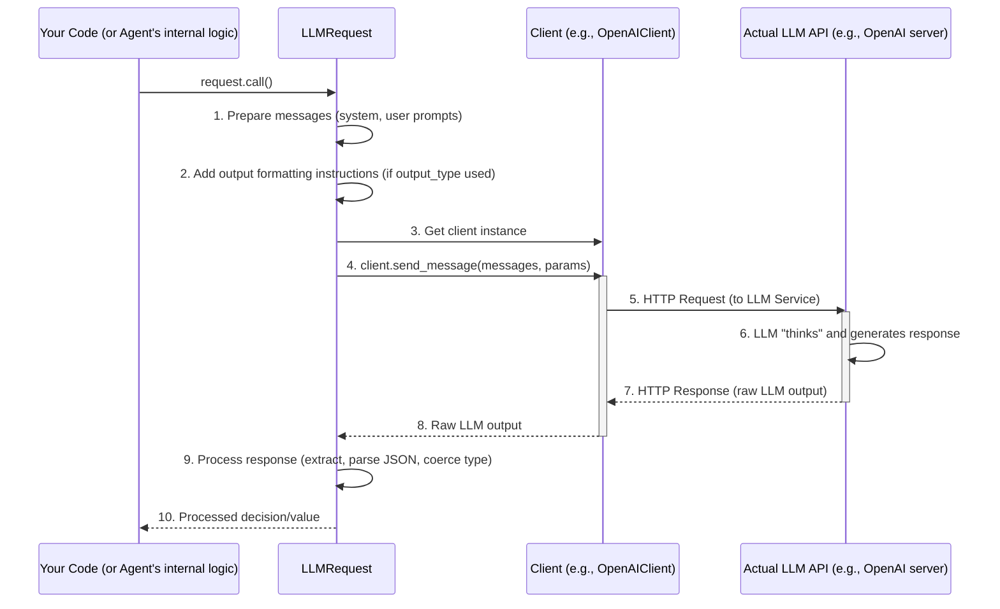

# Chapter 4: LLM Interaction (AI Brain Interface)

In [Chapter 3: TinyWorld (Environment)](03_tinyworld__environment__.md), we created "Bob's Backyard," a place for our `TinyPerson` agents, Bob and Alice, to live and interact. We saw how the `TinyWorld` helps them communicate, like when Bob says "Hello" to Alice.

But how does Bob *decide* to say "Hello"? Or, if Bob is a gardener and knows it's a sunny morning, how does he *decide* to "water the plants"? What's going on inside his digital head? This is where the **LLM Interaction (AI Brain Interface)** comes in – it's the "thinking" part of our agents!

## What is LLM Interaction? Giving Agents a "Brain"

Imagine you want your `TinyPerson` agent to be more than just a pre-programmed robot. You want them to:
*   Understand situations.
*   Reason about what to do.
*   Generate creative responses or plans.

This is a complex task! Instead of trying to write millions of "if-then-else" rules, TinyTroupe uses **Large Language Models (LLMs)** like GPT as the "brain" for the agents.

**Here's the problem this solves:**

Let's go back to Bob, our gardener in "Bob's Backyard."
1.  Bob's persona says he's a "friendly gardener."
2.  Bob "listens" (perceives) that "It's a beautiful, sunny morning!"
3.  We want Bob to intelligently decide what a friendly gardener would do on a sunny morning. Perhaps he'll think, "I should water my flowers," or say, "What a lovely day for gardening!"

The **LLM Interaction** system is how TinyTroupe enables this kind of intelligent decision-making.

**Key Components:**

1.  **Large Language Model (LLM):** This is the powerful AI "brain" (e.g., GPT-3.5, GPT-4, or similar models from Azure, etc.). It's excellent at understanding text, generating human-like responses, and even following complex instructions.
2.  **`LLMRequest`:** Think of this as a carefully written question or a "briefing document" that we prepare for the LLM. It contains all the information the LLM needs to make a good decision for our agent (like Bob's persona, the current situation, and what kind of answer we want).
3.  **Client Classes (`OpenAIClient`, `AzureClient`):** These are like the messengers. Once the `LLMRequest` is ready, a Client class takes this request, sends it over the internet to the actual LLM service, and then brings back the LLM's "intelligent" response.

When an agent like Bob needs to generate a response, plan an action, or make a decision:
*   Information about Bob (his persona, memories, current observations) is gathered.
*   This information is formatted into an `LLMRequest`.
*   A Client (like `OpenAIClient`) sends this request to the LLM.
*   The LLM "thinks" and sends back a response.
*   This response then guides Bob's actions.

## How Agents Use the "AI Brain" (Conceptual)

You've already seen this in action, even if it was hidden! Remember in [Chapter 2: TinyPerson (Agent)](02_tinyperson__agent__.md) when we made Bob `act()`?

```python
# From Chapter 2, when Bob decides what to do:
# bob.listen("It's a beautiful, sunny morning, Bob!")
# actions_bob_took = bob.act(return_actions=True)
```

When `bob.act()` is called:
1.  Bob's `TinyPerson` object internally gathers context: "I am Bob, a friendly gardener. I just heard it's a sunny morning. What should I do or say?"
2.  This context is turned into a prompt for the LLM. This process uses logic similar to what an `LLMRequest` would do.
3.  The prompt is sent to the LLM via a Client.
4.  The LLM might respond with something like: "Given it's a sunny morning, Bob should consider watering his plants or exclaim how lovely the day is."
5.  Bob's `TinyPerson` object then translates this LLM response into concrete actions (like `TALK` or `THINK`).

Most of the time, as a user of `TinyPerson`, you won't directly create `LLMRequest` objects or call `Client` methods. The `TinyPerson` handles this "brain" interaction for you. However, understanding these components helps you see how the magic happens and how you might customize it for advanced scenarios.

## The `LLMRequest`: Asking the AI Brain a Question

The `LLMRequest` (found in `tinytroupe/openai_utils.py`) is a way to structure a query to an LLM.

*   **Analogy:** Imagine you have a super-intelligent consultant (the LLM). Before you ask them a complex question, you'd prepare a briefing document. The `LLMRequest` is that document.

It typically includes:
*   `system_prompt`: General instructions or context for the LLM. For an agent, this might describe its core personality and role (e.g., "You are Bob, a helpful and friendly gardener in a simulation.").
*   `user_prompt`: The specific question or task at hand (e.g., "It is currently sunny. What is an appropriate action for you to take?").
*   `model_params` (optional): Settings that control how the LLM behaves, like `temperature` (for creativity) or `max_tokens` (for response length).
*   `output_type` (optional but powerful): A way to tell the LLM how to structure its answer. For example, you can ask for a `True`/`False` answer, a number, or even a JSON object with specific fields.

Let's see a simplified example of creating an `LLMRequest`. (You usually wouldn't do this directly when just using `TinyPerson`, but it shows the idea).

```python
from tinytroupe.openai_utils import LLMRequest
import tinytroupe.control as control # For begin/end

# You'd need to have your OpenAI/Azure API keys set up as environment variables
# for this to actually run and call an LLM.
# control.begin() # Start simulation for context, though not strictly needed for raw LLMRequest

# Imagine we want the LLM to decide an action for Bob
system_instructions = "You are Bob, a friendly gardener. You decide your next action."
current_situation = "It's a sunny morning. You are in your backyard. What should you do next?"

# Create the request
request_for_bob = LLMRequest(
    system_prompt=system_instructions,
    user_prompt=current_situation
    # We could add model_params like: model="gpt-4o", temperature=0.7
)
print("LLMRequest created. Ready to be sent to the LLM!")

# control.end()
```
This code creates an `LLMRequest` object. It hasn't been sent to the LLM yet; it's just the prepared "question."

To actually send it and get a response, you'd use the `call()` method:
```python
# ... (assuming request_for_bob from above is created and API keys are set)
# control.begin()

# Send the request to the LLM and get the response
# This uses a "Client" class (like OpenAIClient) behind the scenes.
# Note: This makes a real API call if your keys are configured.
# bobs_llm_idea = request_for_bob.call()

# print(f"LLM's idea for Bob: {bobs_llm_idea}")
# Example Output (actual output will vary):
# LLM's idea for Bob: I should check on my plants and see if they need watering.

# control.end()
```
When `request_for_bob.call()` is executed, it uses a "Client" (which we'll see next) to communicate with the LLM service and fetches the response.

## Client Classes (`OpenAIClient`, `AzureClient`): The Messengers

The Client classes (like `OpenAIClient` or `AzureClient`, also in `tinytroupe/openai_utils.py`) are responsible for the actual communication with the LLM service.

*   **Analogy:** If `LLMRequest` is your briefing document, the Client is the secure courier service (or internet connection) that delivers this document to your consultant (the LLM) and brings back their written reply.

Their main job is to:
1.  Take the formatted messages and parameters from an `LLMRequest`.
2.  Send these to the correct LLM API endpoint (e.g., OpenAI's API or Azure's OpenAI Service). This involves handling API keys, network requests, and other technical details.
3.  Receive the raw response from the LLM.
4.  Pass this raw response back to the `LLMRequest` for processing.

You usually don't interact with these clients directly. The `LLMRequest.call()` method uses a helper function `tinytroupe.openai_utils.client()` to get the currently configured client.

```python
from tinytroupe.openai_utils import client as get_llm_client

# Get the current default LLM client instance
# This depends on your 'config.ini' settings (API_TYPE = openai or azure)
llm_service_client = get_llm_client()

print(f"Currently configured LLM client: {type(llm_service_client).__name__}")
# Possible Output:
# Currently configured LLM client: OpenAIClient
# (or AzureClient if that's what's configured in your project's config.ini)
```
This shows you can find out which client is active. The `LLMRequest` uses this active client to `send_message()`.

## Under the Hood: The Journey of an LLM Request

Let's trace what happens when an agent "thinks" using this system, for example, when `LLMRequest.call()` is executed.

**Step-by-Step Flow:**

1.  **Preparation:** The `LLMRequest` object takes the `system_prompt` and `user_prompt` and assembles them into a list of "messages" that the LLM API expects.
2.  **Output Formatting (If Specified):** If an `output_type` (like `bool` or a specific structure) was given to `LLMRequest`, it adds extra instructions to the messages. This tells the LLM to respond in a specific JSON format (e.g., `{"value": ..., "justification": ..., "confidence": ...}`).
3.  **Get Client:** `LLMRequest` calls `openai_utils.client()` to get an instance of the configured client (e.g., `OpenAIClient`).
4.  **Send Message:** It then calls the client's `send_message()` method, passing the prepared messages and any model parameters.
5.  **API Call:** The Client (e.g., `OpenAIClient`) constructs the actual HTTP request and sends it to the LLM service (like OpenAI's API). This includes authentication with API keys.
6.  **LLM Processing:** The remote LLM service receives the request, processes the prompts, and generates a response.
7.  **API Response:** The LLM service sends its response back to the Client.
8.  **Client Receives:** The Client gets this raw response.
9.  **Response Processing:** The `LLMRequest` receives the raw response from the Client. It extracts the main content. If `output_type` was used, it parses the JSON response, extracts the "value" field, and tries to convert it to the desired Python type (e.g., a string "True" into a Python boolean `True`).
10. **Return Value:** Finally, `LLMRequest.call()` returns the processed, useful piece of information (the LLM's decision or answer).

Here's a diagram illustrating this flow:



**Key Code Snippets (Simplified):**

Let's peek at simplified versions of the code involved from `tinytroupe/openai_utils.py`.

*   **`LLMRequest.__init__()`**: Stores the core information.
    ```python
    # Simplified from tinytroupe/openai_utils.py
    class LLMRequest:
        def __init__(self, system_prompt:str, user_prompt:str, output_type=None, **model_params):
            self.system_prompt = system_prompt # General role/instructions
            self.user_prompt = user_prompt     # Specific task/question
            self.output_type = output_type     # Desired answer format (e.g., bool, int)
            self.model_params = model_params   # LLM settings (e.g., temperature)
            self.messages = []                 # Will hold formatted messages for LLM
            # ... other attributes to store the LLM's response later ...
    ```

*   **`LLMRequest.call()`**: Orchestrates the call.
    ```python
    # Simplified from tinytroupe/openai_utils.py
    # class LLMRequest:
        # ... (inside LLMRequest class)
        def call(self, **rendering_configs): # rendering_configs are for advanced template use
            # 1. Prepare messages
            self.messages = [
                {"role": "system", "content": self.system_prompt},
                {"role": "user", "content": self.user_prompt}
            ]
            
            # If a specific output_type is needed, add more instructions for the LLM
            if self.output_type is not None:
                # Tell LLM to respond in JSON with value, justification, confidence
                self.messages.append({"role": "user", 
                                      "content": "Your response MUST be a JSON: {\"value\": ..., \"justification\": ..., \"confidence\": ...}"})
                # More specific hints can be added based on self.output_type (bool, int, etc.)

            # 2. Get the LLM client and send the message
            active_llm_client = get_llm_client() # e.g., OpenAIClient instance
            self.model_output = active_llm_client.send_message(self.messages, **self.model_params)

            # 3. Process the response from the LLM
            raw_content = self.model_output['content'] # The LLM's text reply

            if self.output_type is not None:
                # If JSON was expected, parse it, extract 'value', and convert to Python type
                # json_response = utils.extract_json(raw_content)
                # self.response_value = json_response["value"] 
                # ... (coercion to bool, int, float happens here) ...
                # For simplicity, we'll assume it's processed correctly.
                self.response_value = f"Processed value from: {raw_content}" # Placeholder
            else:
                self.response_value = raw_content
            
            return self.response_value
    ```

*   **`OpenAIClient.send_message()` (Conceptual)**: Handles the actual API interaction.
    ```python
    # Simplified concept from tinytroupe/openai_utils.py
    # class OpenAIClient:
        # ... __init__ and other setup ...
        def send_message(self, current_messages, model="gpt-4o", **params):
            # The real method prepares API parameters from 'params'
            chat_api_params = {
                "model": model,
                "messages": current_messages,
                "temperature": params.get("temperature", 1.0),
                # ... other LLM parameters like max_tokens, top_p ...
            }
            
            # The real method calls the OpenAI (or Azure) Python library:
            # For example: response = self.client.chat.completions.create(**chat_api_params)
            # This makes the actual network request to the LLM service.
            # It also handles caching of API calls (to avoid re-requesting identical things)
            # and retries if the API fails temporarily.

            # For this tutorial, let's just imagine it gets a simple dictionary back:
            print(f"Client sending {len(current_messages)} messages to LLM model {model}...")
            # Imagine LLM responds:
            mock_llm_reply_content = "As Bob, I think I will go water the flowers now."
            return {"content": mock_llm_reply_content} # Simplified return
    ```
    The actual client code in `tinytroupe/openai_utils.py` is much more robust, dealing with API keys, selecting between OpenAI and Azure, handling various API errors, retrying requests, and even caching API call results to save time and money on repeated identical queries.

## How `TinyPerson` Uses This "Brain"

When a `TinyPerson` agent needs to "think" (e.g., during its `act()` method), its internal logic (specifically a method often called `_produce_message` or similar) performs steps analogous to creating and calling an `LLMRequest`:
1.  It gathers all relevant context: persona, recent memories, current observations, goals.
2.  It consults its [TinyMentalFaculty (Agent Cognitive Abilities)](06_tinymentalfaculty__agent_cognitive_abilities__.md). These faculties might provide specific prompt templates or define the expected structure of the LLM's response (e.g., "The LLM should output an Action object").
3.  It constructs the system and user prompts.
4.  It makes the call to the LLM (similar to `LLMRequest.call()`).
5.  It processes the LLM's response, often converting it into an internal `Action` data structure and updating its own cognitive state.

So, while you might not write `LLMRequest(...)` in your day-to-day use of `TinyPerson`, the power of LLM interaction is always there, working behind the scenes to make your agents intelligent.

## Conclusion

You've now peeked into the "brain" of TinyTroupe agents! The **LLM Interaction (AI Brain Interface)** is what allows them to think, reason, and make decisions.

You've learned:
*   Large Language Models (LLMs) act as the intelligent core for agents.
*   `LLMRequest` is like a detailed query or briefing document prepared for the LLM, containing system instructions, the specific user query, and desired output formats.
*   Client classes (like `OpenAIClient` or `AzureClient`) are the messengers that send the `LLMRequest` to the actual LLM service and retrieve the response.
*   The `TinyPerson` agent uses these components internally when it `act()`s, translating its persona, memories, and observations into prompts for the LLM.

This LLM interaction is fundamental to creating agents that feel alive and responsive.

Now that we understand how an agent can be created ([Chapter 2: TinyPerson (Agent)](02_tinyperson__agent__.md)), where it lives ([Chapter 3: TinyWorld (Environment)](03_tinyworld__environment__.md)), and how it "thinks" (this chapter!), you might wonder: how do we create many agents, or other items in our world, in a more organized way? For that, we'll explore [Chapter 5: TinyFactory (Entity Creation)](05_tinyfactory__entity_creation__.md)!

---

Generated by [AI Codebase Knowledge Builder](https://github.com/The-Pocket/Tutorial-Codebase-Knowledge)