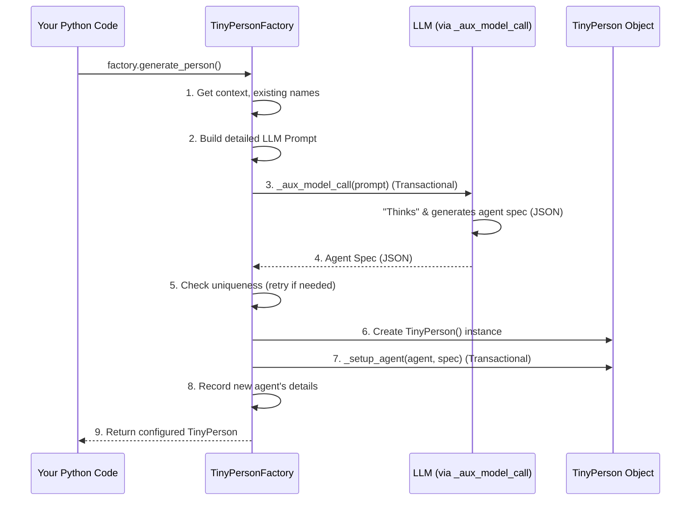

# Chapter 5: TinyFactory (Entity Creation)

Welcome back! In [Chapter 4: LLM Interaction (AI Brain Interface)](04_llm_interaction__ai_brain_interface__.md), we explored how our `TinyPerson` agents get their "smarts" using Large Language Models. We saw how they can "think" and make decisions.

Now, imagine you want to create a whole village full of `TinyPerson` characters, or a team of astronauts for a space mission. Defining each one manually – their name, personality, backstory, skills – would take a lot of time and effort! This is where the **`TinyFactory`** comes to the rescue.

## What's a TinyFactory? Your Character Generator!

Think of a **`TinyFactory`** (and specifically, a `TinyPersonFactory`) as a blueprint or a "character generator" for your simulation. Instead of you meticulously crafting every single detail for every new agent, you give the factory a general idea or theme, and it uses its "smarts" (often with the help of an LLM) to produce new, unique agents for you.

**Here's the problem it solves:**

Let's say you're building a simulation of a "Small Medieval Village."
1.  You need villagers: a baker, a blacksmith, a farmer, some children, an elder, etc.
2.  You want them to have different personalities, simple backstories, and skills relevant to the village.
3.  Creating 10, 20, or even 50 such villagers by hand would be very repetitive!

A `TinyPersonFactory` can take your "Small Medieval Village" theme and automatically generate diverse and contextually relevant villagers for you.

## Key Ideas of the TinyFactory

Our `TinyPersonFactory` works based on these main ideas:

1.  **Context is Key:** You provide a "context text" to the factory, like "a bustling fantasy marketplace" or "a team of scientists on a remote arctic expedition." This context guides the kind of agents it creates.
2.  **LLM-Powered Details:** The factory uses an [LLM Interaction (AI Brain Interface)](04_llm_interaction__ai_brain_interface__.md) to dream up the specifics for each new agent: their name, personality traits, a brief background, and relevant skills, all fitting the given context.
3.  **Striving for Uniqueness:** The factory tries to make each generated agent different from the others, especially by giving them unique names and "minibios" (a short summary of who they are).
4.  **Blueprint for Creation:** It acts like a mold. Once you've set up your factory with a specific context, you can ask it to produce one agent, or many, all fitting that theme.

## Using the `TinyPersonFactory`: Populating Our Village!

Let's create a `TinyPersonFactory` to help us populate a small, peaceful village.

**1. Setting Up (A Familiar Start)**

As always, we begin by initializing our [Simulation (Controller)](01_simulation__controller__.md) and importing what we need.

```python
import tinytroupe.control as control
from tinytroupe.factory import TinyPersonFactory # Our star for today!
from tinytroupe.agent import TinyPerson # To see our creations
from tinytroupe.environment import TinyWorld # Where they will live

# Start the simulation (or load from cache)
control.begin(cache_path="my_village_story.cache.json")

print("Simulation ready. Let's build a factory!")
```
This prepares TinyTroupe for action.

**2. Creating a `TinyPersonFactory`**

Now, let's create our factory. We need to give it a `context_text` that describes the theme for the agents it will generate.

```python
# The theme for our factory
village_context = "A small, peaceful farming village nestled in a green valley, known for its friendly folk and apple orchards."

# Create the factory!
village_folk_factory = TinyPersonFactory(context_text=village_context)

print(f"Factory created for: '{village_context}'")
```
We now have `village_folk_factory`, ready to produce villagers based on our description!

**3. Generating One Villager**

Let's ask the factory to generate our first villager.

```python
print("\nGenerating our first villager...")
# The factory will use the LLM to come up with details
first_villager = village_folk_factory.generate_person()

if first_villager:
    print(f"Meet {first_villager.name}!")
    print(f"  Occupation: {first_villager.get('occupation', {}).get('title', 'Not specified')}")
    print(f"  Personality: {first_villager.get('personality_traits', [])}")
else:
    print("Could not generate a villager this time.")
```
When `generate_person()` is called:
*   The factory uses its `context_text` and asks the LLM to invent a character fitting that theme.
*   It then creates a `TinyPerson` object with the generated details.
*   You'll get back a `TinyPerson` instance! The output will vary each time due to the LLM, but it might be someone like "Elara Meadowlight, the friendly village herbalist."

**4. Generating Many Villagers**

Creating one is great, but the real power comes when generating a group!

```python
print("\nGenerating three more villagers...")
# The factory will try to make them unique
more_villagers = village_folk_factory.generate_people(number_of_people=3, verbose=True)

if more_villagers:
    print(f"\nWe now have {len(more_villagers)} new villagers:")
    for villager in more_villagers:
        print(f"- {villager.name}, the {villager.get('occupation', {}).get('title', 'villager')}")
else:
    print("Could not generate more villagers.")
```
The `generate_people(number_of_people=3)` method calls `generate_person()` three times. The `verbose=True` argument will print a little summary (the "minibio") of each person as they are generated. The factory will try to ensure these new villagers have different names and characteristics from each other and from `first_villager`.

**5. Adding Villagers to a World**

Once you have your generated agents, you can add them to a [TinyWorld (Environment)](03_tinyworld__environment__.md) just like any other `TinyPerson`.

```python
# Create a world for our villagers
village_green = TinyWorld(name="Greenfield Village Green")

# Add the villagers to the world
if first_villager:
    village_green.add_agent(first_villager)
for villager in more_villagers:
    village_green.add_agent(villager)

print(f"\nAll generated villagers added to {village_green.name}.")
print(f"Current inhabitants: {[agent.name for agent in village_green.agents]}")
```
Now your generated villagers are ready to interact in their new home!

**6. Don't Forget to End!**

```python
control.end()
print("Village story simulation ended and saved!")
```

## How Does a `TinyPersonFactory` Work Its Magic?

It might seem like magic, but there's a clear process happening "under the hood" when you ask the factory to generate a person.

**The Journey of Creating a New Person (Simplified):**

When `village_folk_factory.generate_person()` is called:

1.  **Gathering Ingredients:** The factory looks at its `context_text` (e.g., "small, peaceful farming village..."). It also keeps a list of names and short descriptions ("minibios") of people it has already created to avoid making duplicates.
2.  **Writing the "Recipe" (Prompt Construction):** It prepares a detailed set of instructions (a "prompt") for the [LLM Interaction (AI Brain Interface)](04_llm_interaction__ai_brain_interface__.md). This prompt is like asking the LLM:
    *   "You are helping create characters for a simulation."
    *   "The theme is: *\[our context_text\]*."
    *   "Please generate the details (name, age, occupation, personality, brief backstory) for *one new* person."
    *   "Make sure their name is *not* one of these: *\[list of already used names\]*."
    *   "Here are some examples of the kind of JSON output I expect: *\[shows example agent specifications\]*."
    (This prompt is built using a template file, often a `.mustache` file like `prompts/generate_person.mustache`.)
3.  **Asking the "Chef" (LLM Call):** The factory sends this carefully crafted prompt to the LLM. This is done via a method called `_aux_model_call`, which is `@transactional`. This means if you ask for a person with the *exact same* specific inputs again, the [Simulation (Controller)](01_simulation__controller__.md) might use a cached LLM response, saving time and resources!
4.  **Getting the "Dish" (LLM Response):** The LLM "thinks" and sends back its creation – a JSON structure containing the details for the new person (e.g., `{"name": "Barnaby Grumbleseed", "age": 55, "occupation": {"title": "Apple Farmer"}, ...}`).
5.  **Quality Check (Uniqueness):** The factory checks if the `name` provided by the LLM has already been used. If it has, it might try asking the LLM again (up to a certain number of `attempts`) to get a unique one.
6.  **Assembling the Agent:** If a unique and valid specification is received, the factory creates a brand new `TinyPerson` object.
7.  **Setting Up the Agent:** It then uses a method called `_setup_agent` to take all the details from the LLM's JSON response (name, occupation, personality traits, etc.) and apply them to the new `TinyPerson` object (using `agent.include_persona_definitions()`). This method is also `@transactional`.
8.  **Remembering the Newbie:** The factory adds the new person's name and "minibio" to its internal lists so it can avoid duplicates next time.
9.  **Presenting the Agent:** Finally, the newly created and configured `TinyPerson` is returned to you!

Here's a simplified diagram of this process:



**Key Code Components (Simplified View):**

Let's look at some parts of `tinytroupe/factory/tiny_person_factory.py` that make this happen.

*   **`__init__(self, context_text, ...)`:**
    When you create `village_folk_factory = TinyPersonFactory(...)`:
    ```python
    # Simplified from tinytroupe/factory/tiny_person_factory.py
    class TinyPersonFactory(TinyFactory):
        def __init__(self, context_text, simulation_id:str=None):
            super().__init__(simulation_id) # Initializes base factory things
            # Path to the prompt template (like a fill-in-the-blanks form for the LLM)
            self.person_prompt_template_path = os.path.join(
                os.path.dirname(__file__), 'prompts/generate_person.mustache'
            )
            self.context_text = context_text # Stores your theme
            self.generated_minibios = [] # To track generated people
            self.generated_names = []    # To track generated names
    ```
    This sets up the factory with your theme and prepares to keep track of generated agents to ensure diversity.

*   **`generate_person(self, ...)`:**
    This is the main method you call.
    ```python
    # Simplified from tinytroupe/factory/tiny_person_factory.py
    # class TinyPersonFactory:
        # def generate_person(self, agent_particularities:str=None, ... attepmpts:int=10):
            # ... (loads example agent JSONs like Friedrich_Wolf and Sophie_Lefevre) ...

            # Uses the "chevron" library to fill in the .mustache prompt template
            # with current context, examples, and lists of already generated names/minibios.
            prompt = chevron.render(open(self.person_prompt_template_path).read(), {
                "context": self.context_text,
                "agent_particularities": agent_particularities, # Optional extra details
                "example_1": json.dumps(example_1["persona"], indent=4),
                "example_2": json.dumps(example_2["persona"], indent=4),
                "already_generated_minibios": self.generated_minibios,
                "already_generated_names": TinyPerson.all_agents_names() # All names in sim
            })

            # Loop to try generating a unique agent (up to 'attepmpts' times)
            # Inside the loop, it calls an auxiliary function that calls the LLM:
            #   message = self._aux_model_call(messages=[...prompt...], ...)
            #   result = utils.extract_json(message["content"]) # Gets the JSON spec
            #   if result["name"] not in self.generated_names:
            #       agent_spec = result; break # Found a unique one!
            # ... (Loop logic for retries is more complex in actual code) ...

            # If a unique spec was found (agent_spec is not None):
            #   person = TinyPerson(agent_spec["name"]) # Create the agent object
            #   self._setup_agent(person, agent_spec)    # Configure it with LLM details
            #   self.generated_minibios.append(person.minibio())
            #   self.generated_names.append(person.get("name").lower())
            #   return person
            # return None # If no unique agent could be made
    ```
    It carefully prepares a very detailed prompt for the LLM, including examples of what a good agent specification looks like and what names to avoid. Then, it calls the LLM, creates the `TinyPerson`, and sets them up.

*   **`_aux_model_call(self, messages, ...)`:**
    This is a helper method that actually makes the call to the LLM.
    ```python
    # Simplified from tinytroupe/factory/tiny_person_factory.py
    # class TinyPersonFactory:
        # @transactional # IMPORTANT: This LLM call is cached!
        # def _aux_model_call(self, messages, temperature, ...):
            # return openai_utils.client().send_message(
            #     messages,
            #     temperature=temperature,
            #     # ... other LLM params ...
            #     response_format={"type": "json_object"} # Asks LLM for JSON
            # )
    ```
    The `@transactional` decorator is key here. It means the actual call to the LLM is managed by the [Simulation (Controller)](01_simulation__controller__.md). If the same prompt (with the same context, examples, and "already generated" lists) is sent again, the controller can reuse the cached LLM response. This saves time and API costs.

*   **`_setup_agent(self, agent, configuration)`:**
    This helper configures the newly created `TinyPerson` object.
    ```python
    # Simplified from tinytroupe/factory/tiny_person_factory.py
    # class TinyPersonFactory:
        # @transactional # This setup step is also cached!
        # def _setup_agent(self, agent, configuration):
            # agent.include_persona_definitions(configuration)
            # # 'configuration' is the JSON dict received from the LLM
            # # This method populates the agent's persona.
    ```
    This method takes the JSON data from the LLM (the `configuration`) and uses it to define the `agent`'s persona (their traits, background, etc.). Because it's also `@transactional`, the act of applying a specific configuration to a specific (new) agent can be cached and replayed consistently.

The reason `generate_person` itself isn't transactional, but its helper methods `_aux_model_call` and `_setup_agent` are, is a bit subtle. We always want `generate_person` to try and create a *new* `TinyPerson` object. If `generate_person` itself were cached, then calling it a second time might just give you back the *exact same first agent object* if the inputs were identical, which isn't what we want for *generating multiple unique agents*. By caching the LLM call and the setup step separately, we get efficiency while still ensuring new agent objects are created.

## Conclusion

You've now learned about the **`TinyFactory`** (specifically `TinyPersonFactory`), your powerful assistant for populating simulations!

You now know:
*   It's like a "character generator" that uses a given `context_text` and an [LLM Interaction (AI Brain Interface)](04_llm_interaction__ai_brain_interface__.md) to create new `TinyPerson` agents.
*   How to create a factory: `my_factory = TinyPersonFactory(context_text="My simulation theme")`.
*   How to generate a single agent: `agent = my_factory.generate_person()`.
*   How to generate multiple agents: `agents_list = my_factory.generate_people(number_of_people=5)`.
*   A bit about how it works internally, using prompt templates, LLM calls, and transactional caching to efficiently create diverse agents.

With `TinyFactory`, creating rich and varied populations for your tiny worlds becomes much easier. Now that we can create these agents, what kinds of specific "thinking abilities" or skills can we give them?

That's what we'll explore next in [Chapter 6: TinyMentalFaculty (Agent Cognitive Abilities)](06_tinymentalfaculty__agent_cognitive_abilities__.md)!

---

Generated by [AI Codebase Knowledge Builder](https://github.com/The-Pocket/Tutorial-Codebase-Knowledge)