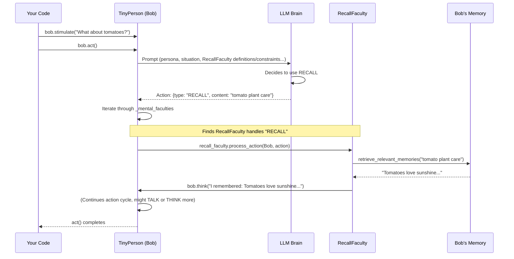

# Chapter 6: TinyMentalFaculty (Agent Cognitive Abilities)

Welcome back! In [Chapter 5: TinyFactory (Entity Creation)](05_tinyfactory__entity_creation__.md), we learned how to use a `TinyPersonFactory` to easily create a whole village of diverse `TinyPerson` agents. We can generate Bob the gardener, Alice the baker, and many more, each with their own unique persona.

But what makes these agents truly "smart" or capable beyond just basic thinking and talking? How can Bob specifically remember a gardening tip he learned, or look up information in a virtual "gardening book"? This is where **`TinyMentalFaculty`** comes in – these are special "cognitive abilities" that enhance what our agents can do.

## What's a TinyMentalFaculty? Giving Agents Special Skills!

Imagine your `TinyPerson` agents are like people. People have general intelligence, but they also have specific skills or senses. Some people have a great memory for faces, others are good at using tools, and some can quickly find information in books.

A **`TinyMentalFaculty`** in TinyTroupe is like one of these specialized cognitive skills or modules. Think of them as different mental tools or senses that an agent can possess. They allow agents to perform more complex and varied actions than just general thinking.

**Here's a simple problem they solve:**

Let's say we have Bob, our friendly gardener from earlier chapters.
1.  Bob learns an important fact: "Roses need at least 6 hours of sunlight."
2.  Later, someone asks Bob, "What do roses need?"
3.  We want Bob to not just make up an answer, but to specifically *recall* the fact he learned. This requires a "memory recall" skill.
4.  Alternatively, if Bob needs to know about "companion planting for tomatoes," and he has access to a "GardeningPedia" document, we'd want him to be able to *consult* that document. This requires a "document access" skill.

`TinyMentalFaculty` provides these kinds of specific abilities.

## Key Ideas of TinyMentalFaculty

1.  **Specialized Modules:** Each faculty is a focused skill. It's not general intelligence, but a particular cognitive function.
2.  **Enhancing Capabilities:** Faculties extend what an agent can do. Without them, an agent might only be able to `THINK` or `TALK` based on its immediate perceptions and general persona. With faculties, it can `RECALL` specific memories, `CONSULT` documents, or `USE_TOOL`s.
3.  **Examples of Faculties:**
    *   `RecallFaculty`: Allows an agent to search its own [TinyMemory (Agent Memory)](07_tinymemory__agent_memory__.md) for specific information using a "mental query."
    *   `FilesAndWebGroundingFaculty`: Enables an agent to list and read the content of external files (like text documents) or web pages provided to it. This "grounds" its knowledge in external sources.
    *   `TinyToolUse`: Allows an agent to interact with [TinyTool (Agent Capability Extenders)](08_tinytool__agent_capability_extenders__.md), which are external tools that can perform actions (e.g., a calculator, a search engine).
4.  **Integration with Agent's "Brain":** When an agent decides what to do (using the [LLM Interaction (AI Brain Interface)](04_llm_interaction__ai_brain_interface__.md)), it's made aware of the faculties it possesses. The LLM can then choose to use one of these faculties by outputting a specific type of action (e.g., a `RECALL` action or a `CONSULT` action).

## Using TinyMentalFaculties: Supercharging Bob!

Let's see how we can equip Bob with some mental faculties and observe how they change his behavior.

**1. Setting Up the Simulation and Bob**

First, the usual setup:

```python
import tinytroupe.control as control
from tinytroupe.agent import TinyPerson
from tinytroupe.agent.mental_faculty import RecallFaculty, FilesAndWebGroundingFaculty # Our new stars!
import os # For file operations

# Start our simulation
control.begin(cache_path="bob_faculties_story.cache.json")

# Make sure we see Bob's detailed thoughts and actions
TinyPerson.communication_display = True

# Create Bob
bob = TinyPerson(name="Bob")
bob.define("occupation", {"title": "Gardener"})
bob.define("personality_traits", ["curious", "eager to learn"])

print(f"Meet {bob.name}, our {bob.get('occupation')['title']}.")
```
This creates Bob, a curious gardener. Right now, he has default faculties, but we'll add more specialized ones.

**2. Equipping Bob with `RecallFaculty`**

Let's give Bob the ability to specifically recall information. `TinyPerson` agents have a list called `_mental_faculties`. We can add our new faculty there.

```python
# Create an instance of RecallFaculty
recall_skill = RecallFaculty()

# Add this skill to Bob's mental faculties
bob._mental_faculties.append(recall_skill) # Add to his internal list of skills

print(f"{bob.name} now has the {recall_skill.name} skill!")
```
Now, Bob has the `RecallFaculty`. How does this help? When Bob `act()`s, his "brain" (the LLM) will be informed that he has a "RECALL" capability.

**Scenario: Bob Learns and Recalls**

First, let's have Bob learn something important. We'll tell him directly, and it will get stored in his [TinyMemory (Agent Memory)](07_tinymemory__agent_memory__.md).

```python
# Bob learns a fact (this gets stored in his memory)
bob.listen("Bob, remember this: 'Tomato plants love sunshine and well-drained soil.'")
print(f"\n{bob.name} has learned about tomato plants.")
```
Now, let's prompt Bob to act in a way that might make him use his recall skill. We'll ask him a question that the learned fact can answer.

```python
print(f"\nNow, let's ask Bob about tomatoes...")
# We use 'stimulate' to give Bob a direct prompt for his next action cycle
bob.stimulate([{"type": "USER_REQUEST", "content": "Bob, what do tomato plants need?"}])
bob.act() # Bob thinks and acts
```
When `bob.act()` runs:
*   Bob's internal prompt to the LLM will include: "You are Bob... You have a RECALL faculty: you can recall information from your memory... You just heard a USER_REQUEST: 'Bob, what do tomato plants need?' What do you do?"
*   The LLM, seeing the RECALL faculty and the question, might decide the best first step is to try and recall information about "tomato plants."
*   It would output an action like: `{type: "RECALL", content: "tomato plant needs"}`.
*   Bob's `RecallFaculty` will process this action, search his memory, and find the stored fact.
*   Bob will then "think" about what he recalled and likely `TALK` about it.

You might see output like this (simplified):
```
...
Bob thinks: I should try to recall information about 'tomato plant needs'.
Bob performs action: [RECALL] content: tomato plant needs
Bob (RecallFaculty): Recalling information related to 'tomato plant needs'. Found 1 relevant memories.
Bob thinks: I have remembered the following information...: - Tomato plants love sunshine and well-drained soil.
Bob thinks: Now I can answer the question.
Bob performs action: [TALK] content: Tomato plants love sunshine and well-drained soil!
...
```
Bob successfully used his `RecallFaculty`!

**3. Equipping Bob with `FilesAndWebGroundingFaculty`**

Now, let's give Bob the ability to consult external documents. First, we need a document for him to read.

```python
# Create a dummy gardening tips file
file_content = "Roses: Prune in late winter. Water deeply.\nLavender: Prefers full sun and dry soil."
file_name = "gardening_tips.txt"
with open(file_name, "w") as f:
    f.write(file_content)

# Create the faculty, telling it where to find documents (current folder '.')
grounding_skill = FilesAndWebGroundingFaculty(folders_paths=["."]) # Looks in current directory

# Add this skill to Bob
bob._mental_faculties.append(grounding_skill)
print(f"\n{bob.name} now has the {grounding_skill.name} skill! He can read files from '.'")
```
Bob now has `FilesAndWebGroundingFaculty` and knows it can look for files in the current directory (where `gardening_tips.txt` is).

**Scenario: Bob Consults His Gardening Tips**

Let's say Bob needs to know about pruning roses.

```python
print(f"\nBob needs to know about rose care...")
bob.stimulate([{"type": "USER_REQUEST", "content": "Bob, how do I care for roses?"}])
bob.act() # Bob thinks and acts
```
When `bob.act()` runs this time:
*   Bob's prompt to the LLM will also include definitions for `LIST_DOCUMENTS` and `CONSULT` from the `FilesAndWebGroundingFaculty`.
*   The LLM might decide to:
    1.  `LIST_DOCUMENTS` to see what's available.
    2.  See `gardening_tips.txt` and decide to `CONSULT` it.
    3.  Read the content about roses.
    4.  `TALK` about rose care.

You might see output like this (simplified):
```
...
Bob thinks: I need to find out about rose care. I should check my available documents.
Bob performs action: [LIST_DOCUMENTS]
Bob (FilesAndWebGroundingFaculty): I have the following documents available to me: ['gardening_tips.txt', ...]
Bob thinks: 'gardening_tips.txt' sounds relevant. I'll consult it.
Bob performs action: [CONSULT] content: gardening_tips.txt
Bob (FilesAndWebGroundingFaculty): I have read the following document: SOURCE: gardening_tips.txt ... CONTENT: Roses: Prune in late winter. Water deeply...
Bob thinks: Okay, roses need pruning in late winter and deep watering.
Bob performs action: [TALK] content: For roses, you should prune them in late winter and water them deeply.
...
```
Bob successfully used `FilesAndWebGroundingFaculty` to find information!

**4. Cleaning up and Ending**
```python
# Clean up the dummy file
if os.path.exists(file_name):
    os.remove(file_name)

control.end()
print("\nSimulation ended. Bob's new skills are impressive!")
```

## How Do TinyMentalFaculties Work? Under the Hood

It's not magic! It's a well-defined interaction between the `TinyPerson`, the faculties, and the [LLM Interaction (AI Brain Interface)](04_llm_interaction__ai_brain_interface__.md).

**A Faculty-Powered Action Cycle:**

1.  **Agent Gathers Context:** When `agent.act()` is called, the `TinyPerson` prepares a prompt for the LLM.
2.  **Faculty Information:** Crucially, this prompt includes information about all the agent's `_mental_faculties`. For each faculty, its `actions_definitions_prompt()` (what actions it enables, e.g., "RECALL: recall info...") and `actions_constraints_prompt()` (how/when to use it, e.g., "Before saying you don't know, try to RECALL...") are added to the LLM's instructions.
3.  **LLM Decides:** The LLM receives this rich prompt. Based on the situation and the available faculty actions, it might decide to use one of them. It then generates an action in a specific format, e.g., `{"type": "RECALL", "content": "query text"}` or `{"type": "CONSULT", "content": "document_name"}`.
4.  **Agent Receives Action:** The `TinyPerson` gets this structured action back from the LLM.
5.  **Faculty Processing:** The `TinyPerson` then iterates through its list of `_mental_faculties`. For each faculty, it calls the faculty's `process_action(agent, action)` method.
6.  **Action Handling:** If a faculty recognizes the action `type` (e.g., `RecallFaculty` recognizes "RECALL"), its `process_action` method executes the specialized logic (like searching memory or reading a file). It then typically returns `True` to signal that it handled the action.
7.  **Outcome:** The faculty's action usually results in the agent "thinking" new thoughts (which are added to its internal message buffer) or directly affecting its state. The agent then continues its action cycle, possibly leading to a `TALK` action or `DONE`.

Here's a simplified sequence diagram for Bob using `RecallFaculty`:



**Key Code Snippets (from `tinytroupe/agent/mental_faculty.py`):**

Let's peek at the structure.

*   **`TinyMentalFaculty` (Base Class):**
    ```python
    # Simplified from tinytroupe/agent/mental_faculty.py
    class TinyMentalFaculty:
        def __init__(self, name: str, ...):
            self.name = name
            # ...
        
        def process_action(self, agent, action: dict) -> bool:
            # Subclasses implement this: Did I handle this action?
            raise NotImplementedError 

        def actions_definitions_prompt(self) -> str:
            # Subclasses implement this: What actions can I do?
            raise NotImplementedError

        def actions_constraints_prompt(self) -> str:
            # Subclasses implement this: How/when should you use my actions?
            raise NotImplementedError
    ```
    This base class defines the interface. Each faculty must tell the agent (and thus the LLM) what actions it offers and how they should be used, and it must be able to process those actions.

*   **`RecallFaculty.process_action()` (Conceptual):**
    ```python
    # Simplified concept for RecallFaculty
    # class RecallFaculty(TinyMentalFaculty):
        # def process_action(self, agent, action: dict) -> bool:
            # if action['type'] == "RECALL" and action['content'] is not None:
                # query = action['content']
                # memories = agent.retrieve_relevant_memories(relevance_target=query)
                # if memories:
                #     agent.think(f"I recalled: {memories}")
                # else:
                #     agent.think(f"I couldn't recall anything about '{query}'.")
                # return True # I handled this action
            # return False # This action is not for me
    ```
    If the action is "RECALL", it uses the agent's memory retrieval capabilities and then makes the agent `think` about what it found.

*   **`RecallFaculty.actions_definitions_prompt()` (Conceptual):**
    ```python
    # Simplified concept for RecallFaculty
    # class RecallFaculty(TinyMentalFaculty):
        # def actions_definitions_prompt(self) -> str:
            # return "- RECALL: Recall info from memory. Specify a 'mental query'."
    ```
    This tells the LLM: "Hey, you can use a RECALL action!"

*   **`FilesAndWebGroundingFaculty.__init__()` (Conceptual):**
    ```python
    # Simplified concept for FilesAndWebGroundingFaculty
    # from tinytroupe.agent.grounding import LocalFilesGroundingConnector
    # class FilesAndWebGroundingFaculty(TinyMentalFaculty):
        # def __init__(self, folders_paths: list=None, ...):
            # super().__init__("Local Files and Web Grounding")
            # self.local_files_connector = LocalFilesGroundingConnector(folders_paths)
            # # ... also a web_connector ...
    ```
    It sets up connectors (like `LocalFilesGroundingConnector` from `tinytroupe/agent/grounding.py`) to actually access the files.

*   **`FilesAndWebGroundingFaculty.process_action()` (Conceptual for CONSULT):**
    ```python
    # Simplified concept for FilesAndWebGroundingFaculty
    # class FilesAndWebGroundingFaculty(TinyMentalFaculty):
        # def process_action(self, agent, action: dict) -> bool:
            # if action['type'] == "CONSULT" and action['content'] is not None:
                # doc_name = action['content']
                # content_parts = self.local_files_connector.retrieve_by_name(doc_name)
                # # ... (also try web_connector) ...
                # if content_parts:
                #     agent.think(f"I consulted '{doc_name}' and found: {content_parts}")
                # else:
                #     agent.think(f"I couldn't find document '{doc_name}'.")
                # return True
            # # ... (handle LIST_DOCUMENTS similarly) ...
            # return False
    ```
    If the action is "CONSULT", it uses its file connector to retrieve the document content.

**How `TinyPerson` Uses Faculties:**
Inside the `TinyPerson` class (not shown in the provided snippets, but core to its logic):
1.  **Storage:** A `TinyPerson` instance usually has a list like `self._mental_faculties` to hold its equipped faculties.
2.  **Prompt Generation:** When preparing the prompt for the LLM (often in a method like `_get_llm_messages()` or `_produce_message()`), the `TinyPerson` iterates through `self._mental_faculties`. It collects the strings from `faculty.actions_definitions_prompt()` and `faculty.actions_constraints_prompt()` and adds them to the system message for the LLM. This makes the LLM aware of all specialized actions.
3.  **Action Dispatch:** After the LLM returns a suggested action (e.g., `{type: "RECALL", ...}`), the `TinyPerson`'s `act()` method (or a helper it calls) will loop through `self._mental_faculties` again. It calls `faculty.process_action(self, current_action)` on each one. If any faculty returns `True`, it means that faculty handled the action, and the loop can stop for that specific action.

This systematic approach allows `TinyPerson` agents to be extended with new cognitive abilities modularly.

## Conclusion

You've now learned about **`TinyMentalFaculty`**, the specialized cognitive abilities that make your TinyTroupe agents more versatile and intelligent!

You've discovered:
*   Faculties are like mental tools or senses (e.g., `RecallFaculty` for memory search, `FilesAndWebGroundingFaculty` for reading documents).
*   They allow agents to perform more complex and specific actions beyond general thinking.
*   How to equip an agent with faculties and see them in action.
*   The basic mechanism: faculties provide action definitions to the LLM, and then process those specific actions when the LLM chooses to use them.

These faculties greatly enrich the behavior of your agents. For instance, the `RecallFaculty` allows an agent to consciously dip into its past experiences and knowledge. But how is that knowledge structured and stored?

In our next chapter, we'll dive deeper into the agent's mind and explore [Chapter 7: TinyMemory (Agent Memory)](07_tinymemory__agent_memory__.md)!

---

Generated by [AI Codebase Knowledge Builder](https://github.com/The-Pocket/Tutorial-Codebase-Knowledge)