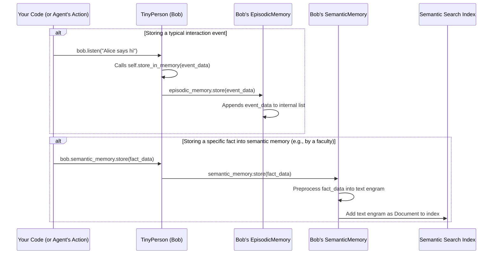

# Chapter 7: TinyMemory (Agent Memory)

Welcome back! In [Chapter 6: TinyMentalFaculty (Agent Cognitive Abilities)](06_tinymentalfaculty__agent_cognitive_abilities__.md), we equipped our `TinyPerson` agents with special skills like `RecallFaculty` and `FilesAndWebGroundingFaculty`, allowing them to perform more complex mental actions. We saw Bob use these faculties to remember specific information and consult documents.

But where does this information "live" inside Bob? How does he remember the flow of a conversation or facts he has learned? This is where **`TinyMemory`** comes into play – it's the foundation for an agent's ability to remember.

## What is TinyMemory? Giving Agents a Past!

Imagine you're talking to a friend. If they forgot everything you said a minute ago, the conversation wouldn't make much sense, right? Or if they learned an important fact yesterday but couldn't recall it today, that wouldn't be very helpful.

**`TinyMemory`** in TinyTroupe provides agents with the ability to remember past experiences, conversations, and learned knowledge. This makes them more consistent, allows them to learn, and helps them make more informed decisions.

**Here's a simple use case:**
1.  **Remembering a Conversation:** Alice tells Bob, "I'm going to the park." A moment later, Bob wants to ask Alice something about her trip to the park. He needs to remember she mentioned going there.
2.  **Remembering a Fact:** Bob learns a new gardening tip: "Lavender plants prefer dry soil." Later, when planning his garden, he should be able to recall this fact.

`TinyMemory` helps agents manage these kinds of memories. It's often divided into two main types:

*   **`EpisodicMemory`**: This is like an agent's personal diary. It remembers specific events, observations, and conversations in the order they happened. "First Alice said X, then I thought Y, then Alice did Z."
*   **`SemanticMemory`**: This is like an agent's personal knowledge base or encyclopedia. It stores general facts, concepts, and learned information, not necessarily tied to a specific time or event. "Lavender needs dry soil." "The sun rises in the east."

## How TinyPerson Uses Memory

Your `TinyPerson` agents come equipped with both `EpisodicMemory` and `SemanticMemory` by default. You've already been seeing them in action!

**1. Setting Up Bob (Our Familiar Gardener)**

Let's start with Bob.

```python
import tinytroupe.control as control
from tinytroupe.agent import TinyPerson
from tinytroupe.agent.memory import EpisodicMemory, SemanticMemory # Import memory types

# Start our simulation
control.begin(cache_path="bob_memory_story.cache.json")

# See Bob's detailed thoughts and actions
TinyPerson.communication_display = True

# Create Bob
bob = TinyPerson(name="Bob")
bob.define("occupation", {"title": "Gardener"})
bob.define("personality_traits", ["friendly", "attentive"])

print(f"Meet {bob.name}, ready to make some memories!")
```
Bob now exists, and he has an `episodic_memory` and a `semantic_memory` instance ready to be used.

**2. Episodic Memory: Remembering Conversations**

Every time Bob `listen()`s to something or `act()`s, these events are automatically stored in his `episodic_memory`. This memory helps him keep track of the immediate context.

```python
# Alice (simulated by us) talks to Bob
print("\n--- Bob's Conversation with Alice (Episodic Memory) ---")
bob.listen("Hi Bob! It's a lovely day, isn't it?", source="Alice")
bob.listen("I was thinking of planting some new flowers.", source="Alice")

# Now, let Bob act. He'll "remember" what Alice just said.
bob.act()
```
When `bob.act()` is called:
*   His `TinyPerson` object automatically uses its `episodic_memory` to fetch recent interactions.
*   This recent history (Alice's two statements) becomes part of the prompt sent to the [LLM Interaction (AI Brain Interface)](04_llm_interaction__ai_brain_interface__.md).
*   Bob's response will naturally follow the conversation because he "remembers" the latest turns. He might say something like, "Hi Alice! It is a lovely day. What kind of flowers are you thinking of planting?"

His `episodic_memory` (a list of interactions) might look something like this internally (simplified):
```
[
  {"role": "user", "content": {"stimuli": [{"type": "CONVERSATION", "content": "Hi Bob! It's a lovely day, isn't it?", "source": "Alice"}]}, ...},
  {"role": "user", "content": {"stimuli": [{"type": "CONVERSATION", "content": "I was thinking of planting some new flowers.", "source": "Alice"}]}, ...},
  {"role": "assistant", "content": {"action": {"type": "TALK", "content": "Hi Alice! Yes, it is a lovely day. What flowers are you thinking of?", "target":"Alice"}, ...}, ...}
]
```
This chronological record is crucial for coherent dialogue and behavior.

**3. Semantic Memory: Remembering Facts**

`SemanticMemory` is for storing and retrieving more general knowledge or specific facts that Bob learns. Unlike episodic memory, which is automatically updated by `listen()` and `act()`, `semantic_memory` is often populated more deliberately, perhaps by a [TinyMentalFaculty (Agent Cognitive Abilities)](06_tinymentalfaculty__agent_cognitive_abilities__.md) or by you directly telling the agent to store a piece of information semantically.

Let's simulate Bob learning a specific fact and storing it in his semantic memory. The `RecallFaculty` we learned about in Chapter 6 would typically use semantic memory to find relevant facts.

```python
print("\n--- Bob Learning a Fact (Semantic Memory) ---")
# The fact Bob learns
fact_about_lavender = "Lavender plants require full sun and well-drained, slightly alkaline soil to thrive."

# We'll directly store this in Bob's semantic memory.
# A faculty might do this after processing information.
# The 'value' needs to be in a dictionary format that SemanticMemory can process.
# We'll simulate it as if Bob concluded this fact himself (a 'THOUGHT' stimulus).
semantic_engram = {
    'type': 'stimulus', # Could also be 'action' or other types
    'content': {"type": "THOUGHT", "content": fact_about_lavender, "source": "Bob"},
    'simulation_timestamp': bob.iso_datetime() # Gets current simulation time
}
bob.semantic_memory.store(semantic_engram) # Store it directly
print(f"{bob.name} has learned and stored in semantic memory: '{fact_about_lavender}'")

# Now, let's try to retrieve information relevant to "lavender soil requirements"
# This is what a RecallFaculty might do internally.
query = "What kind of soil do lavender plants need?"
relevant_facts = bob.semantic_memory.retrieve_relevant(relevance_target=query, top_k=1)

if relevant_facts:
    print(f"\nWhen asked about '{query}', Bob's semantic memory recalled:")
    for fact_text in relevant_facts: # retrieve_relevant returns a list of strings
        print(f"- {fact_text}")
else:
    print(f"\nBob couldn't recall specific facts about '{query}' from semantic memory.")

# Let's see Bob use this information (simulating a RecallFaculty prompting him)
print(f"\nNow, let's ask Bob about lavender care (this would use his RecallFaculty).")
# Stimulate Bob with a question that his RecallFaculty would then use Semantic Memory for
bob.stimulate([{"type": "USER_REQUEST", "content": "Bob, tell me about lavender soil needs."}])
bob.act()
```
When `bob.act()` runs after the `stimulate` call:
*   If Bob has a `RecallFaculty` (as discussed in [Chapter 6: TinyMentalFaculty (Agent Cognitive Abilities)](06_tinymentalfaculty__agent_cognitive_abilities__.md)), that faculty would be invoked.
*   The `RecallFaculty` would then query Bob's `semantic_memory` using a search term like "lavender soil needs".
*   The `semantic_memory` would find the stored fact.
*   Bob would then use this recalled information to answer the question, perhaps saying: "Lavender plants require full sun and well-drained, slightly alkaline soil."

This shows how semantic memory helps agents use specific, learned knowledge.

**4. Don't Forget to End!**
```python
control.end()
print("\nSimulation ended. Bob's memories are saved (as part of the cache)!")
```

## How Does `TinyMemory` Work? A Look Inside

Both `EpisodicMemory` and `SemanticMemory` are built upon a base class `TinyMemory`. Let's explore their workings.

**A Memory Event Unfolds (Simplified):**

1.  **Stimulus/Action Occurs:** An agent like Bob experiences something (e.g., `bob.listen("Hello!")`) or performs an action (e.g., Bob decides to `TALK`).
2.  **`TinyPerson.store_in_memory()`:** The `TinyPerson` class has a method `store_in_memory(value)`.
    *   Currently, this method directly passes the `value` (which is a dictionary describing the event) to `self.episodic_memory.store(value)`.
    *   The `value` typically looks like: `{'role': 'user', 'content': {...details...}, 'type': 'stimulus', 'simulation_timestamp': ...}`.
3.  **`EpisodicMemory._store()`:**
    *   The `EpisodicMemory` simply appends this `value` (the event dictionary) to an internal list called `self.memory`. This list maintains the chronological order.
4.  **`SemanticMemory._store()` (if called directly or by a faculty):**
    *   If `bob.semantic_memory.store(value)` is called, the `SemanticMemory` takes the `value`.
    *   Its `_preprocess_value_for_storage()` method converts the input `value` (e.g., an action or stimulus dictionary) into a textual "engram" (a memory trace), like: `"Fact: I performed action X..."` or `"Stimulus: I received stimulus Y..."`.
    *   This textual engram is then converted into a `Document` object (from the LlamaIndex library).
    *   This `Document` is added to an internal `BaseSemanticGroundingConnector`, which uses an LLM-powered index (like a vector database) to make these facts searchable by relevance.
5.  **Retrieval:**
    *   **Episodic:** `episodic_memory.retrieve_recent()` gets the last few items from its list, often used to build the LLM prompt context.
    *   **Semantic:** `semantic_memory.retrieve_relevant(query)` uses its grounding connector to search the indexed documents for those most similar to the `query` text.

Here's a simplified diagram of storing an event in episodic memory and how semantic memory might store a fact:



**Key Code Snippets (from `tinytroupe/agent/memory.py`):**

*   **`TinyMemory` (Base Class):**
    This is the foundation.
    ```python
    # Simplified from tinytroupe/agent/memory.py
    class TinyMemory(TinyMentalFaculty): # Also a faculty!
        def store(self, value: dict) -> None:
            processed_value = self._preprocess_value_for_storage(value)
            self._store(processed_value) # Calls subclass's _store
        
        def _preprocess_value_for_storage(self, value: Any) -> Any:
            return value # Default: no change

        def _store(self, value: Any) -> None:
            raise NotImplementedError # Subclasses must define this

        # ... other retrieval methods like retrieve_relevant, retrieve_all ...
    ```
    It defines a common interface for storing and retrieving. Note that `TinyMemory` itself inherits from `TinyMentalFaculty`, meaning memories can also provide actions/definitions to the LLM if needed (though `EpisodicMemory` and `SemanticMemory` don't currently use this part of the faculty interface prominently for LLM action generation).

*   **`EpisodicMemory`:**
    Focuses on chronological storage.
    ```python
    # Simplified from tinytroupe/agent/memory.py
    class EpisodicMemory(TinyMemory):
        def __init__(self, fixed_prefix_length: int = 100, lookback_length: int = 100):
            self.memory = [] # A list to store events
            self.fixed_prefix_length = fixed_prefix_length
            self.lookback_length = lookback_length
            # ... (super().__init__ for faculty part if needed)

        def _store(self, value: Any) -> None:
            self.memory.append(value) # Add to the end of the list

        def retrieve_recent(self) -> list:
            # Logic to get first N items + last M items from self.memory
            # (Simplified for brevity, actual code handles prefix and lookback)
            if len(self.memory) > self.lookback_length:
                return self.memory[-self.lookback_length:]
            return list(self.memory) # Return a copy
    ```
    It's essentially a list that stores interaction dictionaries. `retrieve_recent` is key for getting context for new LLM calls.

*   **`SemanticMemory`:**
    Focuses on searchable facts.
    ```python
    # Simplified from tinytroupe/agent/memory.py
    # from llama_index.core import Document
    # from tinytroupe.agent.grounding import BaseSemanticGroundingConnector

    class SemanticMemory(TinyMemory):
        def __init__(self, memories: list=None):
            # self.memories stores initial raw memories if provided
            # _post_init (called due to @utils.post_init decorator) sets up the connector
            pass

        def _post_init(self):
            if not hasattr(self, 'memories') or self.memories is None:
                self.memories = []
            # This connector uses LlamaIndex for semantic search
            self.semantic_grounding_connector = BaseSemanticGroundingConnector("Semantic Memory Storage")
            # If initial memories were provided, build LlamaIndex Documents from them
            self.semantic_grounding_connector.add_documents(
                self._build_documents_from(self.memories)
            )

        def _preprocess_value_for_storage(self, value: dict) -> Any:
            engram = "" # This will be the textual representation of the memory
            if value.get('type') == 'action': # Example: an action the agent took
                engram = f"# Fact\nI have performed action: {value.get('content')}"
            elif value.get('type') == 'stimulus': # Example: something the agent perceived
                stim_content = value.get('content', {}).get('content', '')
                engram = f"# Stimulus\nI perceived: {stim_content}"
            return engram # Return the text string

        def _store(self, value: Any) -> None: # 'value' here is the preprocessed text engram
            if value: # If there's text to store
                engram_doc = self._build_document_from(value) # Creates a LlamaIndex Document
                self.semantic_grounding_connector.add_document(engram_doc)

        def retrieve_relevant(self, relevance_target:str, top_k=20) -> list:
            # Uses the LlamaIndex connector to find top_k most relevant document texts
            return self.semantic_grounding_connector.retrieve_relevant(relevance_target, top_k)

        def _build_document_from(self, memory_text: str): # -> Document:
            # return Document(text=str(memory_text)) # Simplified
            pass # Actual code returns LlamaIndex Document
    ```
    It converts inputs into text, then into `Document` objects that are indexed by `BaseSemanticGroundingConnector` (which uses LlamaIndex). `retrieve_relevant` performs a similarity search against this index.

*   **How `TinyPerson` uses them (from `tinytroupe/agent/tiny_person.py`):**
    ```python
    # Simplified from tinytroupe/agent/tiny_person.py
    class TinyPerson:
        def __init__(self, name:str, episodic_memory=None, semantic_memory=None, ...):
            self.name = name
            # _post_init (due to @utils.post_init) sets default memories if not provided
            if episodic_memory is not None: self.episodic_memory = episodic_memory
            if semantic_memory is not None: self.semantic_memory = semantic_memory
            # ...

        def _post_init(self, **kwargs): # Simplified
            if not hasattr(self, 'episodic_memory'):
                self.episodic_memory = EpisodicMemory()
            if not hasattr(self, 'semantic_memory'):
                self.semantic_memory = SemanticMemory()
            # ...
            self.current_messages = [] # For LLM prompt
            self.reset_prompt() # Builds initial LLM prompt

        def store_in_memory(self, value: Any): # Value is usually a dict
            # IMPORTANT: Default behavior only stores in episodic memory
            # self.semantic_memory.store(value) # This is commented out in the actual code
            self.episodic_memory.store(value)

        def reset_prompt(self): # Simplified
            # ... (builds system message) ...
            self.current_messages = [{"role": "system", "content": self._init_system_message}]
            # Adds recent episodic memories to the LLM prompt
            self.current_messages += self.retrieve_recent_memories()
            # ... (adds final user message to guide LLM output) ...

        def retrieve_recent_memories(self, ...) -> list:
            return self.episodic_memory.retrieve_recent(...)

        def retrieve_relevant_memories(self, relevance_target:str, top_k=20) -> list:
            return self.semantic_memory.retrieve_relevant(relevance_target, top_k=top_k)

        @transactional
        def _observe(self, stimulus, ...): # Called by listen(), see(), think()
            # ... (formats stimulus into a content dictionary) ...
            self.store_in_memory({'role': 'user', 'content': content, 
                                  'type': 'stimulus',
                                  'simulation_timestamp': self.iso_datetime()})
            # ...

        @transactional
        def act(self, ...):
            # ... (LLM call happens in _produce_message()) ...
            # role, content_dict = self._produce_message() # Gets thought/action from LLM
            # action_details = content_dict['action']
            # ...
            # Stores its own action in episodic memory
            self.store_in_memory({'role': role, 'content': content_dict, 
                                  'type': 'action', 
                                  'simulation_timestamp': self.iso_datetime()})
            # ...
    ```
    This shows that `TinyPerson` creates both memory types. Every observation (`_observe`) and action (`act`) gets stored in `episodic_memory` via `store_in_memory`. The `reset_prompt` method, which prepares the input for the LLM, explicitly includes recent episodic memories. `SemanticMemory` is available for faculties or direct usage for more structured knowledge.

## Conclusion

You've now explored **`TinyMemory`**, the system that gives your `TinyPerson` agents their ability to remember!

You've learned:
*   Memory is crucial for consistent and believable agent behavior.
*   **`EpisodicMemory`** stores a chronological log of events and conversations, automatically updated with each agent interaction. This is vital for maintaining conversational context.
*   **`SemanticMemory`** stores general facts and knowledge in a searchable way, often used by [TinyMentalFaculty (Agent Cognitive Abilities)](06_tinymentalfaculty__agent_cognitive_abilities__.md) like `RecallFaculty` to retrieve specific information.
*   `TinyPerson` agents come with both types of memory. While episodic memory is automatically populated, semantic memory often requires more deliberate storage actions.

With memory, our agents can learn from their past and use that knowledge to guide their future. But what if they need to do things in the world beyond just thinking and talking? What if they need a calculator, or a way to search the web, or control a device?

Next, we'll discover how to extend their capabilities even further with [Chapter 8: TinyTool (Agent Capability Extenders)](08_tinytool__agent_capability_extenders__.md)!

---

Generated by [AI Codebase Knowledge Builder](https://github.com/The-Pocket/Tutorial-Codebase-Knowledge)