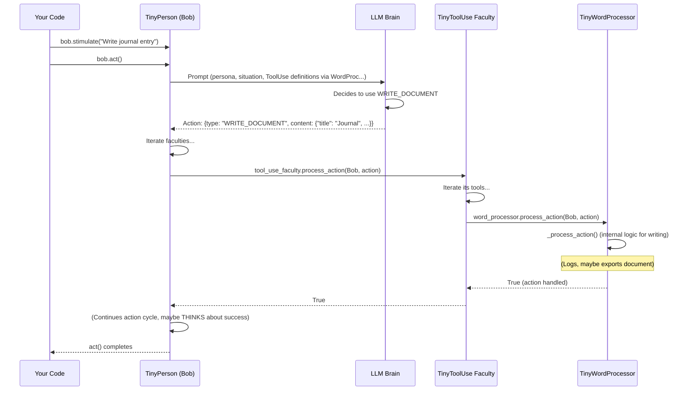

# Chapter 8: TinyTool (Agent Capability Extenders)

Welcome back! In [Chapter 7: TinyMemory (Agent Memory)](07_tinymemory__agent_memory__.md), we explored how `TinyPerson` agents remember their experiences and learned facts, using `EpisodicMemory` and `SemanticMemory`. This allows them to be more consistent and learn over time.

But what if an agent needs to do more than just think, talk, and remember? What if Bob, our gardener, wants to write a detailed "Gardening Journal" entry, or schedule a "Tomato Planting Day" in a calendar? These tasks require specific functionalities beyond basic cognition. This is where **`TinyTool`** objects come in – they are like special items or applets that give your agents new practical abilities!

## What's a TinyTool? Giving Agents Practical Skills!

Imagine you're playing a video game. Your character might be able to think and talk, but they become much more capable when they find items: a sword to fight, a key to open doors, or a map to navigate.

A **`TinyTool`** in TinyTroupe is very much like one of these items. It's an object that an agent can "use" to perform a specific, specialized task. Each tool defines a set of actions an agent can perform with it, effectively extending the agent's abilities.

**Here's the problem they solve:**

Let's say we have Bob, our friendly gardener.
1.  Bob wants to keep a record of his gardening activities. He needs a way to write and save a document.
2.  Bob also wants to plan his week and remember important dates, like when to fertilize his roses. He needs a calendar.

Instead of trying to build complex document-writing or calendar-management logic directly into every `TinyPerson`, we can give Bob a `TinyWordProcessor` tool and a `TinyCalendar` tool.

## Key Ideas of TinyTool

1.  **Specialized Objects:** Each `TinyTool` is designed for a specific purpose (e.g., writing, scheduling, calculating).
2.  **Action Definitions:** Every tool tells the agent (and thus the [LLM Interaction (AI Brain Interface)](04_llm_interaction__ai_brain_interface__.md)) what actions can be performed with it (e.g., `TinyWordProcessor` might offer a `WRITE_DOCUMENT` action).
3.  **Extending Agent Capabilities:** By having access to tools, agents can do things they couldn't do before.
4.  **Used via a Faculty:** Agents typically access and use `TinyTool`s through a special [TinyMentalFaculty (Agent Cognitive Abilities)](06_tinymentalfaculty__agent_cognitive_abilities__.md) called `TinyToolUse`. This faculty acts as the "tool belt" for the agent.

## Using TinyTools: Equipping Bob for Success!

Let's equip Bob with a `TinyWordProcessor` and a `TinyCalendar` and see how he uses them.

**1. Setting Up Bob and the Simulation**

As always, we start with our basic setup:

```python
import tinytroupe.control as control
from tinytroupe.agent import TinyPerson
# Import the tools and the faculty to use them
from tinytroupe.tools import TinyWordProcessor, TinyCalendar
from tinytroupe.agent.mental_faculty import TinyToolUse 

# Start our simulation
control.begin(cache_path="bob_tools_story.cache.json")

# See Bob's detailed thoughts and actions
TinyPerson.communication_display = True

# Create Bob
bob = TinyPerson(name="Bob")
bob.define("occupation", {"title": "Gardener"})
bob.define("personality_traits", ["organized", "likes to write"])

print(f"Meet {bob.name}, our {bob.get('occupation')['title']}.")
```
Bob is ready, an organized gardener who likes to write.

**2. Creating the Tools**

First, let's create instances of the tools Bob will use:

```python
word_processor = TinyWordProcessor(owner=bob) # Bob owns this word processor
calendar_tool = TinyCalendar(owner=bob)      # And this calendar

print(f"{bob.name} now has a {word_processor.name} and a {calendar_tool.name}.")
```
We've created a word processor and a calendar. By specifying `owner=bob`, we're saying these specific tool instances belong to Bob.

**3. Giving Bob the Ability to Use Tools**

Just having tools isn't enough; Bob needs the skill to use them. This is provided by the `TinyToolUse` faculty.

```python
# Create the TinyToolUse faculty, giving it the list of tools Bob can use
bob_tool_skills = TinyToolUse(tools=[word_processor, calendar_tool])

# Add this faculty to Bob's mental faculties
bob._mental_faculties.append(bob_tool_skills)

print(f"{bob.name} can now use his tools via the '{bob_tool_skills.name}' faculty!")
```
Now, when Bob `act()`s, his "brain" (the LLM) will be aware that he has a `TinyToolUse` faculty and that this faculty gives him access to actions like `WRITE_DOCUMENT` (from the word processor) and `CREATE_EVENT` (from the calendar).

**4. Bob Uses the `TinyWordProcessor`**

Let's ask Bob to write a short journal entry.

```python
print(f"\nAsking Bob to write a journal entry...")
# Stimulate Bob with a goal
bob.stimulate([{"type": "USER_REQUEST", 
                "content": "Bob, please write a short journal entry about how nice the weather is today for gardening."}])
bob.act() # Bob thinks and acts
```
When `bob.act()` runs:
*   The LLM prompt for Bob will include information about the `TinyToolUse` faculty, which in turn includes the `actions_definitions_prompt` from `TinyWordProcessor` (describing `WRITE_DOCUMENT`).
*   The LLM, seeing Bob's goal and the available `WRITE_DOCUMENT` action, will likely decide to use it.
*   It would output an action like: `{type: "WRITE_DOCUMENT", content: {"title": "Today's Weather", "content": "The weather is lovely for gardening today...", "author": "Bob"}}`.
*   Bob's `TinyToolUse` faculty will receive this action and pass it to the `TinyWordProcessor`.
*   The `TinyWordProcessor`'s `_process_action` method will then handle it, perhaps logging the document creation or exporting it if an exporter is configured.

You might see output like this (simplified):
```
...
Bob thinks: I need to write a journal entry. I have a wordprocessor tool that can WRITE_DOCUMENT.
Bob performs action: [WRITE_DOCUMENT] content: {"title": "My Garden Journal - Sunny Day", "content": "Today, the sun is shining brightly. It's a perfect day for tending to the plants...", "author": "Bob"}
Bob (TinyToolUse -> TinyWordProcessor): Writing document with title My Garden Journal - Sunny Day...
Bob thinks: I've written the journal entry.
...
```

**5. Bob Uses the `TinyCalendar`**

Now, let's ask Bob to schedule an event.

```python
print(f"\nAsking Bob to schedule a gardening task...")
bob.stimulate([{"type": "USER_REQUEST", 
                "content": "Bob, can you schedule 'Water the seedlings' for tomorrow at 9 AM?"}])
bob.act() # Bob thinks and acts
```
Similar to the word processor:
*   The LLM sees Bob's goal and knows about the `CREATE_EVENT` action from the `TinyCalendar` tool (via the `TinyToolUse` faculty).
*   It might output an action like: `{type: "CREATE_EVENT", content: {"title": "Water the seedlings", "start_time": "tomorrow 9 AM"}}`.
*   The `TinyCalendar` tool will process this, adding the event to its internal calendar data.

You might see output like this (simplified):
```
...
Bob thinks: I need to schedule 'Water the seedlings'. I have a calendar tool for that.
Bob performs action: [CREATE_EVENT] content: {"title": "Water the seedlings", "date": "tomorrow", "start_time": "09:00"} 
Bob (TinyToolUse -> TinyCalendar): Adding event "Water the seedlings" to calendar.
Bob thinks: I've scheduled the task.
...
```

**6. Don't Forget to End!**
```python
control.end()
print("\nSimulation ended. Bob is quite productive with his new tools!")
```

## How Do TinyTools Work? A Look Under the Hood

The magic of `TinyTool`s lies in the interaction between the agent, the `TinyToolUse` faculty, the specific tool, and the [LLM Interaction (AI Brain Interface)](04_llm_interaction__ai_brain_interface__.md).

**An Agent Using a Tool: Step-by-Step**

1.  **Agent's Turn:** When an agent (like Bob) `act()`s, it prepares a prompt for the LLM.
2.  **Faculty Information in Prompt:** This prompt includes definitions from all its [TinyMentalFaculty (Agent Cognitive Abilities)](06_tinymentalfaculty__agent_cognitive_abilities__.md). The `TinyToolUse` faculty contributes by collecting the `actions_definitions_prompt()` from *each tool* it manages (e.g., `TinyWordProcessor` and `TinyCalendar`). This tells the LLM what tool-specific actions are available (e.g., `WRITE_DOCUMENT`, `CREATE_EVENT`).
3.  **LLM Decides Action:** The LLM receives this comprehensive prompt. Based on the agent's current goal and the available actions (including tool actions), it might decide to use a tool. If so, it generates an action in the specified format, like `{type: "WRITE_DOCUMENT", content: "JSON_details"}`.
4.  **Agent Receives Action:** The `TinyPerson` agent gets this structured action back from the LLM.
5.  **Faculty Processing:** The `TinyPerson` iterates through its faculties, calling `faculty.process_action(agent, action)` on each.
6.  **`TinyToolUse` Handles the Action:** When it's the `TinyToolUse` faculty's turn, its `process_action` method is called. This method iterates through its list of `tools`.
7.  **Tool's `process_action` Called:** For each tool, the `TinyToolUse` faculty calls `tool.process_action(agent, action)`.
8.  **Specific Tool Executes:** The `process_action` method of the relevant tool (e.g., `TinyWordProcessor`) checks if the action `type` matches one it handles. If it does (e.g., "WRITE_DOCUMENT"), its `_process_action` method is invoked, which contains the actual logic for performing the task (like creating the document). The tool then returns `True` to signal it handled the action.

Here's a simplified sequence diagram for Bob using his `TinyWordProcessor`:



**Key Code Snippets (Simplified):**

Let's look at the relevant Python files.

*   **`TinyTool` (Base Class - `tinytroupe/tools/tiny_tool.py`):**
    This is the blueprint for all tools.
    ```python
    # Simplified from tinytroupe/tools/tiny_tool.py
    class TinyTool:
        def __init__(self, name, description, owner=None, ...):
            self.name = name
            self.description = description
            self.owner = owner # The agent who owns this tool instance
            # ... other attributes like real_world_side_effects, exporter ...

        def process_action(self, agent, action: dict) -> bool:
            # self._protect_real_world() # Checks for side effects
            self._enforce_ownership(agent) # Checks if agent owns tool
            return self._process_action(agent, action) # Calls internal method

        def _process_action(self, agent, action: dict) -> bool:
            # Subclasses MUST implement this to do the actual work
            raise NotImplementedError 

        def actions_definitions_prompt(self) -> str:
            # Subclasses MUST implement this to tell LLM about its actions
            raise NotImplementedError
        
        def actions_constraints_prompt(self) -> str:
            # Subclasses MUST implement this for LLM usage guidelines
            raise NotImplementedError
    ```
    Every tool needs to define what actions it provides (`actions_definitions_prompt`), how to use them (`actions_constraints_prompt`), and the logic to execute those actions (`_process_action`). The public `process_action` adds checks for ownership and side effects.

*   **`TinyWordProcessor` (Example Tool - `tinytroupe/tools/tiny_word_processor.py`):**
    ```python
    # Simplified from tinytroupe/tools/tiny_word_processor.py
    class TinyWordProcessor(TinyTool):
        def __init__(self, owner=None, exporter=None, ...):
            super().__init__("wordprocessor", "A word processor to write documents.", owner, ...)
            self.exporter = exporter # Optional: for saving documents

        def _process_action(self, agent, action) -> bool:
            if action['type'] == "WRITE_DOCUMENT" and action['content'] is not None:
                doc_spec = utils.extract_json(action['content']) # Expects JSON
                # ... (check for valid keys like title, content, author) ...
                self.write_document(**doc_spec) # Call the main logic
                agent.think(f"I have written a document titled '{doc_spec.get('title', '')}'.")
                return True
            return False

        def write_document(self, title, content, author=None):
            logger.debug(f"Writing '{title}' by {author}: {content[:50]}...")
            # If self.exporter is set, it might save the document to a file here
            # For example: self.exporter.export(artifact_name=title, ...)

        def actions_definitions_prompt(self) -> str:
            return utils.dedent("""
              - WRITE_DOCUMENT: create a new document. Content is JSON:
                * title: (string) Document title. Mandatory.
                * content: (string) Document content in Markdown. Mandatory.
                * author: (string) Your name. Optional.
            """)
        # ... actions_constraints_prompt() provides more rules for LLM ...
    ```
    It handles the "WRITE_DOCUMENT" action by parsing the content (expected to be JSON) and then calling its `write_document` method.

*   **`TinyCalendar` (Example Tool - `tinytroupe/tools/tiny_calendar.py`):**
    ```python
    # Simplified from tinytroupe/tools/tiny_calendar.py
    class TinyCalendar(TinyTool):
        def __init__(self, owner=None):
            super().__init__("calendar", "A calendar to manage events.", owner)
            self.calendar_data = {} # Stores events, e.g., by date

        def _process_action(self, agent, action) -> bool:
            if action['type'] == "CREATE_EVENT" and action['content'] is not None:
                event_content = utils.extract_json(action['content']) # Expects JSON
                # ... (check valid keys: title, date, start_time, etc.) ...
                self.add_event(**event_content)
                agent.think(f"I've added '{event_content.get('title')}' to my calendar.")
                return True
            return False

        def add_event(self, date, title, start_time=None, ...):
            if date not in self.calendar_data:
                self.calendar_data[date] = []
            self.calendar_data[date].append({"title": title, "start_time": start_time, ...})
            logger.debug(f"Event '{title}' added to calendar for {date}.")

        def actions_definitions_prompt(self) -> str:
            return utils.dedent("""
              - CREATE_EVENT: create a new calendar event. Content is JSON:
                * title: (string) Event title. Mandatory.
                * date: (string) Event date. Mandatory.
                * start_time: (string) Event start time. Optional.
                * ... (other fields like description, attendees) ...
            """)
        # ... actions_constraints_prompt() provides more rules for LLM ...
    ```
    It handles "CREATE_EVENT" by parsing details and adding them to its internal `calendar_data`.

*   **`TinyToolUse` (Faculty - `tinytroupe/agent/mental_faculty.py`):**
    This faculty acts as the bridge between the agent and its tools.
    ```python
    # Simplified from tinytroupe/agent/mental_faculty.py
    class TinyToolUse(TinyMentalFaculty):
        def __init__(self, tools: list) -> None: # Takes a list of TinyTool objects
            super().__init__("Tool Use")
            self.tools = tools # Stores the agent's available tools

        def process_action(self, agent, action: dict) -> bool:
            for tool in self.tools: # Try each tool
                if tool.process_action(agent, action): # If tool handles it...
                    return True # ...then we're done with this action.
            return False # No tool handled this action type

        def actions_definitions_prompt(self) -> str:
            prompt = ""
            for tool in self.tools: # Collect definitions from all tools
                prompt += tool.actions_definitions_prompt()
            return prompt
        
        def actions_constraints_prompt(self) -> str:
            prompt = ""
            for tool in self.tools: # Collect constraints from all tools
                prompt += tool.actions_constraints_prompt()
            return prompt
    ```
    The `TinyToolUse` faculty doesn't do much on its own. Its main jobs are:
    1.  To tell the LLM (via `actions_definitions_prompt` and `actions_constraints_prompt`) about *all* the actions available from *all* the tools it holds.
    2.  When an action comes from the LLM, to pass that action along to each of its tools until one of them successfully processes it.

## Conclusion

You've now learned about **`TinyTool`** objects, the powerful capability extenders for your TinyTroupe agents!

You've discovered:
*   `TinyTool`s are like special items or applets (e.g., `TinyWordProcessor`, `TinyCalendar`) that allow agents to perform specific, practical tasks.
*   Each tool defines actions (like `WRITE_DOCUMENT` or `CREATE_EVENT`) and provides its logic.
*   Agents typically use tools via the `TinyToolUse` mental faculty, which acts as their "tool belt."
*   The LLM is made aware of available tool actions and can choose to use them to fulfill an agent's goals.

With `TinyTool`s, your agents can move beyond simple thought and conversation to interact with their world (or simulated aspects of it) in much more complex and useful ways. This completes our journey through the core concepts of the `07_TinyTroupe` project! You now have a solid foundation for building your own fascinating simulations with intelligent, capable tiny agents. Happy creating!

---

Generated by [AI Codebase Knowledge Builder](https://github.com/The-Pocket/Tutorial-Codebase-Knowledge)