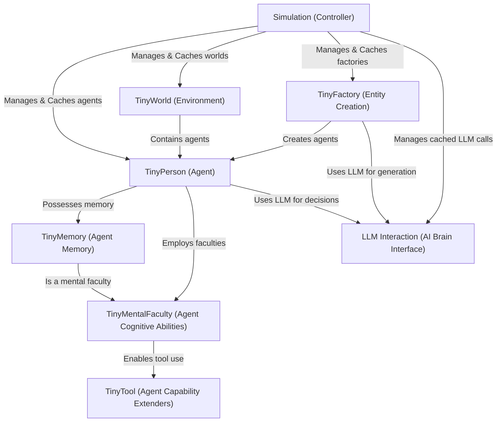

# Tutorial: 07_TinyTroupe

`07_TinyTroupe` is a Python project for building *simulations* featuring **intelligent agents** called `TinyPerson`.
These agents exist and interact within a `TinyWorld` (the environment). They can *think*, *remember* past events using `TinyMemory`,
employ `TinyMentalFaculty` for cognitive abilities, and use `TinyTool`s to perform specific tasks.
The "brain" of each agent is powered by **Large Language Models (LLMs)** through an `LLM Interaction` interface.
A `Simulation` component acts as the overall controller, managing agents, environments, and `TinyFactory` instances that create new agents.
The `Simulation` also handles caching and transactional execution to ensure reproducibility and efficiency.

**Source Repository:** [None](None)

## Chapters

1. [Simulation (Controller)
](01_simulation__controller__.md)
2. [TinyPerson (Agent)
](02_tinyperson__agent__.md)
3. [TinyWorld (Environment)
](03_tinyworld__environment__.md)
4. [LLM Interaction (AI Brain Interface)
](04_llm_interaction__ai_brain_interface__.md)
5. [TinyFactory (Entity Creation)
](05_tinyfactory__entity_creation__.md)
6. [TinyMentalFaculty (Agent Cognitive Abilities)
](06_tinymentalfaculty__agent_cognitive_abilities__.md)
7. [TinyMemory (Agent Memory)
](07_tinymemory__agent_memory__.md)
8. [TinyTool (Agent Capability Extenders)
](08_tinytool__agent_capability_extenders__.md)

---

Generated by [AI Codebase Knowledge Builder](https://github.com/The-Pocket/Tutorial-Codebase-Knowledge)