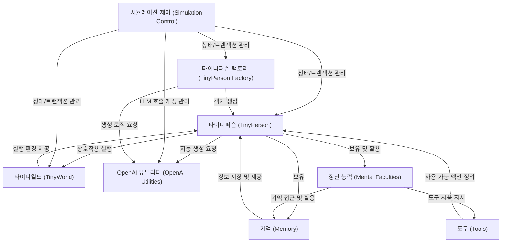

# Tutorial: 07_TinyTroupe

이 프로젝트는 **타이니퍼슨**이라는 *페르소나 기반* 가상 인간 에이전트를 시뮬레이션하는 라이브러리입니다. 각 타이니퍼슨은 고유한 성격, 목표, 기억을 가지고 **타이니월드**라는 가상 환경에서 다른 캐릭터들과 상호작용하며 자신만의 이야기를 만듭니다. *시뮬레이션 제어* 기능을 통해 실험 과정을 효율적으로 관리하고, *OpenAI 유틸리티*를 활용하여 에이전트의 지능적인 행동을 생성합니다. 이를 통해 인간 행동에 대한 통찰을 얻고 상상력을 강화하는 것을 목표로 합니다.

**Source Repository:** [None](None)

## Chapters

1. [시뮬레이션 제어 (Simulation Control)
](01_시뮬레이션_제어__simulation_control__.md)
2. [타이니퍼슨 (TinyPerson)
](02_타이니퍼슨__tinyperson__.md)
3. [타이니월드 (TinyWorld)
](03_타이니월드__tinyworld__.md)
4. [OpenAI 유틸리티 (OpenAI Utilities)
](04_openai_유틸리티__openai_utilities__.md)
5. [타이니퍼슨 팩토리 (TinyPerson Factory)
](05_타이니퍼슨_팩토리__tinyperson_factory__.md)
6. [정신 능력 (Mental Faculties)
](06_정신_능력__mental_faculties__.md)
7. [기억 (Memory)
](07_기억__memory__.md)
8. [도구 (Tools)
](08_도구__tools__.md)

---

Generated by [AI Codebase Knowledge Builder](https://github.com/The-Pocket/Tutorial-Codebase-Knowledge)