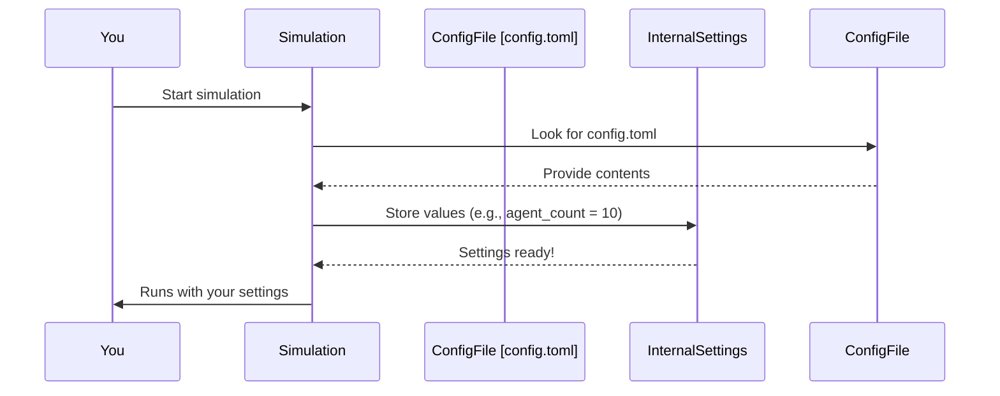

# Chapter 1: Configuration System

Welcome to `simulacra-futura`! This project helps us explore different possible futures by simulating how various "agents" (think of them as digital characters) might react to and shape these futures.

But how do we tell the simulation what kind of future to explore, or how many characters to include? Imagine you're about to play a new board game. Before you start, you usually look at the rulebook and decide on certain settings, like how many players will join or which scenario you'll play. That's exactly what our Configuration System does for `simulacra-futura`!

## What's the Big Idea? The "Settings Panel"

The Configuration System is like the **settings panel** for our simulation. It allows you to change important parameters without needing to dive into the complex code of the simulation itself.

For example, you might want to ask:
*   "What if we simulate 10 agents instead of 50?"
*   "What if the simulation runs for 5 'generations' (rounds) instead of 3?"
*   "What if the central topic is 'the future of renewable energy' instead of 'the future of AI'?"

The Configuration System lets you easily tweak these kinds of settings. It does this by reading instructions from a special file called `config.toml`. This makes `simulacra-futura` flexible and customizable for different experiments and explorations.

## Meet `config.toml`: Your Simulation's Rulebook

The `config.toml` file is where you write down the rules and starting conditions for your simulation. "TOML" stands for "Tom's Obvious, Minimal Language," and it's designed to be very easy for humans to read and write.

Think of it like a simple checklist:

*   Number of digital characters (agents)? `[Set this number]`
*   How many rounds (generations) should the simulation run? `[Set this number]`
*   What's the main topic we're exploring? `[Set this text]`

Here’s a tiny peek at what a part of a `config.toml` file might look like:

```toml
[algorithm]
agent_count = 10
generations = 5
topic = "future of AI"

[output]
save_directory = "my_simulation_results"
```

In this example:
*   `agent_count = 10` tells the simulation to create 10 agents.
*   `generations = 5` tells it to run for 5 cycles.
*   `topic = "future of AI"` sets the main theme.
*   `save_directory` tells the simulation where to save its results.

It's that simple! You just edit this text file, and the simulation will use your new settings the next time it runs.

## How `simulacra-futura` Uses Your Settings

When you start the `simulacra-futura` simulation, one of the first things it does is look for this `config.toml` file. It reads the values you've set and uses them to guide its behavior.

Let's see how this works under the hood.

### The Loading Process: A Quick Tour

1.  **Simulation Starts:** You run the simulation.
2.  **Looking for `config.toml`:** The program searches for a file named `config.toml` in its main directory.
3.  **Reading the Settings:** If found, it reads all the parameters you've defined (like `agent_count`, `generations`, etc.).
4.  **Applying Settings:** The simulation then uses these values to set itself up. For instance, if `agent_count` is 10, it will prepare to create 10 agents. If the file isn't found, it often uses a set of built-in default settings.

Here's a simple diagram showing this flow:



### Peeking at the Code

The main logic for loading the configuration in `simulacra-futura` is handled within the `simulation.py` file. Let's look at a simplified version of how it loads the configuration.

```python
# Part of simulation.py

import toml # A library to help read .toml files
from pathlib import Path

def load_config():
    """Loads settings from config.toml."""
    config_path = Path(__file__).parent / "config.toml"
    if config_path.exists():
        return toml.load(config_path) # Reads the file
    else:
        print("⚠️ config.toml not found. Using default settings.")
        # ... (default settings would be returned here) ...
        return {"algorithm": {"generations": 3, "agent_count": 3}} # Simplified default

# Load settings when the simulation starts
CONFIG = load_config()
```
This `load_config` function tries to find `config.toml`.
*   If it finds the file, `toml.load(config_path)` reads it and turns it into a structure the program can use.
*   If not, it prints a warning and uses some default values.
*   The loaded settings are then stored in a variable, often named `CONFIG`, making them accessible throughout the simulation.

Later, other parts of the simulation will use this `CONFIG` variable. For example, when it's time to create the digital agents:

```python
# Part of simulation.py (simplified from initialize_agents)

def initialize_agents_example():
    """Uses loaded settings to prepare agents."""
    # Get settings from the CONFIG loaded earlier
    agent_count = CONFIG.get("algorithm", {}).get("agent_count", 30)
    topic = CONFIG.get("algorithm", {}).get("topic", "Default Topic")

    print(f"Setting up {agent_count} agents for the topic: '{topic}'")
    # ... (code to actually create agents would follow) ...

# initialize_agents_example() # If you were to run this
```
Here, `CONFIG.get("algorithm", {}).get("agent_count", 30)` tries to get the `agent_count` you specified under the `[algorithm]` section in your `config.toml`. If it can't find it, it defaults to `30`.

This way, the `config.toml` file acts as a central control panel, influencing various parts of the simulation, such as the [Agent Model](03_agent_model_.md) creation and the [Simulation Orchestrator](05_simulation_orchestrator_.md)'s behavior.

## Example: Changing the Simulation Topic

Let's say you want to run a simulation about "the future of work." You would simply open `config.toml` and change the `topic` line:

**Original `config.toml` (snippet):**
```toml
[algorithm]
topic = "future of AI"
# ... other settings ...
```

**Modified `config.toml` for "future of work" (snippet):**
```toml
[algorithm]
topic = "future of work"
# ... other settings ...
```

Save the file. Now, when you run `simulacra-futura`, all the scenarios and discussions generated by the agents will revolve around "the future of work." It's that easy to redirect the entire focus of the simulation!

## Why is This System So Useful?

*   **Easy Customization:** You don't need to be a programmer to change how the simulation runs.
*   **Reproducibility:** If you want someone else to run the exact same simulation as you, just share your `config.toml` file with them!
*   **Experimentation:** Quickly try out different settings (more agents, fewer generations, new topics) to see how the outcomes change.

## What We've Learned

In this chapter, we've seen that the Configuration System in `simulacra-futura` is like a settings panel. It uses a simple text file called `config.toml` to let you control key aspects of the simulation, such as the number of agents, the length of the simulation, and its central topic. This makes the simulation highly flexible and easy to adapt for different exploratory purposes.

Now that you understand how to set up the basic rules of our simulation, you might be wondering about the "digital characters" or agents themselves. How are they defined? That's what we'll explore in the next chapter!

Next up: [Persona Profile Creation](02_persona_profile_creation_.md)

---

Generated by [AI Codebase Knowledge Builder](https://github.com/The-Pocket/Tutorial-Codebase-Knowledge)