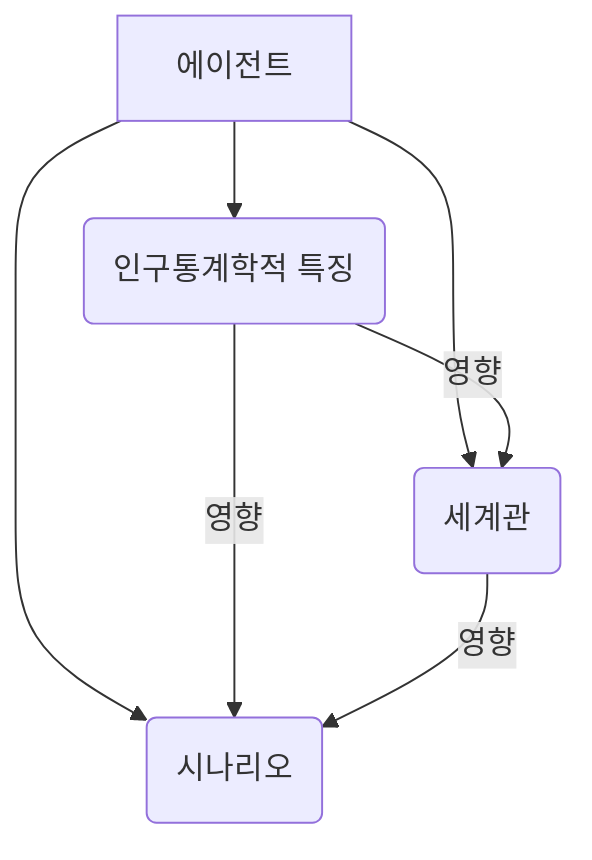
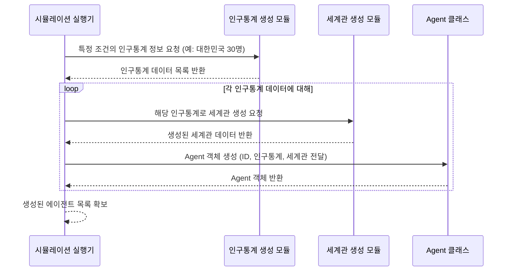

# Chapter 1: 에이전트 (Agent)


`simulacra-futura` 프로젝트에 오신 것을 환영합니다! 이 튜토리얼 시리즈는 여러분이 시뮬레이션의 핵심 개념들을 이해하고 활용할 수 있도록 돕기 위해 만들어졌습니다. 첫 번째 장에서는 시뮬레이션의 가장 기본적인 단위인 **에이전트(Agent)**에 대해 알아보겠습니다.

## 에이전트란 무엇일까요? 왜 필요할까요?

여러분은 혹시 다양한 사람들이 특정 주제, 예를 들어 "미래의 도시 모습"에 대해 어떻게 생각할지 궁금해 본 적이 있나요? 어떤 사람은 기술 발전에 초점을 맞출 것이고, 다른 사람은 환경 문제를, 또 다른 사람은 사회적 관계의 변화를 중요하게 생각할 수 있습니다. 이렇게 다양한 관점을 가진 사람들의 생각을 모아 미래를 예측하거나 이해하려는 시도가 바로 `simulacra-futura` 프로젝트의 목표 중 하나입니다.

이때, 시뮬레이션 속에서 **각각의 가상 개인**을 대표하는 존재가 필요한데, 이것이 바로 **에이전트**입니다. 에이전트는 마치 연극의 등장인물이나 롤플레잉 게임(RPG)의 캐릭터와 같아요. 각 에이전트는 자신만의 고유한 배경(나이, 직업, 가치관 등)을 가지고 있으며, 이를 바탕으로 세상을 바라보고 특정 주제에 대해 자신만의 생각을 펼쳐나갑니다.

간단히 말해, 에이전트는 다음과 같은 특징을 가집니다:

1.  **고유성**: 각 에이전트는 서로 다른 인구학적 특징(예: 나이, 직업, 성별)을 가집니다.
2.  **관점**: 각 에이전트는 세상을 바라보는 자신만의 방식, 즉 세계관(Worldview)을 가지고 있습니다.
3.  **능동성**: 에이전트는 자신의 특징과 세계관을 바탕으로 특정 주제에 대한 미래 시나리오를 생성하고, 다른 에이전트와 상호작용하며 생각을 발전시킬 수 있습니다.

이러한 에이전트들이 모여 시뮬레이션 전체를 구성하게 됩니다.

## 에이전트의 구성 요소

에이전트는 크게 세 가지 주요 정보로 구성됩니다:

1.  **인구통계학적 특징 (Demographics)**: 에이전트의 기본적인 배경 정보입니다. 예를 들어, "30대, 서울 거주, IT 개발자, 환경 문제에 관심이 많은 여성"과 같이 구체적인 정보들이 포함됩니다. 이 정보는 에이전트의 기본적인 성향과 관심사를 형성하는 데 중요한 역할을 합니다. (자세한 내용은 [제 2장: 인구통계 및 세계관 생성](02_인구통계_및_세계관_생성__demographic_and_worldview_generation__.md)에서 다룹니다.)

2.  **세계관 (Worldview)**: 에이전트가 세상을 이해하고 해석하는 방식입니다. 사회, 기술, 환경, 정치, 경제 등 다양한 영역에 대한 에이전트의 기본적인 생각이나 태도를 의미합니다. 예를 들어, 어떤 에이전트는 기술 발전을 매우 긍정적으로 보는 반면, 다른 에이전트는 기술 발전의 부작용을 더 우려할 수 있습니다. (이 역시 [제 2장: 인구통계 및 세계관 생성](02_인구통계_및_세계관_생성__demographic_and_worldview_generation__.md)에서 자세히 다룹니다.)

3.  **시나리오 (Scenario)**: 특정 주제에 대해 에이전트가 생성하는 구체적인 미래 예측이나 의견입니다. 이 시나리오는 에이전트의 인구통계학적 특징과 세계관을 바탕으로 생성됩니다. 예를 들어 "미래 자동차"라는 주제에 대해, 한 에이전트는 "모든 자동차가 하늘을 나는 자율주행차가 될 것이다"라는 시나리오를, 다른 에이전트는 "환경 문제로 개인 자동차 소유가 줄고 대중교통 중심 사회가 될 것이다"라는 시나리오를 생성할 수 있습니다. (시나리오 생성 및 변화 과정은 [제 3장: 시나리오 생성 및 진화](03_시나리오_생성_및_진화__scenario_generation_and_evolution__.md)에서 자세히 알아봅니다.)

이 세 가지 요소가 결합되어 하나의 온전한 에이전트를 이룹니다.



위 그림처럼, 인구통계학적 특징은 세계관 형성에 영향을 주고, 이 둘은 다시 에이전트가 생성하는 시나리오에 영향을 미칩니다.

## 에이전트 사용해보기 (코드 예시)

`simulacra-futura` 프로젝트에서 에이전트는 `agent.py` 파일에 정의된 `Agent` 클래스를 통해 만들어집니다. 실제 시뮬레이션에서는 이보다 복잡한 과정을 거치지만, 기본적인 에이전트 생성은 다음과 같이 간단하게 표현할 수 있습니다.

먼저, 에이전트의 세계관을 정의하는 `WorldviewStructure`와 시나리오를 담는 `Scenario` 클래스가 필요합니다.

```python
# agent.py 파일 내용 (일부)
from dataclasses import dataclass
from typing import Dict, Any, List, Optional

@dataclass
class WorldviewStructure:
    society: str = "사회는 평등해야 한다." # 사회에 대한 관점
    technology: str = "기술은 삶을 윤택하게 한다." # 기술에 대한 관점
    # ... 기타 환경, 인구, 정치, 경제, 자원 등에 대한 관점 생략 ...

@dataclass
class Scenario:
    society: str = "" # 시나리오의 사회적 측면
    # ... 기타 기술, 환경 등 측면 생략 ...
    agent_id: Optional[str] = None # 이 시나리오를 만든 에이전트 ID
```

위 코드에서 `WorldviewStructure`는 에이전트가 사회, 기술 등에 대해 어떤 생각을 가지고 있는지 정의합니다. `Scenario`는 특정 주제에 대한 에이전트의 구체적인 생각(시나리오)을 담습니다.

이제 이들을 사용하여 `Agent` 객체를 만들어 보겠습니다.

```python
# agent.py 파일 내용 (일부)

class Agent:
    def __init__(self, agent_id: int, 
                 demographic: Dict[str, Any] = None, 
                 worldview: WorldviewStructure = None):
        self.agent_id = agent_id  # 에이전트 고유 ID
        self.demographic = demographic or {} # 인구통계 정보 (딕셔너리 형태)
        self.worldview = worldview or WorldviewStructure() # 세계관 정보
        self.scenarios: List[Scenario] = [] # 에이전트가 생성한 시나리오 목록

    # 에이전트 정보를 딕셔너리로 보여주는 함수 (간략화)
    def to_dict(self) -> Dict[str, Any]:
        return {
            "agent_id": self.agent_id,
            "demographic": self.demographic,
            "worldview": self.worldview.society, # 간단히 사회관만 표시
            "num_scenarios": len(self.scenarios)
        }

# 에이전트 생성 예시
my_demographic = {"나이": "20대", "직업": "대학생"}
my_worldview = WorldviewStructure(society="사회는 더 개방적이어야 한다.", technology="신기술은 언제나 환영이야!")
agent1 = Agent(agent_id=1, demographic=my_demographic, worldview=my_worldview)

print(agent1.to_dict())
```

위 예시 코드를 실행하면 다음과 비슷한 출력을 볼 수 있습니다:

```
{'agent_id': 1, 'demographic': {'나이': '20대', '직업': '대학생'}, 'worldview': '사회는 더 개방적이어야 한다.', 'num_scenarios': 0}
```

이처럼 `Agent` 클래스를 통해 각기 다른 특성을 가진 가상의 개인들을 만들고, 그들의 정보를 관리할 수 있습니다. `agent1`은 ID가 1이고, 20대 대학생이라는 인구통계 정보와 "사회는 더 개방적이어야 한다"는 사회관을 가진 에이전트입니다. 아직은 생성한 시나리오가 없으므로 `num_scenarios`는 0입니다.

## 에이전트는 어떻게 동작할까요? (내부 구현 살짝 보기)

에이전트가 시뮬레이션에서 실제로 어떻게 만들어지고 활용되는지 간단한 흐름을 통해 살펴보겠습니다.



1.  **시뮬레이션 시작**: 시뮬레이션 실행기(`simulation.py`의 `run_simulation` 함수 등)가 에이전트 생성을 시작합니다.
2.  **인구통계 생성**: [제 2장: 인구통계 및 세계관 생성](02_인구통계_및_세계관_생성__demographic_and_worldview_generation__.md)에서 다룰 `demographic_generator.py`를 통해 다양한 인구통계학적 특징을 가진 가상 개인들의 프로필이 만들어집니다. 예를 들어, "대한민국의 20대 여성, 회사원" 또는 "50대 남성, 자영업자" 같은 정보가 생성됩니다.
    ```python
    # simulation.py (일부) - initialize_agents 함수 내
    # demographics = generate_and_save_demographics(...) # 인구통계 생성
    ```
    이 코드는 `demographic_generator.py`의 함수를 호출하여 인구통계 정보를 생성하고 저장합니다.
3.  **세계관 생성**: 생성된 인구통계 정보를 바탕으로, 각 에이전트의 세계관이 만들어집니다. 이 과정은 `worldview_generator.py`에서 담당하며, 역시 [제 2장: 인구통계 및 세계관 생성](02_인구통계_및_세계관_생성__demographic_and_worldview_generation__.md)에서 자세히 설명합니다.
    ```python
    # simulation.py (일부) - initialize_agents 함수 내
    # worldview = generate_worldview_from_demographic(demographic, topic) # 세계관 생성
    ```
    각 `demographic` 정보와 시뮬레이션 주제(`topic`)를 바탕으로 `worldview_generator.py`의 함수를 통해 세계관이 생성됩니다.
4.  **Agent 객체화**: 이렇게 만들어진 인구통계 정보와 세계관 정보를 `agent.py`의 `Agent` 클래스에 전달하여 실제 에이전트 객체를 생성합니다.
    ```python
    # simulation.py (일부) - initialize_agents 함수 내
    # agent = Agent(agent_id=i+1, demographic=demographic, worldview=worldview)
    ```
    각 에이전트는 고유 ID, 인구통계 정보, 그리고 방금 생성된 세계관을 가지고 초기화됩니다.

이렇게 생성된 에이전트들은 이제 시뮬레이션의 다양한 활동에 참여할 준비를 마친 것입니다. 예를 들어, 특정 주제에 대한 자신의 의견, 즉 [시나리오 생성 및 진화](03_시나리오_생성_및_진화__scenario_generation_and_evolution__.md)를 시작할 수 있습니다.

`agent.py` 파일의 핵심은 `Agent` 클래스와 그 구성요소인 `WorldviewStructure`, `Scenario`입니다.

*   `WorldviewStructure`: 에이전트가 세상을 바라보는 7가지 주요 영역(사회, 기술, 환경, 인구, 정치, 경제, 자원)에 대한 생각을 담습니다.
    ```python
    # agent.py (일부)
    @dataclass
    class WorldviewStructure:
        society: str = ""       # 사회 구조, 가치관 등에 대한 관점
        technology: str = ""    # 기술 발전, 활용 방식 등에 대한 관점
        environment: str = ""   # 자연 환경, 환경 정책 등에 대한 관점
        # ... (이하 생략)
    ```
*   `Scenario`: 특정 주제에 대해 에이전트가 제시하는 7가지 영역별 의견을 담습니다.
    ```python
    # agent.py (일부)
    @dataclass
    class Scenario:
        society: str = ""       # 주제에 대한 사회적 관점의 의견
        technology: str = ""    # 주제에 대한 기술적 관점의 의견
        # ... (이하 생략)
        agent_id: Optional[str] = None # 이 시나리오를 만든 에이전트의 ID
        selected: bool = False  # 시나리오 선택 여부
    ```
*   `Agent`: 이 모든 정보를 통합하여 하나의 에이전트를 구성합니다. `__init__` 메서드를 통해 초기 정보를 받아 에이전트를 만들고, `add_scenario`와 같은 메서드를 통해 시나리오를 추가하거나, `to_dict` 메서드로 자신의 정보를 외부에 보여줄 수 있습니다.

## 정리하며

이번 장에서는 `simulacra-futura` 프로젝트의 가장 기본적인 단위인 **에이전트**에 대해 알아보았습니다. 에이전트는 시뮬레이션 속 가상의 개인으로, 각기 다른 인구통계학적 특징과 세계관을 가지며 이를 바탕으로 미래 시나리오를 생성합니다. 마치 다양한 배경과 생각을 가진 사람들이 모여 토론하는 작은 사회와 같다고 생각할 수 있습니다.

에이전트의 핵심 구성 요소는 다음과 같습니다:

*   **인구통계학적 특징 (Demographics)**: 나이, 직업, 지역 등 개인의 배경 정보.
*   **세계관 (Worldview)**: 세상을 바라보는 관점 (사회, 기술, 환경 등).
*   **시나리오 (Scenario)**: 특정 주제에 대한 에이전트의 구체적인 생각.

우리는 에이전트가 어떻게 정의되고, 코드에서 어떻게 표현되는지 간략하게 살펴보았습니다. 또한, 시뮬레이션 과정에서 에이전트가 어떻게 초기화되는지에 대한 큰 그림도 그려보았습니다.

다음 장에서는 에이전트의 개성을 부여하는 핵심 요소인 인구통계 정보와 세계관이 실제로 어떻게 생성되는지 자세히 알아보겠습니다.

➡️ [제 2장: 인구통계 및 세계관 생성](02_인구통계_및_세계관_생성__demographic_and_worldview_generation__.md)

---

Generated by [AI Codebase Knowledge Builder](https://github.com/The-Pocket/Tutorial-Codebase-Knowledge)