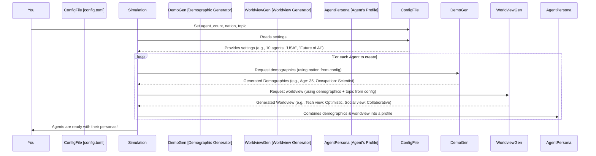

# Chapter 2: Persona Profile Creation

Welcome back! In [Chapter 1: Configuration System](01_configuration_system_.md), we learned how to use the `config.toml` file to set the basic rules for our simulation, like how many digital characters (agents) to create and what topic they'll explore. Now, let's dive into how these agents actually come to life with their own unique characteristics and perspectives. This chapter is all about "Persona Profile Creation."

## What's a Persona Profile? Meet Your Digital Characters!

Imagine you're creating characters for a story or a game. You wouldn't just say "I have three characters." You'd want to give them names, ages, jobs, and perhaps some core beliefs or personality traits. That's exactly what Persona Profile Creation does in `simulacra-futura`!

This is the "character creation" phase for our Agents. It’s a two-step process:

1.  **Filling out the "Character Sheet" (Demographics):** First, the system generates realistic demographic details for each Agent. This includes things like:
    *   Age (e.g., "30s", "50s")
    *   Location (e.g., "Seoul", "New York" – depending on the `nation` set in `config.toml`)
    *   Occupation (e.g., "Teacher", "Engineer", "Artist")
    *   And other relevant social attributes.
    Think of this like filling out a detailed character sheet for a role-playing game.

2.  **Crafting a "Worldview":** Once an Agent has their basic demographic details, the system then crafts a unique "worldview" for them. This worldview represents their fundamental beliefs and perspectives on various aspects of life, such as:
    *   Society (e.g., views on social structures, community)
    *   Technology (e.g., optimistic or cautious about tech advancements)
    *   The environment, politics, and more.

This two-step process ensures that each Agent in our simulation starts with a distinct and plausible personality. These initial profiles are crucial because they will influence how Agents think, what opinions they form, and how they act throughout the simulation.

## How It Works: From Blank Slate to Unique Persona

Let's say in our `config.toml` file (from [Chapter 1: Configuration System](01_configuration_system_.md)), we specified that we want to create 10 agents, and the simulation's `topic` is "the future of remote work."

Here’s a simplified look at how `simulacra-futura` creates a persona for one of these agents:

### Step 1: Generating Demographics – The "Character Sheet"

The system first needs to decide what kind of person this agent is. It uses a part of the `simulacra-futura` project called the `demographic_generator.py`.

1.  **Defining Categories:** Based on the `nation` you set in `config.toml` (e.g., "대한민국" for South Korea, or "USA"), it first determines relevant demographic categories. For instance, in South Korea, "Military Service Status" might be a relevant category, whereas it might not be in another country.
    *   If `TEST_MODE` is enabled in `config.toml`, it might use a predefined list like: `["Age", "Gender", "Occupation", "Location"]`.
    *   Otherwise, it can even use an AI to suggest relevant categories for the specified `nation`!

2.  **Filling in the Details:** Once the categories are set, it fills them with realistic values.
    *   If `TEST_MODE` is on, it picks random values from a sample list. For example:
        ```python
        # Simplified concept from demographic_generator.py (TEST_MODE)
        def generate_sample_demographics_for_one_agent(categories, nation):
            agent_details = {}
            # Example for "Occupation"
            if "Occupation" in categories:
                possible_jobs = ["Teacher", "Doctor", "Artist", "Engineer"]
                agent_details["Occupation"] = random.choice(possible_jobs)
            # ... fills other categories ...
            print(f"Generated sample demographics: {agent_details}")
            return agent_details
        ```
        This function would return something like: `{'Occupation': 'Engineer', 'Age': '40s', ...}`.
    *   If `TEST_MODE` is off, it uses an AI (like OpenAI's GPT) to generate more diverse and contextually appropriate demographic profiles, ensuring they reflect the `nation`'s characteristics.

    The `demographic_generator.py` in `simulacra-futura` handles this for all agents, often in parallel to speed things up if you're creating many agents.

### Step 2: Crafting the Worldview – How They See Things

With the "character sheet" (demographics) ready, the next step is to give the Agent a "worldview." This is handled by `worldview_generator.py`.

The worldview is shaped by the Agent's demographics and the main `topic` of the simulation (e.g., "the future of remote work").

1.  **Input for Worldview:** The system takes the demographic profile generated in Step 1 (e.g., `{'Occupation': 'Engineer', 'Age': '40s', ...}`) and the simulation `topic`.

2.  **Generating Perspectives:** It then crafts a set of beliefs or perspectives for the Agent across different domains like society, technology, economy, etc.
    *   If `TEST_MODE` is on, it might use predefined templates. For example, an older agent might have a more traditional view on societal changes compared to a younger one.
        ```python
        # Simplified concept from worldview_generator.py (TEST_MODE)
        def generate_sample_worldview(demographics, topic):
            worldview = {}
            # Example: View on technology influenced by age and topic
            if demographics.get("Age") == "20s":
                worldview["technology_perspective"] = f"Excited about how tech impacts {topic}."
            else:
                worldview["technology_perspective"] = f"Cautious about {topic} and new tech."
            # ... fills other worldview aspects ...
            print(f"Generated sample worldview: {worldview}")
            return worldview
        ```
        This could result in a worldview like: `{'technology_perspective': 'Cautious about the future of remote work and new tech.'}`.

    *   If `TEST_MODE` is off, an AI is used to generate a more nuanced and detailed worldview. For example, an "Engineer" who is "40s" living in "Seoul" might have a specific outlook on "the future of remote work" that considers technological feasibility, work-life balance, and Korean work culture. The AI would try to make these connections.

The `worldview_generator.py` uses the demographics as a foundation to ensure the worldview is plausible for that type of person.

## The Big Picture: From Configuration to Full Persona

Let's visualize the journey from your settings to a fully formed agent persona:



This diagram shows that the `config.toml` file you learned about in [Chapter 1: Configuration System](01_configuration_system_.md) provides the initial instructions. Then, the `Demographic Generator` and `Worldview Generator` work together to flesh out each agent.

### A Peek into the Code Structure

While the actual AI calls can be complex, the core idea is straightforward.

**In `demographic_generator.py`:**

A key function, `generate_and_save_demographics`, orchestrates the creation of demographic profiles for the number of agents specified in `CONFIG`.

```python
# Simplified from demographic_generator.py
# (This is conceptual - actual code uses AI and is more complex)

# CONFIG is loaded from config.toml (see Chapter 1)
# NATION = CONFIG.get("algorithm", {}).get("nation", "대한민국")
# AGENT_COUNT = CONFIG.get("algorithm", {}).get("agent_count", 10)

def simplified_get_demographics_for_all_agents(count, nation_setting):
    all_agent_demographics = []
    for i in range(count):
        # In reality, generate_demographics calls an AI or sample generator
        # For simplicity, let's imagine a direct creation:
        details = {"id": i, "nation": nation_setting, "age": f"{random.randint(2,6)}0s"}
        all_agent_demographics.append(details)
    return all_agent_demographics

# agent_demographics = simplified_get_demographics_for_all_agents(AGENT_COUNT, NATION)
# print(f"Generated demographics for {len(agent_demographics)} agents.")
```
This simplified snippet shows the intent: loop through the desired number of agents and create a "character sheet" for each. The actual `demographic_generator.py` is much more sophisticated, using the `generate_demographic_keys` and `generate_demographics` functions (often involving AI or detailed sample data if `TEST_MODE` is true) to produce rich profiles.

**In `worldview_generator.py`:**

The function `generate_worldviews_from_demographics` takes these demographic profiles and the simulation `topic` to craft their worldviews.

```python
# Simplified from worldview_generator.py
# (Conceptual - actual code uses AI or sample templates)

# TOPIC = CONFIG.get("algorithm", {}).get("topic", "Future of Work")
# agent_demographics = [...] # list of demographic dicts from previous step

def simplified_get_worldviews(demographics_list, current_topic):
    all_agent_worldviews = []
    for demo in demographics_list:
        # In reality, generate_worldview_from_demographic is called
        # For simplicity:
        perspective = f"Views on {current_topic} influenced by age: {demo.get('age')}."
        worldview = {"main_perspective": perspective}
        all_agent_worldviews.append(worldview)
    return all_agent_worldviews

# agent_worldviews = simplified_get_worldviews(agent_demographics, TOPIC)
# print(f"Generated worldviews for {len(agent_worldviews)} agents.")
```
Again, this is a very high-level illustration. The real `generate_worldview_from_demographic` function constructs a detailed `WorldviewStructure` object with multiple facets (society, technology, etc.), tailored to the agent's demographics and the simulation topic.

The result of this whole process is a collection of unique agent personas, each with a "character sheet" (demographics) and a "personality" (worldview). These personas are then used to initialize the [Agent Model](03_agent_model_.md), which we'll explore next.

## Why Is This Important?

*   **Plausible Agents:** By basing worldviews on demographics, the agents feel more realistic and less random.
*   **Diverse Perspectives:** This process helps create a variety of agent types, leading to richer and more interesting simulation dynamics. Imagine a simulation about "climate change" – an elderly farmer's perspective will likely differ from a young tech entrepreneur's!
*   **Foundation for Behavior:** These initial personas are the starting point for how agents will interpret information, make decisions, and interact within the simulated [Scenario Dynamics](04_scenario_dynamics_.md).

## What We've Learned

In this chapter, we've explored Persona Profile Creation, the "character creation" stage of `simulacra-futura`. We saw how it's a two-step process:
1.  **Demographics Generation:** Creating a "character sheet" with details like age, occupation, and location.
2.  **Worldview Crafting:** Developing the agent's fundamental beliefs and perspectives based on their demographics and the simulation's topic.

This process, handled by modules like `demographic_generator.py` and `worldview_generator.py`, ensures each agent starts with a unique and believable identity, all guided by the settings you provide in `config.toml`.

Now that our agents have their initial personalities, how do they actually "live" and "think" in the simulation? That's where the [Agent Model](03_agent_model_.md) comes in.

Next up: [Agent Model](03_agent_model_.md)

---

Generated by [AI Codebase Knowledge Builder](https://github.com/The-Pocket/Tutorial-Codebase-Knowledge)