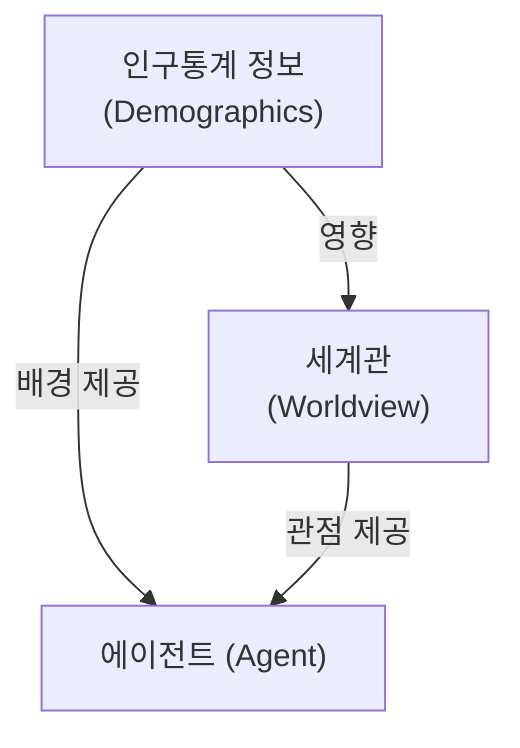
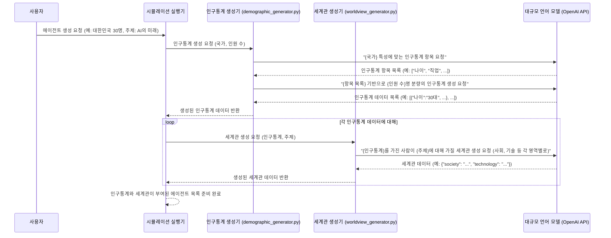

# Chapter 2: 인구통계 및 세계관 생성 (Demographic and Worldview Generation)


지난 [제 1장: 에이전트 (Agent)](01_에이전트__agent__.md)에서는 우리 `simulacra-futura` 시뮬레이션의 가장 기본적인 구성 단위인 에이전트에 대해 알아보았습니다. 에이전트가 가상의 개인으로서 시뮬레이션에 참여한다는 것을 기억하시나요? 하지만 에이전트가 그냥 텅 빈 껍데기라면 아무런 의미가 없겠죠. 각 에이전트는 자신만의 생각과 특징을 가져야 합니다.

이번 장에서는 바로 이 에이전트에게 '개성'을 불어넣는 과정, 즉 **인구통계 정보와 세계관을 생성하는 방법**에 대해 자세히 알아보겠습니다. 마치 소설가가 매력적인 등장인물을 만들기 위해 배경 설정을 꼼꼼하게 짜는 것과 비슷하다고 생각할 수 있습니다.

## 왜 에이전트에게 인구통계와 세계관이 필요할까요?

여러분, "인공지능(AI)이 미래 사회에 어떤 영향을 미칠까?"라는 주제로 사람들의 의견을 수렴한다고 상상해 보세요. 20대 대학생과 60대 은퇴한 농부, 그리고 IT 기업의 CEO는 분명 AI를 바라보는 시각이 다를 겁니다. 20대 학생은 새로운 기술에 대한 기대감이 클 수 있고, 농부는 자신의 일자리에 대한 걱정을 할 수도 있으며, CEO는 사업 기회를 모색할 것입니다.

이처럼 다양한 배경(인구통계)을 가진 사람들은 세상을 보는 자신만의 창(세계관)을 통해 현상을 해석하고 미래를 예측합니다. `simulacra-futura`에서 에이전트들이 현실감 있는 다양한 의견을 내놓게 하려면, 바로 이러한 '다름'을 만들어주는 것이 중요합니다.

*   **인구통계 (Demographics)**: 에이전트의 기본적인 배경 정보입니다. 나이, 성별, 직업, 거주 지역, 교육 수준 등이 여기에 해당합니다. 이 정보는 에이전트가 어떤 경험을 하고 어떤 환경에 놓여있는지를 결정하는 기초가 됩니다.
*   **세계관 (Worldview)**: 에이전트가 세상을 이해하고 해석하는 방식, 즉 가치관의 집합입니다. 사회, 기술, 환경, 정치 등 다양한 영역에 대한 에이전트의 기본적인 생각이나 태도를 의미합니다. 이 세계관은 주로 에이전트의 인구통계학적 특징에 영향을 받아 형성됩니다.

이 두 가지 요소가 결합되어 각 에이전트는 고유한 정체성을 갖게 되고, 이를 바탕으로 특정 주제에 대해 자신만의 의견, 즉 [제 3장: 시나리오 생성 및 진화](03_시나리오_생성_및_진화__scenario_generation_and_evolution__.md)를 만들어낼 수 있습니다.

## 인구통계 정보 생성하기: 에이전트의 배경 설정

`simulacra-futura`에서는 `demographic_generator.py` 파일에 있는 기능들을 통해 에이전트의 인구통계 정보를 생성합니다. 이 과정은 마치 특정 국가의 인구 분포를 참고하여 가상의 시민 프로필을 만드는 것과 같습니다.

예를 들어, "대한민국에 거주하는 30명의 가상 시민"을 만들고 싶다고 해봅시다. 이때 각 시민은 서로 다른 나이, 직업, 지역 등의 특징을 가져야겠죠?

### 인구통계 정보란?

간단히 말해, 에이전트가 누구인지 알려주는 정보입니다. 다음은 일반적인 인구통계 정보의 예시입니다.

*   나이: "30대"
*   성별: "여성"
*   직업: "소프트웨어 개발자"
*   거주 지역: "경기도 성남시"
*   학력: "대학교 졸업"
*   관심사: "인공지능, 환경 문제"

이런 정보들이 모여 하나의 에이전트의 기본적인 프로필을 구성합니다.

### 인구통계 정보 생성 코드 예시

`demographic_generator.py`의 `generate_and_save_demographics` 함수를 사용하면 특정 국가와 인원수에 맞춰 인구통계 정보를 쉽게 생성할 수 있습니다. 이 함수는 내부적으로 대규모 언어 모델(LLM)을 사용하여 현실적인 데이터를 만들어냅니다.

```python
# demographic_generator.py 사용 예시 (간략화)
from demographic_generator import generate_and_save_demographics

# 대한민국 국민 1명의 인구통계 정보 생성 요청
# 실제로는 LLM을 호출하여 정보를 생성하지만, 여기서는 개념 이해를 돕기 위해
# 함수가 반환하는 가상의 결과만 보여드립니다.
korean_demographics = generate_and_save_demographics(
    n=1,  # 생성할 인구통계 정보 개수
    nation="대한민국",
    filename="sample_demographics.json" # 저장될 파일 이름
)

# 생성된 첫 번째 인구통계 정보 출력 (예시)
if korean_demographics:
    print(korean_demographics[0])
```

위 코드를 실행하면 (실제 LLM 연동 시) 다음과 같은 결과가 `sample_demographics.json` 파일에 저장되고, `korean_demographics` 변수에도 담기게 됩니다.

```
{'지역': '서울특별시', '성별': '남성', '연령': '40대', '직업': '회사원', '교육수준': '대학교 졸업'} # 예시 출력
```

이렇게 생성된 인구통계 정보는 각 에이전트의 기본적인 배경이 됩니다.

## 세계관 생성하기: 에이전트의 생각 틀 만들기

인구통계 정보가 에이전트의 '배경'이라면, 세계관은 에이전트가 세상을 바라보는 '렌즈'와 같습니다. 같은 사건이라도 어떤 렌즈를 통해 보느냐에 따라 다르게 해석될 수 있겠죠? `simulacra-futura`에서는 `worldview_generator.py` 파일의 기능을 사용하여 각 에이전트의 고유한 세계관을 만듭니다.

세계관은 주로 에이전트의 인구통계 정보와 시뮬레이션의 주요 주제를 바탕으로 형성됩니다. 예를 들어, '환경 문제에 관심이 많은 20대 대학생' 에이전트는 기술 발전이 환경에 미치는 영향에 대해 더 민감하게 반응하는 세계관을 가질 가능성이 높습니다.

### 세계관이란?

에이전트가 다양한 사회적, 기술적, 환경적 문제에 대해 가지는 기본적인 관점입니다. `agent.py` 파일에 정의된 `WorldviewStructure` 클래스는 다음과 같은 주요 영역에 대한 에이전트의 생각을 담습니다.

*   `society`: 사회 구조, 가치관에 대한 관점
*   `technology`: 기술 발전에 대한 관점
*   `environment`: 환경 문제에 대한 관점
*   `population`: 인구 변화에 대한 관점
*   `politics`: 정치 체제에 대한 관점
*   `economics`: 경제 시스템에 대한 관점
*   `resources`: 자원 활용에 대한 관점

### 세계관 생성 코드 예시

`worldview_generator.py`의 `generate_worldview_from_demographic` 함수는 특정 인구통계 정보와 주제를 바탕으로 세계관을 생성합니다. 이 함수 역시 내부적으로 LLM을 활용합니다.

```python
# worldview_generator.py 사용 예시 (간략화)
from worldview_generator import generate_worldview_from_demographic
from agent import WorldviewStructure # WorldviewStructure 클래스 가져오기

# 예시 인구통계 정보 (위에서 생성했다고 가정)
sample_demographic = {'연령': '20대', '직업': '대학생', '관심사': '환경 문제'}
topic = "미세먼지 해결 방안" # 시뮬레이션 주제

# 세계관 생성 요청
# 실제로는 LLM을 호출하여 정보를 생성하지만, 여기서는 개념 이해를 돕기 위해
# 함수가 반환하는 가상의 결과만 보여드립니다.
agent_worldview = generate_worldview_from_demographic(sample_demographic, topic)

# 생성된 세계관의 일부 출력 (예시)
if agent_worldview:
    print(f"사회에 대한 관점: {agent_worldview.society}")
    print(f"환경에 대한 관점: {agent_worldview.environment}")
```

위 코드를 실행하면 다음과 같은 `WorldviewStructure` 객체가 생성되고, 그 내용의 일부를 출력할 수 있습니다.

```
사회에 대한 관점: 정부와 기업, 시민 모두가 미세먼지 문제 해결을 위해 노력해야 합니다. # 예시 출력
환경에 대한 관점: 미세먼지는 심각한 환경 문제이며, 강력한 규제와 기술 개발이 필요합니다. # 예시 출력
```

## 인구통계와 세계관, 에이전트를 완성하다

이렇게 만들어진 인구통계 정보와 세계관은 [제 1장: 에이전트 (Agent)](01_에이전트__agent__.md)에서 배운 `Agent` 객체를 초기화하는 데 사용됩니다.



인구통계 정보는 에이전트의 기본적인 배경을 설정하고, 이 배경은 세계관 형성에 영향을 줍니다. 그리고 이 두 가지가 합쳐져 비로소 한 명의 '생각하는 에이전트'가 탄생하는 것입니다.

```python
# 에이전트 생성 과정 (simulation.py 또는 관련 로직)

# 1. 인구통계 생성 (위 예시에서 가져옴)
# demographic_data = {'지역': '서울특별시', '성별': '남성', '연령': '40대', ...}

# 2. 세계관 생성 (위 예시에서 가져옴)
# agent_worldview_data = WorldviewStructure(
#     society="정부와 기업, 시민 모두가 ...",
#     environment="미세먼지는 심각한 환경 문제이며 ...",
#     # ... 기타 관점들 ...
# )

# 3. 에이전트 객체 생성 (1장에서 배운 내용)
# from agent import Agent
# new_agent = Agent(agent_id=1, 
#                   demographic=demographic_data, 
#                   worldview=agent_worldview_data)

# print(f"에이전트 {new_agent.agent_id} 생성 완료!")
# print(f"  - 직업: {new_agent.demographic.get('직업')}")
# print(f"  - 기술에 대한 관점: {new_agent.worldview.technology}") # 예시로 기술 관점 출력
```
위 코드는 `simulation.py`의 `initialize_agents` 함수 내부에서 실제로 일어나는 과정을 간략하게 보여줍니다. 먼저 `generate_and_save_demographics`를 호출하여 인구통계 정보를 만들고, 각 인구통계 정보에 대해 `generate_worldview_from_demographic`를 호출하여 세계관을 생성한 뒤, 이들을 `Agent` 클래스의 생성자에 전달하여 에이전트 객체를 만듭니다.

## 내부 동작 살짝 엿보기

인구통계와 세계관은 어떻게 자동으로 생성될까요? `simulacra-futura`는 주로 **대규모 언어 모델 (Large Language Model, LLM)**, 예를 들어 OpenAI의 GPT와 같은 모델의 능력을 활용합니다.

1.  **인구통계 생성 단계 (`demographic_generator.py`)**:
    *   사용자가 "대한민국 국민 30명에 대한 인구통계 정보를 만들어줘" 라고 요청했다고 가정해봅시다.
    *   먼저, LLM에게 "대한민국 국민의 인구통계학적 특징을 나타내는 주요 항목들(예: 나이, 성별, 직업 등)은 무엇인가?"라고 질문하여 **인구통계 키(key) 목록**을 얻습니다.
    *   그 다음, 얻어진 키 목록을 바탕으로 "이 항목들에 대해 대한민국 실제 인구 분포를 고려하여 30명 분량의 구체적인 값을 채워줘" 라고 LLM에게 요청하여 **인구통계 데이터**를 생성합니다.

2.  **세계관 생성 단계 (`worldview_generator.py`)**:
    *   앞서 생성된 어떤 에이전트의 인구통계 정보(예: "40대, 교사, 서울 거주")와 시뮬레이션 주제(예: "원격 교육의 미래")를 LLM에게 전달합니다.
    *   그리고 "이러한 배경을 가진 사람이 이 주제에 대해 사회, 기술, 환경 등의 측면에서 어떤 생각을 가질 것 같아?"라고 질문하여 해당 에이전트의 **세계관 데이터**를 생성합니다.

이 과정을 간단한 순서도로 표현하면 다음과 같습니다.



### `demographic_generator.py` 자세히 보기

이 파일의 핵심 함수는 `generate_demographics` (내부적으로 `generate_demographic_batch` 사용)와 `generate_demographic_keys` 입니다.

*   `generate_demographic_keys(nation: str)`: 특정 국가(`nation`)에 적합한 인구통계 정보의 항목 이름들(예: "연령", "직업", "관심사")을 LLM을 통해 결정합니다.
    ```python
    # demographic_generator.py (일부 개념)
    def generate_demographic_keys(nation: str) -> List[str]:
        prompt = f"{nation} 국민의 특성을 나타낼 인구통계 항목은 무엇인가요? JSON 리스트로 알려주세요."
        # response = client.chat.completions.create(...) # LLM 호출
        # keys = json.loads(response.choices[0].message.content)
        return ["연령", "성별", "직업", "지역"] # 예시: LLM이 반환한 키 목록
    ```

*   `generate_demographics(n: int, demographic_keys: List[str], nation: str)`: 위에서 얻은 항목들(`demographic_keys`)을 바탕으로, 해당 국가(`nation`)의 실제 인구 분포를 고려하여 `n`명의 구체적인 인물 정보(값)를 LLM을 통해 생성합니다.
    ```python
    # demographic_generator.py (일부 개념)
    def generate_demographics(n: int, keys: List[str], nation: str) -> List[Dict[str, Any]]:
        all_demographics = []
        # 실제로는 여러 명을 한 번에 생성하거나, 배치로 나누어 생성합니다.
        for _ in range(n):
            prompt = f"{nation} 국민의 인구통계 정보를 생성합니다. 항목: {keys}. 현실적인 값을 채워주세요."
            # response = client.chat.completions.create(...) # LLM 호출
            # demographic_data = json.loads(response.choices[0].message.content)
            # all_demographics.append(demographic_data)
            # 아래는 LLM 호출을 간단화한 예시입니다.
            example_data = {key: f"임의의 {key} 값" for key in keys}
            all_demographics.append(example_data)
        return all_demographics
    ```

### `worldview_generator.py` 자세히 보기

이 파일의 핵심 함수는 `generate_worldview_from_demographic` 입니다.

*   `generate_worldview_from_demographic(demographic: Dict[str, Any], topic: Optional[str])`: 입력받은 개인의 인구통계 정보(`demographic`)와 현재 시뮬레이션의 주제(`topic`)를 바탕으로, 그 사람이 가질 법한 세계관(사회, 기술, 환경 등에 대한 생각)을 LLM을 통해 생성하여 `WorldviewStructure` 객체로 반환합니다.
    ```python
    # worldview_generator.py (일부 개념)
    from agent import WorldviewStructure

    def generate_worldview_from_demographic(demographic: Dict[str, Any], topic: str) -> WorldviewStructure:
        demographic_str = ", ".join([f"{k}: {v}" for k, v in demographic.items()])
        prompt = f"""
        다음 인물 정보: [{demographic_str}]
        이 사람이 '{topic}'라는 주제에 대해 어떤 세계관을 가질까요?
        사회, 기술, 환경, 인구, 정치, 경제, 자원에 대한 관점을 각각 설명해주세요.
        JSON 형식으로 답변해주세요: {{"society": "...", "technology": "...", ...}}
        """
        # response = client.chat.completions.create(...) # LLM 호출
        # worldview_dict = json.loads(response.choices[0].message.content)
        # return WorldviewStructure(**worldview_dict) # 딕셔너리를 WorldviewStructure 객체로 변환

        # 아래는 LLM 호출을 간단화한 예시입니다.
        return WorldviewStructure(
            society=f"{demographic.get('직업', '한 시민')}으로서 사회는 ...해야 한다고 생각합니다.",
            technology="기술은 중요하지만 ... 점도 고려해야 합니다.",
            # ... 나머지 필드도 유사하게 생성 ...
        )
    ```

물론 실제 코드에는 오류 처리, 테스트 모드 지원, 여러 건의 데이터를 효율적으로 처리하기 위한 병렬 처리 등 더 많은 내용이 포함되어 있지만, 핵심 아이디어는 위와 같습니다.

## 정리하며

이번 장에서는 시뮬레이션에 참여할 에이전트들에게 살아있는 듯한 개성을 부여하는 첫 단계인 **인구통계 정보 및 세계관 생성** 과정을 살펴보았습니다.

*   **인구통계 정보**는 에이전트의 나이, 직업, 성별 등 기본적인 배경을 설정합니다. (`demographic_generator.py`)
*   **세계관**은 이러한 인구통계 정보를 바탕으로 에이전트가 세상을 바라보는 관점, 즉 사회, 기술, 환경 등에 대한 기본적인 생각을 형성합니다. (`worldview_generator.py`)

이 두 가지 정보가 결합되어 각 에이전트는 고유한 정체성을 갖게 됩니다. 마치 우리가 다양한 배경과 생각을 가진 사람들을 만나듯, 시뮬레이션 속 에이전트들도 각자의 '이야기'를 가지게 되는 것입니다.

이제 에이전트들이 자신만의 배경과 생각을 갖추었으니, 다음 단계는 이들이 특정 주제에 대해 구체적인 의견, 즉 '시나리오'를 만들어내는 과정입니다. 다음 장에서 이 흥미로운 과정을 함께 살펴보겠습니다!

➡️ [제 3장: 시나리오 생성 및 진화 (Scenario Generation and Evolution)](03_시나리오_생성_및_진화__scenario_generation_and_evolution__.md)

---

Generated by [AI Codebase Knowledge Builder](https://github.com/The-Pocket/Tutorial-Codebase-Knowledge)