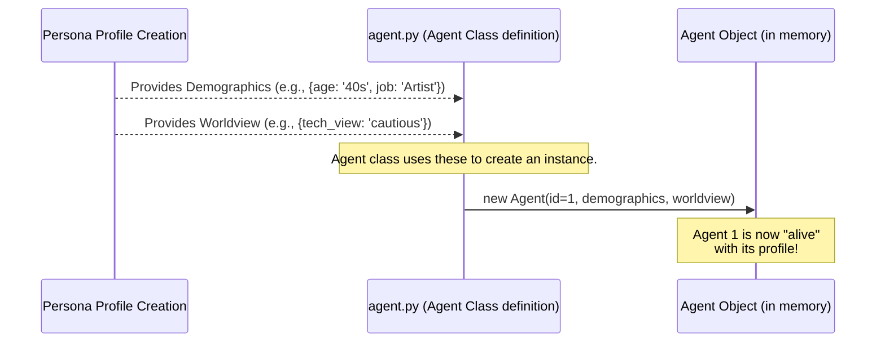

# Chapter 3: Agent Model

Welcome to Chapter 3! In [Chapter 2: Persona Profile Creation](02_persona_profile_creation_.md), we learned how `simulacra-futura` creates detailed "character sheets" for our digital individuals, giving them demographics (like age and job) and a unique worldview.

But a character sheet is just a description. How do these individuals actually become "actors" or "characters" in our simulation? That's where the **Agent Model** comes in!

## What's an Agent Model? The "Brain and Soul" of Our Digital Characters

Think of the Agent Model as the blueprint for the "brain and soul" of each character in our simulation. It's what takes the persona profiles we created and turns them into active participants.

**What an Agent Is:**
In `simulacra-futura`, an "Agent" is a digital persona that:
1.  Has a **unique identity** (like a name or ID).
2.  Carries its **background** (the demographics we saw in Chapter 2, e.g., "35-year-old Engineer").
3.  Possesses a **way of seeing the world** (their worldview, e.g., "optimistic about technology").
4.  Can **generate ideas about the future** (we call these "Scenarios").
5.  Can **change its mind** or evolve its ideas over time based on interactions (more on this in [Chapter 4: Scenario Dynamics](04_scenario_dynamics_.md)).

Imagine a large-scale societal role-playing game. Each player (Agent) has their own character sheet, beliefs, and then they *act* – they propose ideas, react to events, and discuss with others. Our Agent Model defines how these digital players are structured in the code.

The core idea is that an Agent's individual characteristics (their demographics and worldview) deeply influence how they perceive potential futures and what kind of future scenarios they might propose or support.

## Bringing an Agent to Life: The `Agent` Class

In the `simulacra-futura` project, the "Agent Model" is primarily represented by the `Agent` class found in the `agent.py` file. This class is like a container that holds all the information and capabilities of a single digital character.

Let's look at the key pieces of information an `Agent` object holds:

1.  **Identity:** A unique `agent_id`.
2.  **Demographics:** A dictionary holding their background information (e.g., `{'age': '30s', 'occupation': 'Teacher'}`). This comes directly from the [Persona Profile Creation](02_persona_profile_creation_.md) process.
3.  **Worldview:** A structured way of representing their beliefs and perspectives across various domains (society, technology, environment, etc.). This also comes from [Persona Profile Creation](02_persona_profile_creation_.md).
4.  **Scenarios:** A list where the Agent stores ideas or "scenarios" about the future that they generate or encounter.

### How an Agent Gets Its "Stuff"

Remember those `demographics` and `worldview` details from Chapter 2? When the simulation starts and initializes its agents, it creates an `Agent` object for each one and "fills" it with this information.


This diagram shows that the persona details (demographics and worldview) are passed to the `Agent` class, which then creates an actual `Agent` object – our digital character.

### Peeking Inside `agent.py`: The Building Blocks

Let's look at simplified snippets from `agent.py` to understand these components.

**1. `WorldviewStructure`: How an Agent Sees the World**

The agent's worldview isn't just a random thought; it's structured. The `WorldviewStructure` class helps organize this.

```python
# Simplified from agent.py
from dataclasses import dataclass

@dataclass
class WorldviewStructure:
    """Organizes an agent's views on different life aspects."""
    society: str = ""       # Views on social structures
    technology: str = ""    # Views on technology
    environment: str = ""   # Views on the environment
    # ... and other aspects like politics, economics, etc.
```
This `dataclass` is like a template. Each agent will have its own `WorldviewStructure` filled with *its specific* views, based on its persona. For example, one agent's `technology` field might say "Excited by AI advancements," while another's might say "Wary of automation."

**2. `Scenario`: An Agent's Idea About the Future**

Agents think about the future! When an Agent proposes an idea, that idea is also structured. This is where the `Scenario` class comes in.

```python
# Simplified from agent.py
@dataclass
class Scenario:
    """Represents an agent's idea or scenario about the future."""
    society: str = ""       # The future of society in this scenario
    technology: str = ""    # The future of technology
    # ... other aspects ...
    agent_id: Optional[str] = None # Who proposed this?
```
Similar to `WorldviewStructure`, a `Scenario` object holds different facets of a potential future. An agent might generate a scenario like: "A future where renewable **technology** is widespread, leading to a more equitable **society**."

**3. The `Agent` Class Itself: Putting It All Together**

Now, let's see how the `Agent` class uses these.

```python
# Simplified from agent.py
class Agent:
    def __init__(self, agent_id: int, 
                 demographic: Dict[str, Any], 
                 worldview: WorldviewStructure):
        self.agent_id = agent_id
        self.demographic = demographic    # Their "character sheet"
        self.worldview = worldview        # How they see things
        self.scenarios: List[Scenario] = [] # Their ideas (initially empty)
        # ... other attributes like adopted_scenario ...
```
When a new `Agent` is created (or "initialized"):
*   It gets an `agent_id`.
*   It's given its `demographic` data (from [Persona Profile Creation](02_persona_profile_creation_.md)).
*   It's given its `worldview` (a `WorldviewStructure` object, also from Chapter 2).
*   It starts with an empty list of `scenarios`. As the simulation runs, this list will get populated with ideas the agent generates or adopts.

For example, after the setup from [Chapter 1: Configuration System](01_configuration_system_.md) and [Chapter 2: Persona Profile Creation](02_persona_profile_creation_.md), the simulation might create an agent like this:

```python
# Conceptual example of creating an Agent instance
# (Actual creation is handled within the simulation orchestrator)

# Assume demo_profile and wv_profile are loaded/generated as in Chapter 2
demo_profile = {"age": "50s", "occupation": "Farmer"}
wv_profile_data = {"society": "Values community", "technology": "Prefers proven methods"}
agent_worldview = WorldviewStructure(**wv_profile_data) # Creates Worldview object

# Create the Agent!
agent1 = Agent(agent_id=1, demographic=demo_profile, worldview=agent_worldview)

print(f"Agent {agent1.agent_id} is a {agent1.demographic['occupation']}.")
# Output: Agent 1 is a Farmer.
print(f"Their view on society: {agent1.worldview.society}")
# Output: Their view on society: Values community
```
This `agent1` object is now a fully defined digital character in our simulation, ready to participate!

### Storing and Loading Agents

Just like you can save your progress in a game, `simulacra-futura` can save and load the state of these agents. The `agent.py` file includes helper functions for this:

*   `agent.to_dict()`: A method within the `Agent` class that converts an Agent object into a dictionary format, which is easy to save (e.g., as JSON).
*   `Agent.from_dict()`: A class method that can create an `Agent` object from such a dictionary.
*   `save_agents(list_of_agents, filename)`: Saves a list of Agent objects to a file.
*   `load_agents(filename)`: Loads a list of Agent objects from a file.

```python
# Simplified concept of saving agents (from agent.py)
def save_agents(agents: List[Agent], filename: str):
    agents_data_to_save = []
    for ag in agents:
        agents_data_to_save.append(ag.to_dict()) # Convert each agent to dict
    # ... code to write agents_data_to_save to a JSON file ...
    print(f"Saved {len(agents)} agents to {filename}.")

# To use it (conceptual):
# save_agents([agent1, agent2], "my_agents.json")
```
This is super helpful for pausing a simulation and resuming it later, or for analyzing the agents' states at different points.

## Why is the Agent Model Important?

*   **The "Actors" of the Simulation:** Agents are not just data; they are the entities that will drive the simulation forward by generating and reacting to ideas.
*   **Linking Personality to Action:** The Agent Model ensures that an agent's background (demographics) and beliefs (worldview) are intrinsically linked to how it behaves and what futures it imagines. A young tech enthusiast will likely propose different scenarios than an elderly historian.
*   **Foundation for Dynamics:** These well-defined Agents are the foundation upon which [Chapter 4: Scenario Dynamics](04_scenario_dynamics_.md) will build. How they interact, how their ideas spread, and how consensus is formed all depend on these individual Agent models.

## What We've Learned

In this chapter, we've dived into the **Agent Model**, the core representation of our digital characters in `simulacra-futura`.
*   We learned that an Agent encapsulates an identity, demographics, and a worldview, making them unique individuals.
*   These Agents are defined by the `Agent` class in `agent.py`, which uses other structures like `WorldviewStructure` to organize their beliefs and `Scenario` to represent their ideas about the future.
*   The persona profiles from [Chapter 2: Persona Profile Creation](02_persona_profile_creation_.md) provide the initial data to "bring these Agents to life."

Our agents are now defined! They have their unique personalities and perspectives. But what do they *do*? How do they come up with ideas about the future and interact with each other's ideas? That's what we'll explore next.

Next up: [Chapter 4: Scenario Dynamics](04_scenario_dynamics_.md)

---

Generated by [AI Codebase Knowledge Builder](https://github.com/The-Pocket/Tutorial-Codebase-Knowledge)