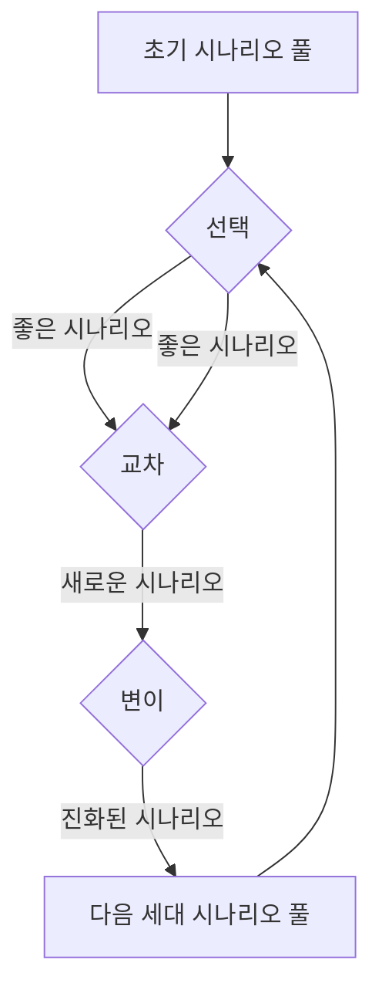
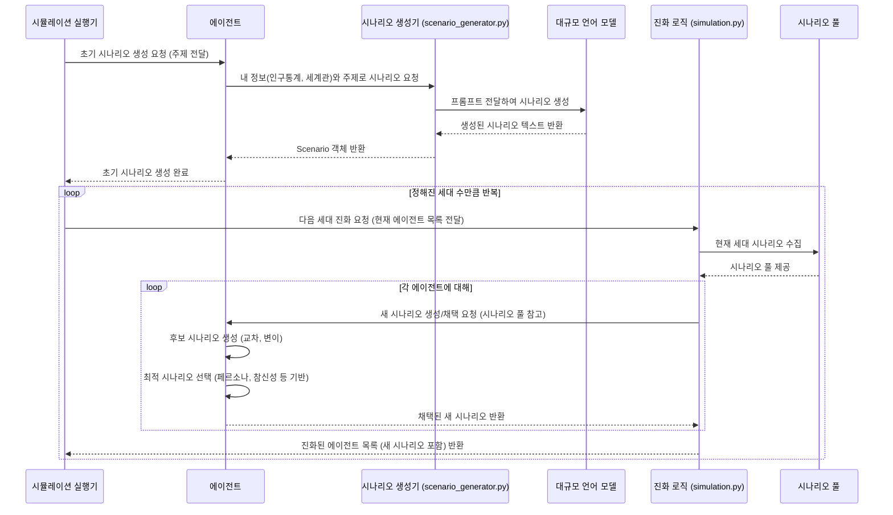

# Chapter 3: 시나리오 생성 및 진화 (Scenario Generation and Evolution)


지난 [제 2장: 인구통계 및 세계관 생성](02_인구통계_및_세계관_생성__demographic_and_worldview_generation__.md)에서는 우리 `simulacra-futura` 시뮬레이션 속 에이전트들에게 고유한 배경(인구통계)과 생각의 틀(세계관)을 부여하는 과정을 살펴보았습니다. 이제 각 에이전트는 자신만의 개성을 갖추게 되었으니, 다음 단계는 이들이 특정 주제에 대해 구체적인 미래 예측, 즉 '시나리오'를 만들어내는 것입니다.

이번 장에서는 에이전트들이 어떻게 미래 시나리오를 창조하고, 이 시나리오들이 여러 세대를 거치며 더욱 새롭고 정교한 아이디어로 발전해 나가는지, 즉 **시나리오 생성 및 진화** 과정에 대해 알아보겠습니다.

## 미래를 상상하는 에이전트: 시나리오란 무엇일까요?

여러분은 "10년 후 전기 자동차는 우리 생활에 어떤 모습일까?"라는 질문을 받는다면 어떤 상상을 하시겠어요? 어떤 사람은 하늘을 나는 전기 자동차를, 다른 사람은 모든 충전소가 태양광으로 운영되는 모습을, 또 다른 사람은 전기 자동차로 인해 대기오염이 사라진 도시를 떠올릴 수 있습니다. 이렇게 **특정 주제에 대해 각자가 그리는 미래의 모습이나 의견**이 바로 **시나리오**입니다.

`simulacra-futura`에서 에이전트들은 [제 2장: 인구통계 및 세계관 생성](02_인구통계_및_세계관_생성__demographic_and_worldview_generation__.md)에서 얻은 자신만의 인구통계학적 특성과 세계관을 바탕으로 주어진 주제(예: "전기 자동차의 미래")에 대한 다양한 시나리오를 만들어냅니다.

예를 들어,
*   **환경 운동가 에이전트**: "전기 자동차는 화석 연료 사용을 줄여 환경 보호에 크게 기여할 것이며, 대중교통과의 연계를 통해 도시의 모습을 바꿀 것이다."
*   **기술 낙관론자 에이전트**: "모든 전기 자동차는 완전 자율 주행 기능을 갖추게 될 것이며, 인공지능이 최적의 경로와 충전 스케줄을 관리할 것이다."
*   **경제학자 에이전트**: "전기 자동차 산업은 새로운 일자리를 창출하지만, 기존 내연기관 산업의 전환 과정에서 경제적 충격이 발생할 수 있다."

이처럼 다양한 배경과 관점을 가진 에이전트들이 각자의 시나리오를 제시함으로써, 우리는 하나의 주제에 대한 다채로운 미래상을 탐색할 수 있습니다.

## 첫 번째 아이디어: 시나리오 생성하기

에이전트가 시나리오를 만드는 과정은 `scenario_generator.py` 파일의 도움을 받습니다. 이 모듈은 에이전트의 정보와 주제를 바탕으로 대규모 언어 모델(LLM)에게 요청하여 그럴듯한 시나리오를 생성합니다.

에이전트가 생성하는 시나리오는 [제 1장: 에이전트 (Agent)](01_에이전트__agent__.md)에서 보았던 `Scenario` 클래스 형태로 저장됩니다. 각 시나리오는 사회, 기술, 환경 등 여러 측면에 대한 구체적인 내용을 담고 있습니다.

```python
# agent.py (일부 복습)
from dataclasses import dataclass, field
from typing import Optional

@dataclass
class Scenario:
    society: str = ""       # 사회적 관점의 의견
    technology: str = ""    # 기술적 관점의 의견
    environment: str = ""   # 환경적 관점의 의견
    # ... 기타 인구, 정치, 경제, 자원 등 측면 생략 ...
    agent_id: Optional[str] = None # 이 시나리오를 만든 에이전트 ID
    selected: bool = False  # 진화 과정에서 선택되었는지 여부
```
위 `Scenario` 데이터 클래스는 에이전트가 특정 주제에 대해 다양한 측면에서 어떤 생각을 하는지를 담는 그릇입니다.

### 시나리오 생성 코드 맛보기

`scenario_generator.py`의 `generate_scenario_for_agent` 함수는 특정 에이전트와 주제를 받아 시나리오를 생성합니다.

```python
# scenario_generator.py (개념적 예시)
from agent import Agent, Scenario # Agent와 Scenario 클래스 가져오기

def generate_scenario_for_agent(agent: Agent, topic: str) -> Scenario:
    # 에이전트의 인구통계 정보와 세계관을 바탕으로 LLM에게 요청할 프롬프트 생성
    prompt = f"{agent.demographic} 정보와 {agent.worldview} 세계관을 가진 에이전트가 '{topic}'에 대해 어떻게 생각할까요? 사회, 기술, 환경 측면에서 구체적으로 답해주세요."
    
    # 실제로는 LLM API를 호출합니다.
    # llm_response_json = call_llm(prompt) 
    # 여기서는 가상의 응답을 사용합니다.
    llm_response_json = {
        "society": "전기차는 공유경제를 활성화시킬 것입니다.",
        "technology": "배터리 기술이 획기적으로 발전할 것입니다.",
        "environment": "도시 대기 질이 크게 개선될 것입니다."
    }
    
    return Scenario(
        society=llm_response_json.get("society"),
        technology=llm_response_json.get("technology"),
        environment=llm_response_json.get("environment"),
        agent_id=str(agent.agent_id)
    )

# 에이전트 예시 (1, 2장에서 생성되었다고 가정)
# from agent import WorldviewStructure
# example_agent = Agent(agent_id=1, 
#                       demographic={"직업": "엔지니어"}, 
#                       worldview=WorldviewStructure(technology="기술은 미래를 바꾼다"))

# 시나리오 생성 요청
# electric_car_scenario = generate_scenario_for_agent(example_agent, "전기 자동차의 미래")
# print(f"에이전트 {electric_car_scenario.agent_id}의 시나리오 (기술): {electric_car_scenario.technology}")
```
위 코드가 실행되면 (실제 LLM 연동 시) `example_agent`의 특성을 반영한 "전기 자동차의 미래" 시나리오가 생성됩니다. 예를 들어, `electric_car_scenario.technology`는 "배터리 기술이 획기적으로 발전할 것입니다."와 같은 내용을 담게 됩니다.

이렇게 각 에이전트는 자신만의 첫 번째 시나리오를 갖게 됩니다. 이 시나리오들은 앞으로 펼쳐질 '진화' 과정의 출발점이 됩니다.

## 아이디어 발전시키기: 시나리오의 진화

`simulacra-futura`의 핵심적인 특징 중 하나는 생성된 시나리오들이 **유전 알고리즘(Genetic Algorithm)**의 원리를 통해 여러 **세대(generation)**를 거치며 발전한다는 점입니다. 마치 생물이 환경에 적응하며 진화하듯, 미래 시나리오들도 더 나은 아이디어로 진화해 나갑니다.

이 진화 과정은 크게 세 가지 단계로 이루어집니다:

1.  **선택 (Selection)**: 현재 세대의 시나리오들 중에서 "좋은" 시나리오들을 선택합니다. 여기서 "좋음"의 기준은 다양할 수 있습니다. 예를 들어, 에이전트의 페르소나와 얼마나 잘 맞는지, 또는 기존 시나리오들과 얼마나 다른 새로운 관점을 제시하는지 등이 기준이 될 수 있습니다. ([`scenario_selector.py`](scenario_selector.py)의 `select_scenario` 함수가 이 역할을 합니다.)
2.  **교차 (Crossover)**: 선택된 두 부모 시나리오의 아이디어를 조합하여 새로운 자식 시나리오를 만듭니다. 예를 들어, 한 시나리오의 기술적 전망과 다른 시나리오의 사회적 전망을 결합하는 식입니다. ([`simulation.py`](simulation.py)의 `crossover_scenarios` 함수)
3.  **변이 (Mutation)**: 생성된 자식 시나리오에 작은 변화를 무작위로 추가합니다. 이는 기존에 없던 새로운 아이디어가 등장할 가능성을 열어줍니다. 예를 들어, "모든 자동차가 자율주행차가 될 것이다"라는 시나리오에 "하지만, 해킹 위험에 대한 대비가 필요하다"라는 문장을 추가하는 식입니다. ([`simulation.py`](simulation.py)의 `mutate_scenario` 함수)

이 세 단계를 반복하면서 시나리오들은 점점 더 다양해지고, 때로는 예상치 못한 창의적인 미래상으로 발전하게 됩니다.



이 그림처럼, 초기 시나리오들은 선택, 교차, 변이 과정을 거쳐 다음 세대의 시나리오 풀을 형성하고, 이 과정이 여러 세대에 걸쳐 반복됩니다.

### 선택 (Selection): 좋은 아이디어 고르기

다양한 시나리오들 중에서 어떤 것을 다음 세대로 전달할지 결정하는 과정입니다. `simulation.py`의 `select_scenarios` 함수(또는 `scenario_selector.py`의 더 정교한 선택 로직)가 이 역할을 합니다. 간단하게는 무작위로 몇 개를 고를 수도 있고, 각 시나리오의 "적합도(fitness)"를 평가하여 우수한 시나리오를 선택할 수도 있습니다.

```python
# simulation.py (select_scenarios 함수의 개념적 간소화)
import random

def select_scenarios_simple(scenario_pool: list, num_to_select: int) -> list:
    # 시나리오 풀에서 무작위로 num_to_select 개수만큼 선택
    if len(scenario_pool) <= num_to_select:
        return scenario_pool[:] # 모든 시나리오 선택
    
    selected = random.sample(scenario_pool, num_to_select)
    for s in selected:
        s.selected = True # 선택되었음을 표시
    print(f"{len(selected)}개의 시나리오가 다음 세대를 위해 선택되었습니다.")
    return selected

# 가상 시나리오 풀 (Scenario 객체들의 리스트라고 가정)
# pool = [Scenario(society="A"), Scenario(society="B"), Scenario(society="C"), Scenario(society="D")]
# selected_for_next_gen = select_scenarios_simple(pool, 2)
# print([s.society for s in selected_for_next_gen]) # 예시: ['A', 'C'] 또는 다른 조합
```
위 코드는 시나리오 풀에서 무작위로 두 개의 시나리오를 선택하는 간단한 예시입니다. 실제로는 `scenario_selector.py`에서 에이전트의 페르소나와의 유사도나 시나리오의 참신성 등 더 복잡한 기준을 사용할 수 있습니다.

### 교차 (Crossover): 아이디어 섞기

선택된 두 "부모" 시나리오의 특징을 섞어 새로운 "자식" 시나리오를 만듭니다. 마치 부모의 유전자를 물려받아 자식이 태어나는 것과 비슷합니다. `simulation.py`의 `crossover_scenarios` 함수가 이 역할을 합니다.

```python
# simulation.py (crossover_scenarios 함수의 개념적 간소화)
from agent import Scenario # Scenario 클래스 가져오기

def crossover_scenarios_simple(scenario1: Scenario, scenario2: Scenario, new_agent_id: str) -> Scenario:
    new_scenario = Scenario(agent_id=new_agent_id)
    # 각 측면(society, technology 등)에 대해 무작위로 부모 시나리오 중 하나를 선택
    if random.random() < 0.5:
        new_scenario.society = scenario1.society
    else:
        new_scenario.society = scenario2.society
        
    if random.random() < 0.5:
        new_scenario.technology = scenario1.technology
    else:
        new_scenario.technology = scenario2.technology
    # ... 다른 측면들도 유사하게 처리 ...
    print(f"두 시나리오가 교차되어 새로운 시나리오 '{new_scenario.society[:10]}...'가 생성되었습니다.")
    return new_scenario

# 부모 시나리오 예시
# parent1 = Scenario(society="사회는 협력적", technology="기술은 발전적", agent_id="p1")
# parent2 = Scenario(society="사회는 경쟁적", technology="기술은 신중해야", agent_id="p2")

# 교차 실행
# child_scenario = crossover_scenarios_simple(parent1, parent2, "child1")
# print(f"자식 시나리오 사회: {child_scenario.society}, 기술: {child_scenario.technology}")
# 예시 출력: 자식 시나리오 사회: 사회는 협력적, 기술: 기술은 신중해야 (무작위 선택에 따라 달라짐)
```
이 코드에서는 두 부모 시나리오의 사회적 측면과 기술적 측면을 무작위로 조합하여 새로운 자식 시나리오를 만듭니다. 실제 `crossover_scenarios` 함수는 시나리오의 모든 측면을 고려하여 교차를 수행합니다.

### 변이 (Mutation): 새로운 생각의 씨앗 뿌리기

교차를 통해 생성된 자식 시나리오에 작은, 무작위적인 변화를 주는 과정입니다. 이는 기존에는 없던 새로운 아이디어나 관점이 등장할 수 있는 기회를 제공합니다. `simulation.py`의 `mutate_scenario` 함수가 이 역할을 합니다.

```python
# simulation.py (mutate_scenario 함수의 개념적 간소화)
from agent import Scenario # Scenario 클래스 가져오기

def mutate_scenario_simple(scenario: Scenario) -> Scenario:
    mutation_chance = 0.1 # 10% 확률로 변이 발생
    if random.random() < mutation_chance:
        # 간단한 변이: 특정 측면에 덧붙이는 말 추가
        if scenario.technology: # 기술적 측면이 있다면
            scenario.technology += " 하지만 예기치 못한 부작용도 고려해야 합니다."
            print(f"시나리오 '{scenario.technology[:20]}...'에 변이가 적용되었습니다.")
    return scenario

# 변이시킬 시나리오 예시
# scenario_to_mutate = Scenario(technology="AI가 모든 것을 자동화할 것이다.", agent_id="c1")
# mutated_scenario = mutate_scenario_simple(scenario_to_mutate)
# print(f"변이 후 기술 시나리오: {mutated_scenario.technology}")
# 예시 출력 (10% 확률로): 변이 후 기술 시나리오: AI가 모든 것을 자동화할 것이다. 하지만 예기치 못한 부작용도 고려해야 합니다.
```
이 예시에서는 10%의 확률로 시나리오의 기술적 측면에 "하지만 예기치 못한 부작용도 고려해야 합니다."라는 문장을 덧붙입니다. 실제 `mutate_scenario` 함수는 더 다양한 방식의 변이를 적용할 수 있습니다.

## 세대를 거듭하는 진화: `evolve_generation`

`simulation.py`의 `evolve_generation` 함수는 위에서 설명한 선택, 교차, 변이 과정을 한 세대에 걸쳐 총괄합니다. 이 함수는 현재 세대의 에이전트(와 그들의 시나리오)를 입력으로 받아, 진화된 다음 세대의 시나리오를 가진 에이전트 목록을 반환합니다.

중요한 점은, `simulacra-futura`에서는 **에이전트 자체(인구통계, 세계관)는 변하지 않고, 에이전트가 생성하고 채택하는 시나리오만 진화**한다는 것입니다. 각 에이전트는 여러 세대에 걸쳐 다양한 시나리오를 접하고, 그중 자신의 페르소나에 가장 적합하거나 가장 참신하다고 판단되는 시나리오를 "채택"하게 됩니다.

```python
# simulation.py (evolve_generation 및 evolve_agent 함수의 개념적 흐름)

# evolve_agent: 한 에이전트가 새 시나리오를 만드는 과정 (간략화)
def evolve_agent_conceptual(agent: Agent, scenario_pool: list, topic: str):
    # 1. 시나리오 풀에서 관심 있는 시나리오 2개 선택 (예: 무작위 또는 유사도 기반)
    #    (select_scenarios_simple 또는 scenario_selector.py의 기능 활용)
    # selected_other_scenarios = select_from_pool(scenario_pool, 2) 
    
    # 2. 자신의 기존 시나리오와 선택된 시나리오들을 조합 (교차)
    #    (crossover_scenarios_simple 활용)
    # new_scenario_idea = crossover_ideas(agent.get_latest_scenario(), selected_other_scenarios[0], ...)
    
    # 3. 약간의 변형 (변이)
    #    (mutate_scenario_simple 활용)
    # final_new_scenario = mutate_idea(new_scenario_idea)
    
    # 4. 생성된 아이디어를 자신의 시나리오 목록에 추가
    # agent.add_scenario(final_new_scenario)
    # print(f"에이전트 {agent.agent_id}가 새로운 시나리오를 생성했습니다.")
    pass # 실제 구현은 복잡하므로 개념만 설명

# evolve_generation: 한 세대의 모든 에이전트에 대해 시나리오 진화 (간략화)
def evolve_generation_conceptual(current_agents: list, topic: str):
    all_current_scenarios = [] # 현재 세대의 모든 시나리오를 모음
    for agent in current_agents:
        if agent.get_latest_scenario():
            all_current_scenarios.append(agent.get_latest_scenario())
            
    for agent in current_agents:
        # 각 에이전트는 전체 시나리오 풀을 참고하여 새 시나리오를 만듦
        evolve_agent_conceptual(agent, all_current_scenarios, topic)
        
    print(f"{len(current_agents)}명의 에이전트가 한 세대 진화했습니다.")
    return current_agents # 업데이트된 에이전트 목록 반환
```
실제 `evolve_generation`과 `evolve_agent` 함수는 각 에이전트가 자신의 페르소나와 다른 에이전트들의 시나리오를 고려하여 새로운 시나리오를 생성하고, 그중 가장 적합한 것을 채택하는 더 정교한 과정을 거칩니다. 이 모든 과정은 [제 4장: 시뮬레이션 총괄 (Simulation Orchestration)](04_시뮬레이션_총괄__simulation_orchestration__.md)에서 자세히 다루는 `run_simulation` 함수에 의해 여러 세대에 걸쳐 반복됩니다.

## 내부 동작 살짝 엿보기: 시나리오 생성과 진화의 흐름

에이전트가 시나리오를 만들고, 이 시나리오들이 진화하는 과정을 좀 더 자세히 들여다봅시다.

1.  **초기 시나리오 생성 (0세대)**:
    *   [제 2장: 인구통계 및 세계관 생성](02_인구통계_및_세계관_생성__demographic_and_worldview_generation__.md)을 통해 모든 에이전트는 각자의 인구통계 정보와 세계관을 갖습니다.
    *   `scenario_generator.py`의 `generate_scenarios_for_agents` 함수가 호출됩니다.
    *   각 에이전트에 대해 `generate_scenario_for_agent` 함수는 에이전트의 정보와 시뮬레이션 주제(예: "전기 자동차의 미래")를 LLM에 전달하여 초기 시나리오를 생성합니다.
    *   이렇게 생성된 초기 시나리오들은 각 에이전트에게 할당됩니다.

2.  **시나리오 진화 (1세대 이후)**:
    *   `simulation.py`의 `evolve_generation` 함수가 호출됩니다.
    *   **시나리오 풀 구성**: 현재 세대(이전 세대)의 모든 에이전트들이 가진 (채택된) 시나리오들을 모아 전체 "시나리오 풀"을 만듭니다.
    *   **각 에이전트의 시나리오 생성/채택**:
        *   각 에이전트는 자신의 페르소나와 현재 시나리오 풀에 있는 다른 시나리오들을 참고합니다.
        *   `evolve_agent` 함수 내에서, 에이전트는 자신의 기존 시나리오와 풀에서 선택된 다른 시나리오들을 **교차(crossover)**하고 **변이(mutation)**시켜 여러 개의 새로운 후보 시나리오를 만듭니다.
        *   `scenario_selector.py`의 `select_scenario` 함수는 생성된 후보 시나리오들 중에서 해당 에이전트의 페르소나에 가장 잘 맞거나, 또는 가장 참신한 시나리오 하나를 **선택(selection)**하여 에이전트가 "채택"하도록 합니다.
    *   이 과정을 모든 에이전트에 대해 반복합니다.
    *   모든 에이전트가 새로운 세대의 시나리오를 채택하면 한 세대의 진화가 완료됩니다.
    *   이 진화 과정은 설정된 총 세대 수만큼 반복됩니다.

아래는 이 과정을 간단하게 표현한 순서도입니다.



### `scenario_generator.py` 자세히 보기

`generate_scenario_for_agent` 함수는 에이전트의 특성을 LLM이 이해할 수 있는 프롬프트로 변환하는 것이 핵심입니다.

```python
# scenario_generator.py (generate_scenario_for_agent 함수의 프롬프트 부분 일부)
def generate_scenario_for_agent(agent: Agent, topic: str) -> Scenario:
    # ... (생략) ...
    demographic_str = ", ".join([f"{k}: {v}" for k, v in agent.demographic.items()]) # 인구통계 정보를 문자열로
    worldview_str = "\n".join([f"{k}: {v}" for k, v in agent.worldview.to_dict().items()]) # 세계관을 문자열로
    
    prompt = f"""
    이런 사람: {demographic_str}
    이런 세계관: {worldview_str}
    이 사람이 "{topic}"에 대해 어떻게 생각할까요? (사회, 기술, 환경 등 7가지 관점)
    JSON 형식으로: {{"society": "...", ...}}
    """
    # response = client.chat.completions.create(model="...", messages=[{"role": "user", "content": prompt}])
    # scenario_dict = json.loads(response.choices[0].message.content)
    # return Scenario(**scenario_dict, agent_id=str(agent.agent_id))
    # ... (실제 LLM 호출 및 결과 처리 부분은 간략화) ...
    return Scenario(society="LLM이 생성한 사회 시나리오", agent_id=str(agent.agent_id)) # 예시
```
이 프롬프트를 LLM에 전달하면, LLM은 주어진 에이전트의 특성을 고려하여 주제에 대한 시나리오를 각 측면별로 생성해 JSON 형태로 반환합니다. `scenario_generator.py`는 이 JSON 응답을 파싱하여 `Scenario` 객체로 만듭니다.

### `simulation.py`의 진화 관련 함수들

*   `crossover_scenarios(scenario1, scenario2, ...)`: 두 부모 시나리오의 각 측면(사회, 기술 등)을 일정 확률로 섞어 새로운 자식 시나리오를 만듭니다.
    ```python
    # simulation.py (crossover_scenarios 일부 개념)
    def crossover_scenarios(scenario1: Scenario, scenario2: Scenario, ...) -> Scenario:
        new_scenario = Scenario(...)
        fields = ['society', 'technology', ...] # 시나리오의 모든 측면
        for field in fields:
            # 50% 확률로 scenario1의 해당 측면을, 아니면 scenario2의 측면을 가져옴
            if random.random() < 0.5:
                setattr(new_scenario, field, getattr(scenario1, field, ""))
            else:
                setattr(new_scenario, field, getattr(scenario2, field, ""))
        return new_scenario
    ```

*   `mutate_scenario(scenario)`: 시나리오의 각 측면에 일정 확률(`mutation_rate`)로 미리 정의된 변형 문구(예: "하지만 다른 관점도 고려해야 합니다.")를 추가하거나 내용을 조금씩 수정합니다.
    ```python
    # simulation.py (mutate_scenario 일부 개념)
    def mutate_scenario(scenario: Scenario) -> Scenario:
        mutation_rate = 0.3 # 변이 확률
        fields = ['society', 'technology', ...]
        for field in fields:
            if random.random() < mutation_rate and getattr(scenario, field):
                # 기존 내용에 변형 문구 추가
                setattr(scenario, field, getattr(scenario, field) + " (변이 발생!)")
        return scenario
    ```

*   `evolve_agent(agent, generation, scenario_pool, topic, all_scenarios)`: 한 에이전트가 시나리오 풀을 참고하여 여러 개의 후보 시나리오를 생성(교차, 변이 활용)하고, 그 중 자신의 페르소나에 가장 적합한 시나리오를 `scenario_selector.py`의 `select_scenario`를 통해 선택하여 채택합니다.

*   `evolve_generation(current_generation, generation)`: 현재 세대의 모든 에이전트에 대해 `evolve_agent`를 호출하여 다음 세대의 시나리오를 생성하고 채택하도록 합니다.

이러한 함수들이 유기적으로 작동하여 시나리오 풀 전체가 점진적으로 발전해 나가는 것입니다.

## 정리하며

이번 장에서는 `simulacra-futura` 프로젝트의 핵심 동력 중 하나인 **시나리오 생성 및 진화** 과정을 살펴보았습니다.

*   **시나리오 생성**: 각 에이전트는 자신의 고유한 인구통계 정보와 세계관을 바탕으로 특정 주제에 대한 초기 미래 시나리오를 만들어냅니다. 이 과정은 주로 `scenario_generator.py`와 LLM의 도움을 받습니다.
*   **시나리오 진화**: 생성된 시나리오들은 여러 세대에 걸쳐 유전 알고리즘의 원리인 **선택, 교차, 변이**를 통해 발전합니다. 이 과정을 통해 더욱 다양하고 정교하며, 때로는 창의적인 미래상들이 탐색됩니다. 이 진화 과정은 `simulation.py`의 여러 함수들을 통해 이루어집니다.

마치 다양한 아이디어가 서로 영향을 주고받으며 더 나은 해결책으로 발전하듯, `simulacra-futura`의 시나리오들도 집단 지성처럼 진화해 나갑니다. 이 과정을 통해 우리는 단일 관점에서는 보기 어려운 복잡한 미래의 다양한 가능성을 엿볼 수 있게 됩니다.

다음 장에서는 이 모든 과정, 즉 에이전트 초기화부터 시나리오 생성, 진화, 그리고 결과 저장까지의 전체 시뮬레이션 흐름을 어떻게 조율하고 실행하는지, 즉 **시뮬레이션 총괄**에 대해 알아보겠습니다.

➡️ [제 4장: 시뮬레이션 총괄 (Simulation Orchestration)](04_시뮬레이션_총괄__simulation_orchestration__.md)

---

Generated by [AI Codebase Knowledge Builder](https://github.com/The-Pocket/Tutorial-Codebase-Knowledge)