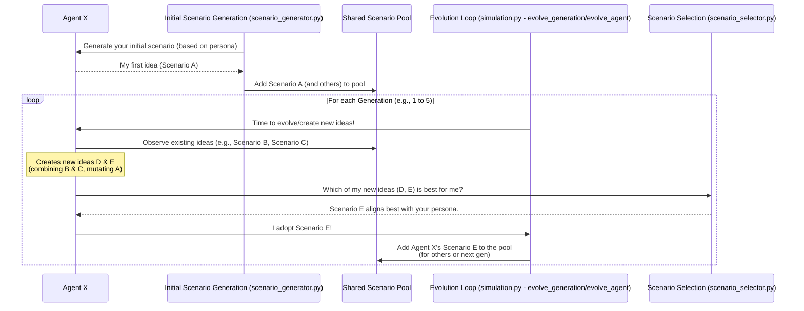

# Chapter 4: Scenario Dynamics

Welcome back! In [Chapter 3: Agent Model](03_agent_model_.md), we learned how each digital character, or "Agent," in `simulacra-futura` gets its own unique identity, background (demographics), and way of seeing the world (worldview). They are like detailed character profiles ready for action.

But what do these Agents *do* with their perspectives? How do they think about the future? And how do their ideas interact and evolve? That's what "Scenario Dynamics" is all about!

## What's the Big Idea? A Collaborative Future-Thinking Workshop!

Imagine you're in a big workshop with a diverse group of people. Your goal is to brainstorm and explore many different possibilities for the "future of cities."

1.  **Everyone's First Idea:** First, everyone jots down their own initial idea based on who they are and what they believe. An architect might focus on sustainable buildings, while a social worker might think about community spaces.
2.  **Sharing and Mixing:** Then, ideas are shared. People might team up, combine parts of their ideas, or get inspired by others to slightly change their own.
3.  **Picking the Best:** After some discussion and refinement, everyone might vote on or choose the ideas they find most promising or prefer.
4.  **Repeat:** This process might happen over several rounds, with ideas getting better and more diverse each time.

**Scenario Dynamics** in `simulacra-futura` works very much like this! It's how our digital Agents:
*   Brainstorm initial "scenarios" (their ideas about the future) based on their personas.
*   Share these scenarios.
*   Combine and slightly alter scenarios, like a creative workshop mixed with ideas from nature (like "crossover" and "mutation" in evolution).
*   Select which scenarios they "adopt" or prefer.

This process happens iteratively, over several "generations" (rounds of the simulation). It allows a wide range of future possibilities to emerge and evolve based on the collective thinking of all the Agents. It's the heart of how `simulacra-futura` explores different futures.

## The Journey of an Idea: How Scenarios Evolve

Let's break down the key steps in Scenario Dynamics. Remember, each Agent has its own persona, defined by its demographics and [worldview](03_agent_model_.md#1-worldviewstructure-how-an-agent-sees-the-world).

### Step 1: Initial Scenario Generation (The First Brainstorm)

At the very beginning of the simulation (Generation 0), each Agent creates its first scenario. This scenario is heavily influenced by its unique persona and the main `topic` of the simulation (set in your `config.toml` from [Chapter 1: Configuration System](01_configuration_system_.md)).

*   **How it works:** The `generate_scenarios_for_agents` function in `scenario_generator.py` (which we touched on when discussing how Agents get their ideas in [Chapter 3: Agent Model](03_agent_model_.md)) is called. Each Agent uses its background and worldview to dream up a future.

```python
# Conceptual: In simulation.py, during setup
# from scenario_generator import generate_scenarios_for_agents
# from agent import Agent # (and other necessary imports)

# agents = initialize_agents() # Agents are created (Ch 2 & 3)
# topic = CONFIG.get("algorithm", {}).get("topic", "Future of Work")

# Each agent now generates its first scenario
# generate_scenarios_for_agents(agents, topic)

# for agent in agents:
#     print(f"Agent {agent.agent_id} initial scenario: {agent.scenarios[0].society[:30]}...")
```
After this step, each Agent in `agents` will have at least one [Scenario](03_agent_model_.md#2-scenario-an-agents-idea-about-the-future) object in its `scenarios` list. For example, Agent 1 (a young tech entrepreneur) might propose a tech-heavy future, while Agent 2 (an elderly farmer) might propose a more nature-focused one.

### Step 2: The Scenario Pool (Sharing Ideas)

All the scenarios generated by all Agents in a generation are considered to be part of a larger "scenario pool." This pool represents the collective imagination of the Agent society at that point. Agents can draw inspiration from this pool for the next steps.

This isn't a specific data structure you'll see named "pool" in the code, but it's a concept: when new ideas are being formed, existing ideas from various agents are considered.

### Step 3: Evolution – Crossover, Mutation, and Adoption (The Workshop Rounds)

This is where things get really dynamic! For each subsequent "generation" (or round) of the simulation, Agents go through a process to refine and evolve scenarios. This is mainly handled by the `evolve_generation` and `evolve_agent` functions in `simulation.py`.

Let's look at what one Agent might do within the `evolve_agent` function:

**a. Inspiration and Combining Ideas (Crossover-like Process)**

An Agent doesn't just stick to its own initial idea. It looks at other scenarios too! It might take its own most recent scenario and combine it with a couple of interesting scenarios from the wider pool.

The `combine_scenarios` function (a helper within `simulation.py`) is a simplified way this happens. Imagine an Agent taking key aspects from different "parent" scenarios to create a new "child" scenario.

```python
# Simplified from simulation.py - combine_scenarios
# (Conceptual: an agent is trying to create a new idea)
# agent = current_agent
# source_scenarios = [agent.scenarios[-1], scenario_from_pool1, scenario_from_pool2]
# base_scenario = agent.scenarios[-1] # Its own idea is a strong base

def simplified_combine(agent_persona, ideas_to_mix, main_idea):
    new_idea = {"society": "", "technology": ""} # A new blank scenario
    # Prefer main_idea for some aspects (e.g., 70% chance)
    if random.random() < 0.7:
        new_idea["society"] = main_idea.society
    else: # Pick from other ideas_to_mix
        new_idea["society"] = random.choice(ideas_to_mix).society
    # ... similar logic for technology and other aspects ...
    return new_idea # Returns a new scenario dictionary/object
```
This new scenario is a blend, potentially bringing together diverse perspectives. For instance, an Agent might combine a scenario strong on "technology" with another strong on "social equality" to create a new scenario about "inclusive technology."

**b. Tweaking Ideas (Mutation)**

Sometimes, an idea just needs a little twist. "Mutation" introduces small, random changes to a scenario. This helps explore slightly different variations and prevents ideas from becoming too similar.

The `mutate_scenario` function in `simulation.py` does this.

```python
# Simplified from simulation.py - mutate_scenario
# new_scenario = result_from_combine_step

def simplified_mutate(scenario_to_tweak):
    if random.random() < 0.3: # 30% chance to mutate an aspect
        original_tech_idea = scenario_to_tweak.technology
        # Add a small random thought
        scenario_to_tweak.technology = original_tech_idea + " However, consider the impact on privacy."
    # ... similar for other aspects ...
    return scenario_to_tweak
```
This could mean adding a caveat, a new consideration, or slightly altering a predicted outcome in one aspect of the scenario.

**c. Choosing Favorites (Selection/Adoption)**

After an Agent has generated a few new potential scenarios (through processes like combination and mutation), it needs to decide which one it likes best or wants to "adopt" for this generation. This decision is guided by the Agent's own persona (its demographics and worldview). Does this new idea resonate with how the Agent sees the world?

The `select_scenario` function from `scenario_selector.py` helps with this. (Its use is shown in `evolve_agent` within `simulation.py`).

```python
# Conceptual: Inside evolve_agent in simulation.py
# agent = current_agent
# new_scenarios_created_by_agent = [combined_idea1, mutated_idea2, ...]
# all_scenarios_in_simulation = [...] # All scenarios so far

# The Agent uses the selector to pick one of its new creations
# selected_one = select_scenario(agent, new_scenarios_created_by_agent, all_scenarios_in_simulation)
# agent.add_scenario(selected_one) # Agent adopts this new scenario
```
The `select_scenario` function (detailed in `scenario_selector.py`) can use different strategies. For example, it might pick the scenario that is most similar to the Agent's own worldview, or sometimes it might pick a more "novel" or surprising scenario to encourage diversity. The chosen scenario is then added to the Agent's list of scenarios.

### Step 4: Iteration Across Generations

Steps 2 and 3 (pooling, combining, mutating, selecting) are repeated for a set number of "generations," which you define in your `config.toml` (e.g., `generations = 5`).


With each generation:
*   New scenarios are created from existing ones.
*   Agents refine their "preferred" scenarios.
*   The overall diversity and complexity of ideas in the scenario pool can change.

This whole process is orchestrated by `run_simulation()` in `simulation.py`, which calls `evolve_generation()` for each generation. `evolve_generation()` in turn manages the `evolve_agent()` process for every agent.

## Why is Scenario Dynamics Important?

*   **Emergent Futures:** It allows complex and diverse future possibilities to emerge from the simple rules governing individual Agents and their interactions. You're not just getting one predefined future, but a whole landscape of them.
*   **Collective Intelligence (of sorts):** The system harnesses the "perspectives" of many different Agents. Good ideas (those adopted by many agents or those that combine strong elements) tend to persist and evolve.
*   **Exploration:** It’s a way to explore how different starting conditions (Agent personas, the initial topic) can lead to vastly different sets of future scenarios.
*   **Adaptation:** While Agent personas are fixed, their *ideas* about the future adapt and change based on the "discussion" happening in the scenario pool.

## What We've Learned

In this chapter, we explored **Scenario Dynamics**, the engine that drives the creation and evolution of future ideas in `simulacra-futura`. We saw that:

1.  Agents first **generate initial scenarios** based on their unique [Agent Model](03_agent_model_.md).
2.  These scenarios enter a **shared pool of ideas**.
3.  Through iterative "generations," Agents create **new scenarios** by:
    *   **Combining** aspects of existing scenarios (like crossover).
    *   **Mutating** scenarios with small, random changes.
4.  Agents then **select or adopt** scenarios that best align with their personas or other criteria.
5.  This entire process, involving functions from `simulation.py` (like `evolve_generation`, `combine_scenarios`, `mutate_scenario`) and `scenario_selector.py` (for `select_scenario`), allows a rich set of future possibilities to emerge and evolve over time.

So, we have our Agents, they have their personas, and now we see how their ideas about the future can dynamically change and interact. But how is this whole multi-agent, multi-generation process managed and run from start to finish? That's what the [Simulation Orchestrator](05_simulation_orchestrator_.md) is for!

Next up: [Chapter 5: Simulation Orchestrator](05_simulation_orchestrator_.md)

---

Generated by [AI Codebase Knowledge Builder](https://github.com/The-Pocket/Tutorial-Codebase-Knowledge)