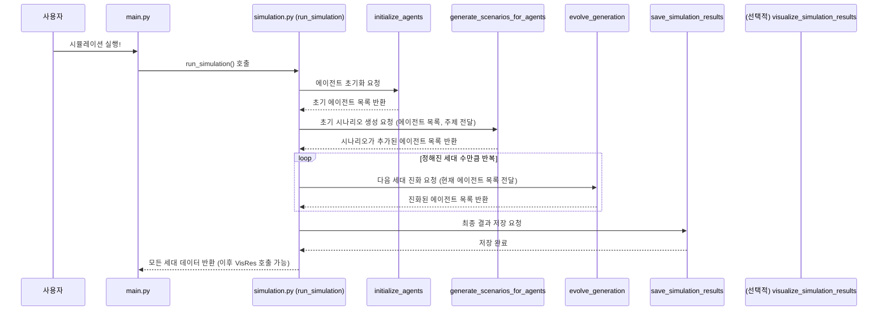

# Chapter 4: 시뮬레이션 총괄 (Simulation Orchestration)


지난 [제 3장: 시나리오 생성 및 진화](03_시나리오_생성_및_진화__scenario_generation_and_evolution__.md)에서는 개별 에이전트들이 어떻게 자신만의 미래 시나리오를 만들고, 이 시나리오들이 여러 세대에 걸쳐 발전해 나가는지 살펴보았습니다. 멋진 아이디어들이 샘솟는 것을 보았죠! 하지만 이렇게 훌륭한 각본과 배우들이 있어도, 전체 연극을 성공적으로 이끌 지휘자가 없다면 어떨까요? 모든 것이 뒤죽박죽이 될지도 모릅니다.

이번 장에서는 바로 이 '지휘자'의 역할, 즉 **시뮬레이션 총괄 (Simulation Orchestration)**에 대해 알아볼 것입니다. `simulacra-futura` 프로젝트가 어떻게 전체 시뮬레이션 과정을 처음부터 끝까지 조율하고 실행하는지, 그 비밀을 함께 파헤쳐 봅시다.

## 오케스트라의 지휘자처럼: 시뮬레이션 총괄이란?

여러분, 멋진 오케스트라 연주를 상상해 보세요. 바이올린, 첼로, 트럼펫 등 각양각색의 악기 연주자들이 있습니다. 이들은 각자 훌륭한 연주 실력을 갖추고 있지만, 지휘자의 지휘봉이 없다면 아름다운 교향곡을 만들어내기 어렵습니다. 지휘자는 각 파트의 연주(개별 모듈)가 언제 시작하고, 어떤 빠르기와 분위기로 연주해야 하는지 등을 조율하여 하나의 완성된 음악(시뮬레이션 결과)을 만들어냅니다.

**시뮬레이션 총괄**은 바로 이 오케스트라 지휘자와 같은 역할을 합니다. `simulacra-futura`에서 시뮬레이션 총괄은 다음과 같은 복잡한 과정을 순서대로 지휘하는 중앙 통제실입니다:

1.  **설정 읽어오기**: 시뮬레이션의 주제, 에이전트 수, 진화 세대 수 등 기본 설정을 불러옵니다. ([제 5장: 설정 관리](05_설정_관리__configuration_management__.md)에서 자세히 다룹니다.)
2.  **가상 인물 만들기 (에이전트 초기화)**:
    *   다양한 배경의 인물 정보(인구통계)를 생성합니다. ([제 2장: 인구통계 및 세계관 생성](02_인구통계_및_세계관_생성__demographic_and_worldview_generation__.md))
    *   각 인물의 생각 틀(세계관)을 만듭니다. ([제 2장: 인구통계 및 세계관 생성](02_인구통계_및_세계관_생성__demographic_and_worldview_generation__.md))
    *   이 정보들을 바탕으로 시뮬레이션에 참여할 에이전트를 생성합니다. ([제 1장: 에이전트 (Agent)](01_에이전트__agent__.md))
3.  **첫 아이디어 구상 (초기 시나리오 생성)**: 각 에이전트가 주어진 주제에 대해 자신의 첫 번째 미래 시나리오를 만듭니다. ([제 3장: 시나리오 생성 및 진화](03_시나리오_생성_및_진화__scenario_generation_and_evolution__.md))
4.  **아이디어 발전시키기 (세대별 시나리오 진화)**: 여러 세대에 걸쳐 에이전트들이 서로의 시나리오를 참고하고 발전시켜 더 새롭고 다양한 시나리오를 만들어냅니다. ([제 3장: 시나리오 생성 및 진화](03_시나리오_생성_및_진화__scenario_generation_and_evolution__.md))
5.  **결과물 정리 (결과 저장 및 시각화)**: 최종적으로 얻어진 다양한 시나리오와 에이전트 정보를 저장하고, 필요하다면 시각화 자료로 만듭니다. ([제 7장: 결과 저장 (Result Exporting)](07_결과_저장__result_exporting__.md) 및 [제 6장: 데이터 시각화 (Data Visualization)](06_데이터_시각화__data_visualization__.md))

이 모든 과정을 매끄럽게 연결하고 실행하는 것이 바로 시뮬레이션 총괄의 역할입니다. `simulacra-futura`에서는 주로 `simulation.py` 파일 안의 `run_simulation()` 함수가 이 지휘자 역할을 수행합니다.

## 전체 시뮬레이션 실행하기: `main.py`와 `run_simulation()`

보통 `simulacra-futura` 프로젝트를 실행할 때는 `main.py` 파일을 사용합니다. 이 파일은 사용자의 요청을 받아 `simulation.py`에 있는 `run_simulation()` 함수를 호출하여 실제 시뮬레이션을 시작합니다.

```python
# main.py (아주 간략화된 예시)
from simulation import run_simulation, visualize_simulation_results

if __name__ == "__main__":
    print("🚀 Simulacra Futura 시뮬레이션을 시작합니다...")
    
    # 1. 전체 시뮬레이션 실행!
    all_generations_data = run_simulation() # 여기가 핵심!
    
    # 2. 결과 시각화 (선택 사항)
    if all_generations_data: # 시뮬레이션 결과가 있다면
        print("📊 결과 시각화 중...")
        visualize_simulation_results(all_generations_data)
    
    print("✅ 시뮬레이션이 성공적으로 완료되었습니다.")
```
위 코드에서 `run_simulation()` 함수를 호출하면, 앞서 설명한 모든 과정이 순서대로 진행됩니다. 이 함수는 시뮬레이션의 모든 세대에 걸친 에이전트 데이터를 반환하며, 이 데이터는 이후 시각화 등에 사용될 수 있습니다.

시뮬레이션의 구체적인 설정(예: "대한민국 30명 에이전트로 '인공지능의 미래' 주제를 5세대 동안 시뮬레이션")은 [제 5장: 설정 관리](05_설정_관리__configuration_management__.md)에서 다룰 `config.toml` 파일을 통해 조정할 수 있습니다. `run_simulation()` 함수는 이 설정 파일을 읽어와 그에 맞춰 동작합니다.

## 지휘자의 악보: `run_simulation()` 함수 내부 들여다보기

`simulation.py` 파일의 `run_simulation()` 함수가 실제로 어떤 순서로 작업을 처리하는지 좀 더 자세히 살펴보겠습니다. 마치 지휘자가 악보를 보고 각 파트를 지휘하듯, `run_simulation()` 함수는 정해진 순서에 따라 다른 모듈의 함수들을 호출합니다.

### 1단계: 준비 운동 (설정 로드 및 디렉터리 준비)

시뮬레이션을 시작하기 전에 기본적인 준비를 합니다.

```python
# simulation.py (run_simulation 함수 일부 - 준비 단계)
from config import load_config # 설정 로드 함수 (가상)
from utils import ensure_directories # 디렉터리 생성 함수 (가상)

def run_simulation():
    ensure_directories() # 결과 저장 폴더 등 준비
    config = load_config() # config.toml에서 설정값 읽어오기
    
    # 설정값에서 필요한 정보 가져오기 (예시)
    num_generations = config.get("algorithm", {}).get("generations", 3)
    topic = config.get("algorithm", {}).get("topic", "미래 도시의 모습")
    # ... 나머지 과정은 이 설정들을 사용 ...
```
이 단계에서는 시뮬레이션 결과를 저장할 폴더가 있는지 확인하고 없으면 만들며, `config.toml` 파일에서 시뮬레이션 횟수, 주제 등 중요한 설정들을 읽어옵니다. (자세한 설정 방법은 [제 5장: 설정 관리](05_설정_관리__configuration_management__.md)에서!)

### 2단계: 가상 인물 등장! (에이전트 초기화)

이제 시뮬레이션에 참여할 가상의 인물들, 즉 에이전트들을 만듭니다. `initialize_agents()` 함수가 이 역할을 담당합니다.

```python
# simulation.py (run_simulation 함수 일부 - 에이전트 초기화)
from agent import Agent # Agent 클래스
from demographic_generator import generate_and_save_demographics # 인구통계 생성
from worldview_generator import generate_worldview_from_demographic # 세계관 생성

def initialize_agents() -> List[Agent]:
    config = load_config()
    agent_count = config.get("algorithm", {}).get("agent_count", 10)
    nation = config.get("algorithm", {}).get("nation", "대한민국")
    topic = config.get("algorithm", {}).get("topic", "미래 도시의 모습")
    
    print(f"👥 {agent_count}명의 에이전트를 위한 인구통계 정보 생성 중...")
    demographics = generate_and_save_demographics(agent_count, nation) # 2장 내용
    
    agents = []
    for i, demo_info in enumerate(demographics):
        print(f"  - 에이전트 {i+1}의 세계관 생성 중...")
        worldview = generate_worldview_from_demographic(demo_info, topic) # 2장 내용
        agent = Agent(agent_id=i+1, demographic=demo_info, worldview=worldview) # 1장 내용
        agents.append(agent)
    return agents

# run_simulation 함수 내에서 호출
# agents = initialize_agents()
```
`initialize_agents()` 함수는 다음 작업을 수행합니다:
1.  [제 2장: 인구통계 및 세계관 생성](02_인구통계_및_세계관_생성__demographic_and_worldview_generation__.md)에서 배운 `generate_and_save_demographics`를 호출하여 에이전트들의 배경 정보(나이, 직업 등)를 만듭니다.
2.  각 인구통계 정보와 시뮬레이션 주제를 바탕으로 `generate_worldview_from_demographic`를 호출하여 각 에이전트의 생각 틀(세계관)을 만듭니다.
3.  이렇게 만들어진 인구통계 정보와 세계관 정보를 [제 1장: 에이전트 (Agent)](01_에이전트__agent__.md)의 `Agent` 클래스에 전달하여 실제 에이전트 객체들을 생성합니다.

### 3단계: 첫 번째 생각들 (초기 시나리오 생성)

에이전트들이 준비되었으니, 이제 각자 첫 번째 아이디어, 즉 초기 시나리오를 만들 차례입니다. `generate_scenarios_for_agents()` 함수가 이 역할을 합니다.

```python
# simulation.py (run_simulation 함수 일부 - 초기 시나리오 생성)
from scenario_generator import generate_scenarios_for_agents # 시나리오 생성 함수

# run_simulation 함수 내에서 호출
# topic = config.get("algorithm", {}).get("topic", "미래 도시의 모습")
# print("📝 모든 에이전트의 초기 시나리오 생성 중...")
# generate_scenarios_for_agents(agents, topic) # 3장 내용
# 각 에이전트의 scenarios 리스트에 첫 시나리오가 추가됨
```
이 함수는 [제 3장: 시나리오 생성 및 진화](03_시나리오_생성_및_진화__scenario_generation_and_evolution__.md)에서 설명한 대로, 각 에이전트의 정보(인구통계, 세계관)와 시뮬레이션 주제를 바탕으로 LLM(대규모 언어 모델)을 활용하여 초기 시나리오를 생성하고, 각 에이전트의 시나리오 목록에 추가합니다.

### 4단계: 아이디어의 진화 (세대별 반복)

이제 시뮬레이션의 핵심인 시나리오 진화 과정이 여러 세대에 걸쳐 반복됩니다. `evolve_generation()` 함수가 각 세대의 진화를 담당합니다.

```python
# simulation.py (run_simulation 함수 일부 - 세대별 진화)
# all_generations_data = [agents[:]] # 0세대 (초기) 상태 저장

# for gen_num in range(1, num_generations + 1): # 설정된 세대 수만큼 반복
#     print(f"🔄 세대 {gen_num}/{num_generations} 진화 중...")
#     
#     # 이전 세대 에이전트 목록(agents)을 기반으로 현재 세대 진화
#     updated_agents = evolve_generation(agents, gen_num, topic) # 3장 내용
#     agents = updated_agents # 에이전트 목록을 새 세대로 업데이트
#     all_generations_data.append(agents[:]) # 현재 세대 상태 저장
```
`evolve_generation()` 함수는 [제 3장: 시나리오 생성 및 진화](03_시나리오_생성_및_진화__scenario_generation_and_evolution__.md)에서 배운 선택, 교차, 변이 과정을 통해 에이전트들이 새로운 시나리오를 만들고 채택하도록 합니다. 이 과정이 `num_generations` 만큼 반복되면서 시나리오들은 점점 더 다양하고 깊이있게 발전합니다. 각 세대의 에이전트 상태는 `all_generations_data` 리스트에 차곡차곡 저장됩니다.

### 5단계: 대단원의 막 (결과 저장 및 시각화)

모든 세대의 진화가 끝나면, 최종 결과를 저장하고 필요에 따라 시각화합니다.

```python
# simulation.py (run_simulation 함수 일부 - 결과 저장)
from result_exporter import save_simulation_results # 결과 저장 함수
# from visualization import visualize_simulation_results # 시각화 함수 (main.py에서 호출될 수도 있음)

# ... (세대 반복 후) ...
# print("💾 시뮬레이션 최종 결과 저장 중...")
# save_simulation_results(agents, all_generations_data) # 7장 내용

# return all_generations_data # 모든 세대의 데이터 반환
```
`save_simulation_results()` 함수는 모든 에이전트 정보와 그들이 생성/채택한 시나리오들을 파일로 저장합니다. ([제 7장: 결과 저장 (Result Exporting)](07_결과_저장__result_exporting__.md) 참조).
`visualize_simulation_results()` 함수는 저장된 데이터를 바탕으로 다양한 그래프나 애니메이션을 만들어 결과를 한눈에 보기 쉽게 표현합니다. ([제 6장: 데이터 시각화 (Data Visualization)](06_데이터_시각화__data_visualization__.md) 참조).

### 전체 흐름 요약 다이어그램

`run_simulation()` 함수가 지휘하는 전체 시뮬레이션 과정을 간단한 순서도로 나타내면 다음과 같습니다.



이처럼 `run_simulation()` 함수는 `simulacra-futura`의 여러 모듈들을 마치 오케스트라 단원처럼 조화롭게 사용하여, 설정부터 최종 결과 도출까지의 복잡한 시뮬레이션 과정을 총괄합니다.

아래는 시뮬레이션 전체 흐름을 나타내는 또 다른 그림입니다. 각 단계가 어떤 장에서 자세히 다루어지는지도 함께 표시했습니다.

```mermaid
graph TD
    Start[시작: main.py 실행] --> LoadConfig(설정 로드<br>config.toml<br>[[제 5장: 설정 관리](05_설정_관리__configuration_management__.md)]);
    LoadConfig --> InitAgents(에이전트 초기화<br>initialize_agents<br>[[제 1장: 에이전트](01_에이전트__agent__.md), [[제 2장: 인구통계 및 세계관 생성](02_인구통계_및_세계관_생성__demographic_and_worldview_generation__.md)]);
    InitAgents --> GenInitialScenarios(초기 시나리오 생성<br>generate_scenarios_for_agents<br>[[제 3장: 시나리오 생성 및 진화](03_시나리오_생성_및_진화__scenario_generation_and_evolution__.md)]);
    GenInitialScenarios --> EvolutionLoop{세대 반복};
    EvolutionLoop -- 각 세대 --> EvolveGen(시나리오 진화<br>evolve_generation<br>[[제 3장: 시나리오 생성 및 진화](03_시나리오_생성_및_진화__scenario_generation_and_evolution__.md)]);
    EvolveGen --> EvolutionLoop;
    EvolutionLoop -- 완료 --> SaveResults(결과 저장<br>save_simulation_results<br>[[제 7장: 결과 저장](07_결과_저장__result_exporting__.md)]);
    SaveResults --> OptionalVis(시각화 (선택)<br>visualize_simulation_results<br>[[제 6장: 데이터 시각화](06_데이터_시각화__data_visualization__.md)]);
    OptionalVis --> End[종료];
```

## 정리하며

이번 장에서는 `simulacra-futura` 프로젝트의 '지휘자' 역할을 하는 **시뮬레이션 총괄**에 대해 배웠습니다. `simulation.py` 파일의 `run_simulation()` 함수가 중심이 되어, 에이전트 생성부터 시나리오 진화, 최종 결과 저장에 이르기까지 모든 단계를 순서대로 조율하고 실행한다는 것을 알게 되었습니다.

마치 잘 짜인 각본처럼, 각 모듈이 자신의 역할을 충실히 수행하고 `run_simulation()`이라는 지휘자의 안내에 따라 움직일 때, 비로소 `simulacra-futura`는 복잡한 미래를 탐색하는 강력한 도구가 됩니다.

지금까지 우리는 시뮬레이션의 주요 구성 요소들과 전체 실행 흐름을 살펴보았습니다. 하지만 이 모든 과정이 어떻게 사용자의 의도대로 조절될 수 있을까요? 다음 장에서는 시뮬레이션의 세부 사항을 결정하는 '설정'을 어떻게 관리하는지 알아보겠습니다.

➡️ [제 5장: 설정 관리 (Configuration Management)](05_설정_관리__configuration_management__.md)

---

Generated by [AI Codebase Knowledge Builder](https://github.com/The-Pocket/Tutorial-Codebase-Knowledge)