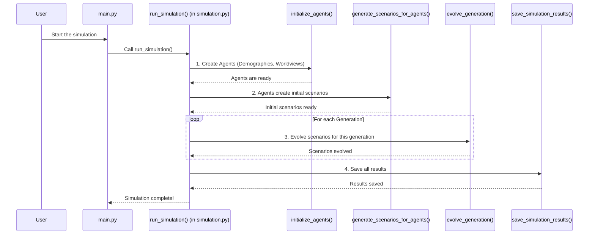

# Chapter 5: Simulation Orchestrator

Welcome to Chapter 5! In the previous chapter, [Chapter 4: Scenario Dynamics](04_scenario_dynamics_.md), we saw how our digital Agents brainstorm, share, and evolve ideas about the future over several "generations." It's like a dynamic workshop where many ideas are discussed and refined.

But who manages this whole workshop? Who makes sure everyone (all the digital Agents) gets a chance to "speak," that ideas are passed around correctly, and that the workshop runs for the right amount of time? That's the job of the **Simulation Orchestrator**!

## What's the Big Idea? The "Director" of the Show

Imagine a movie set. You have actors (our [Agents](03_agent_model_.md)), scriptwriters (the rules for [Scenario Dynamics](04_scenario_dynamics_.md)), and set designers (our [Configuration System](01_configuration_system_.md) defining the theme). The **Simulation Orchestrator** is like the **director** of this movie.

The director doesn't act or write the script themselves, but they make sure:
1.  The actors are ready and know their roles ([Persona Profile Creation](02_persona_profile_creation_.md)).
2.  The scenes happen in the correct order.
3.  Each part of the production (sound, lighting, acting) works together.
4.  The movie is filmed from start to finish.
5.  And finally, the completed film is ready for viewing.

Similarly, the Simulation Orchestrator in `simulacra-futura` is the central component that manages the entire simulation lifecycle. It tells other parts of the project what to do and when to do it, ensuring the simulation runs smoothly from setup to generating final results. It's the conductor leading the orchestra, making sure each section plays its part at the right time.

## The Conductor's Score: Key Responsibilities

The Simulation Orchestrator follows a "score" or a plan to run the simulation. Here are its main tasks, in order:

1.  **Read the Settings:** First, it checks the "rulebook" – our `config.toml` file from [Chapter 1: Configuration System](01_configuration_system_.md). This tells it things like how many Agents to create, what the simulation topic is, and how many "generations" (rounds) to run.
2.  **Prepare the "Actors" (Agents):**
    *   It triggers the creation of demographic profiles for each Agent ([Chapter 2: Persona Profile Creation](02_persona_profile_creation_.md)).
    *   It then ensures each Agent gets a unique worldview based on these demographics.
    *   Finally, it creates the actual [Agent Model](03_agent_model_.md) objects.
3.  **Run the "Workshop" (Scenario Evolution):**
    *   It instructs Agents to generate their initial ideas (scenarios) about the future.
    *   Then, for each "generation" specified in the configuration, it manages the process of [Scenario Dynamics](04_scenario_dynamics_.md) – where Agents combine, mutate, and select scenarios.
4.  **Wrap Up and Save:** Once all generations are complete, it ensures that all the important data (like the final state of Agents and their scenarios) is properly saved. This is crucial for [Results Management](07_results_management_.md).
5.  **Prepare for Viewing (Optional):** It can also kick off the process to create charts and graphs from the simulation data, making it ready for [Data Visualization & Reporting](06_data_visualization___reporting_.md).

## How It Works: The `run_simulation()` Function in `simulation.py`

In `simulacra-futura`, the role of the Simulation Orchestrator is primarily handled by the `run_simulation()` function located in the `simulation.py` file. This function is like the main script for our director.

Let's look at a simplified flow of what `run_simulation()` does:



This diagram shows `run_simulation()` calling other specialized functions to perform each step of the simulation.

### A Peek at the Orchestrator's Code (Simplified)

Let's look at a very simplified version of what `run_simulation()` in `simulation.py` might be doing conceptually.

**1. Getting Ready (Load Config, Ensure Directories):**
The `run_simulation()` function first makes sure everything is set up.

```python
# Simplified from simulation.py - run_simulation()

# CONFIG is already loaded at the top of simulation.py (from Chapter 1)
# ensure_directories() # Makes sure folders for saving results exist

def simplified_run_simulation():
    print("Orchestrator: Starting the simulation!")
    # Get settings like number of generations, topic, etc. from CONFIG
    generations = CONFIG.get("algorithm", {}).get("generations", 3)
    topic = CONFIG.get("algorithm", {}).get("topic", "Default Topic")
```
This part reads the settings you provided in `config.toml` (like `generations = 5`).

**2. Creating the Agents:**
Next, it calls a function to create and initialize all the Agents.

```python
# Continuing simplified_run_simulation()

    # Call the function that handles Persona Profile Creation and Agent Model setup
    # This comes from initialize_agents() in simulation.py
    agents = initialize_agents() # (Covered in Ch2 & Ch3)
    print(f"Orchestrator: {len(agents)} agents are ready.")
```
The `initialize_agents()` function does the heavy lifting of [Persona Profile Creation](02_persona_profile_creation_.md) and setting up each [Agent Model](03_agent_model_.md).

**3. Generating Initial Scenarios:**
With Agents ready, they need to think of their first ideas.

```python
# Continuing simplified_run_simulation()

    # Agents generate their first scenarios (Covered in Ch4)
    # This comes from generate_scenarios_for_agents() in simulation.py
    generate_scenarios_for_agents(agents, topic)
    print("Orchestrator: Initial scenarios generated.")
```
This step populates each Agent's initial thoughts on the simulation `topic`.

**4. Running Through Generations (The Main Loop):**
This is where the [Scenario Dynamics](04_scenario_dynamics_.md) happen repeatedly.

```python
# Continuing simplified_run_simulation()
    all_generations_data = [agents] # Store agents from generation 0

    for gen_num in range(1, generations + 1): # Loop from 1 up to 'generations'
        print(f"Orchestrator: Starting Generation {gen_num}...")
        # Call the function that evolves scenarios for one generation (Covered in Ch4)
        # This comes from evolve_generation() in simulation.py
        updated_agents = evolve_generation(agents, gen_num)
        agents = updated_agents # Use the updated agents for the next round
        all_generations_data.append(agents) # Store current state
        print(f"Orchestrator: Generation {gen_num} complete.")
```
The `evolve_generation()` function is where Agents combine, mutate, and select scenarios, as we discussed in [Chapter 4: Scenario Dynamics](04_scenario_dynamics_.md). The orchestrator just tells it to "do its thing" for each generation.

**5. Saving the Results:**
After all generations are done, the results need to be saved.

```python
# Continuing simplified_run_simulation()

    # Save the final state of agents and all scenarios
    # This calls save_simulation_results() in simulation.py
    save_simulation_results(agents, all_generations_data) # (Details in Ch7)
    print("Orchestrator: Simulation finished and results saved.")
    
    return all_generations_data # Return data for visualization
```
This step ensures all the hard work of the simulation isn't lost. The actual saving mechanisms are part of [Results Management](07_results_management_.md).

**6. Triggering Visualization (Optional):**
Finally, the orchestrator might also tell the system to create visuals.

```python
# Conceptual: After simplified_run_simulation() returns
# all_results = simplified_run_simulation()

# This comes from visualize_simulation_results() in simulation.py
# visualize_simulation_results(all_results) # (Details in Ch6)
# print("Orchestrator: Visualization process initiated.")
```
This prepares the data for you to see and understand, which we'll cover in [Chapter 6: Data Visualization & Reporting](06_data_visualization___reporting_.md).

The actual `run_simulation` function in `simulation.py` is more detailed, handling lists of scenarios across generations (`all_generation_scenarios`) and collecting all agent states, but the sequence of major operations is as described above.

## The Starting Whistle: `main.py`

So, `run_simulation()` in `simulation.py` directs the whole show. But who tells `run_simulation()` to start? That's usually the job of the `main.py` file. Think of `main.py` as the person who blows the whistle to start the game.

A very simplified look at `main.py`:
```python
# Simplified from main.py

# Import the main orchestrator function from simulation.py
from simulation import run_simulation, visualize_simulation_results

def main():
    print("Program Started: Welcome to Simulacra Futura!")
    
    # Call the orchestrator to run the entire simulation
    all_generations_data = run_simulation()
    
    # After simulation, call the visualization function
    if all_generations_data: # If simulation ran successfully
        visualize_simulation_results(all_generations_data)
        
    print("Program Finished.")

if __name__ == "__main__":
    main() # This line makes the main() function run when you execute main.py
```
When you run the `simulacra-futura` project (usually by executing `python main.py` in your terminal), the `main()` function in `main.py` is called. This, in turn, calls `run_simulation()`, kicking off the entire orchestrated process.

## Why is the Simulation Orchestrator So Important?

*   **Order and Control:** It ensures that all the complex pieces of the simulation happen in the correct order. Without it, it would be like an orchestra where every musician starts playing a different tune at a random time!
*   **Manages Complexity:** It breaks down the huge task of "running a simulation" into smaller, manageable steps, calling other specialized modules to handle each step.
*   **Central Point of Execution:** It provides a clear starting point (`run_simulation()`) for the entire process.
*   **Flexibility:** Because it reads from the [Configuration System](01_configuration_system_.md), you can change how the entire simulation runs (e.g., more agents, different topic) just by changing `config.toml`, and the orchestrator will adapt.

## What We've Learned

In this chapter, we've met the **Simulation Orchestrator**, the "director" or "conductor" of `simulacra-futura`.
*   It manages the entire simulation flow, from reading initial settings to saving final results.
*   Its main responsibilities include initializing Agents, running scenario evolution across generations, and coordinating data saving.
*   The core of this orchestration happens in the `run_simulation()` function within `simulation.py`.
*   The `main.py` file typically initiates the call to `run_simulation()`.

The Orchestrator ensures all the components we've learned about so far – [Configuration System](01_configuration_system_.md), [Persona Profile Creation](02_persona_profile_creation_.md), [Agent Model](03_agent_model_.md), and [Scenario Dynamics](04_scenario_dynamics_.md) – work together harmoniously.

Now that the simulation has run and the results are potentially saved, how do we make sense of all the data generated? How do we see what kind of futures our Agents imagined? That's what we'll explore next!

Next up: [Chapter 6: Data Visualization & Reporting](06_data_visualization___reporting_.md)

---

Generated by [AI Codebase Knowledge Builder](https://github.com/The-Pocket/Tutorial-Codebase-Knowledge)