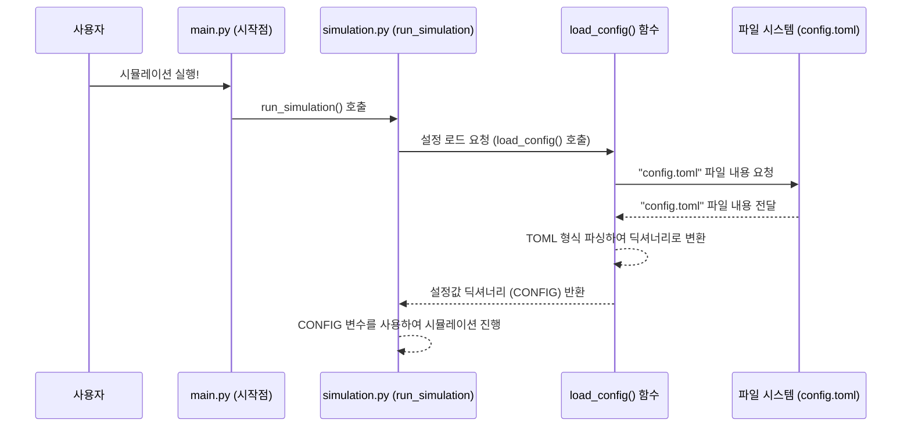

# Chapter 5: 설정 관리 (Configuration Management)


지난 [제 4장: 시뮬레이션 총괄 (Simulation Orchestration)](04_시뮬레이션_총괄__simulation_orchestration__.md)에서는 `simulacra-futura` 프로젝트가 마치 오케스트라의 지휘자처럼 전체 시뮬레이션 과정을 조율하고 실행하는 모습을 살펴보았습니다. `run_simulation()` 함수가 에이전트 생성부터 시나리오 진화, 결과 저장까지 모든 단계를 이끌었죠. 그런데 이 지휘자는 어떤 악보를 보고 연주를 지휘할까요? 시뮬레이션의 주제는 무엇으로 할지, 에이전트는 몇 명이나 등장시킬지, 몇 세대 동안 진화시킬지 등등... 이런 세부 사항들은 어떻게 결정될까요?

이번 장에서는 바로 이 시뮬레이션의 '악보'이자 '레시피' 역할을 하는 **설정 관리(Configuration Management)** 기능에 대해 알아보겠습니다. 이 기능을 통해 우리는 코드 수정 없이도 시뮬레이션의 다양한 작동 방식을 손쉽게 제어할 수 있습니다.

## 요리 레시피처럼, 시뮬레이션도 설정을 바꿔봐요!

맛있는 케이크를 만든다고 상상해 보세요. 밀가루, 설탕, 계란의 양이나 오븐의 온도, 굽는 시간 등 레시피의 작은 변화가 케이크의 맛과 모양을 크게 바꿀 수 있습니다. 때로는 기본 레시피 그대로 만들기도 하고, 때로는 설탕을 줄이거나 과일을 추가해서 새로운 맛을 시도해 볼 수도 있죠.

`simulacra-futura`의 시뮬레이션도 마찬가지입니다.
*   "미래의 인공지능"이라는 주제로 시뮬레이션을 돌려볼까?
*   아니면 "100명의 에이전트"를 참여시켜서 더 다양한 의견을 들어볼까?
*   "10세대" 동안 진화시켜서 아이디어가 어떻게 발전하는지 깊이 있게 관찰해 볼까?

이런 다양한 실험 조건들을 매번 코드 속으로 들어가서 수정한다면 정말 번거롭고 실수하기도 쉬울 거예요. 그래서 `simulacra-futura`는 이러한 설정값들을 **`config.toml`** 이라는 하나의 파일에 모아두고, 이 파일만 수정하면 시뮬레이션의 전체적인 행동 방식을 쉽게 바꿀 수 있도록 만들었습니다. 마치 요리 레시피처럼, `config.toml` 파일의 내용을 조절하여 매번 동일한 조건의 실험 결과를 얻거나, 혹은 다른 조건으로 새로운 실험을 진행할 수 있게 되는 것이죠!

## `config.toml`: 시뮬레이션의 중앙 제어판

`config.toml` 파일은 `simulacra-futura` 시뮬레이션의 모든 중요한 설정값들을 담고 있는 텍스트 파일입니다. TOML은 "Tom's Obvious, Minimal Language"의 약자로, 사람이 읽고 쓰기 쉬운 단순한 형식의 설정 파일 포맷입니다.

이 파일 안에는 예를 들어 다음과 같은 정보들이 들어갈 수 있습니다:
*   시뮬레이션 주제 (예: "미래 에너지")
*   참여할 에이전트 수 (예: 50명)
*   시뮬레이션 총 세대 수 (예: 5세대)
*   사용할 AI 모델 (예: "gpt-4-turbo")
*   결과 파일을 저장할 위치

이 `config.toml` 파일 하나만 있으면, 복잡한 코드 내부를 들여다보지 않고도 시뮬레이션의 핵심적인 부분들을 마음대로 조절할 수 있습니다.

### `config.toml` 파일 예시 살펴보기

`simulacra-futura` 프로젝트 폴더 안에 있는 `config.toml` 파일을 열어보면 다음과 비슷한 내용을 볼 수 있습니다. (실제 파일은 더 많은 설정 항목을 가질 수 있지만, 여기서는 이해를 돕기 위해 주요 항목들만 간추렸습니다.)

```toml
# config.toml (간략화된 예시)

[algorithm]  # 시뮬레이션 알고리즘 관련 설정
topic = "미래의 교육 시스템"  # 시뮬레이션 주제
agent_count = 20           # 생성할 에이전트 수
generations = 5            # 총 진화 세대 수
nation = "대한민국"        # 에이전트들의 국가 배경
test_mode = false          # 테스트 모드 사용 여부 (true면 샘플 데이터 사용)

[openai]     # OpenAI API 관련 설정
model = "gpt-4"            # 사용할 AI 모델 이름

[output]     # 결과물 출력 관련 설정
save_directory = "simulation_outputs" # 결과 파일 저장 폴더 이름
```

위 예시를 살펴볼까요?
*   `[algorithm]`, `[openai]`, `[output]`처럼 대괄호(`[]`)로 묶인 부분은 **섹션**이라고 부릅니다. 관련된 설정들을 그룹으로 묶어주는 역할을 해요.
*   각 섹션 아래에는 `이름 = 값` 형태로 실제 설정들이 정의됩니다. 예를 들어 `topic = "미래의 교육 시스템"`은 시뮬레이션 주제를 "미래의 교육 시스템"으로 설정하겠다는 의미입니다.
*   `#` 기호로 시작하는 줄은 **주석**입니다. 프로그램은 이 부분을 무시하지만, 사람이 파일을 이해하는 데 도움을 주는 설명을 적을 수 있습니다.

만약 여러분이 시뮬레이션 주제를 "미래의 직업"으로 바꾸고 싶다면, `config.toml` 파일을 열어서 `topic = "미래의 교육 시스템"` 부분을 `topic = "미래의 직업"`으로 수정하고 저장하기만 하면 됩니다! 정말 간단하죠?

## 설정은 어떻게 프로그램에 전달될까요?

그렇다면 `simulacra-futura` 프로그램은 이 `config.toml` 파일의 내용을 어떻게 알고 시뮬레이션에 적용하는 걸까요?

[제 4장: 시뮬레이션 총괄 (Simulation Orchestration)](04_시뮬레이션_총괄__simulation_orchestration__.md)에서 배운 `simulation.py`의 `run_simulation()` 함수는 시뮬레이션이 시작될 때 가장 먼저 이 `config.toml` 파일을 읽어오는 작업을 합니다. 이를 위해 `simulation.py` 내부에는 (또는 별도의 `config_loader.py` 같은 파일에는) 다음과 같은 `load_config()` 함수가 있습니다.

```python
# simulation.py 파일 내용 (일부 발췌 및 간략화)
import toml # TOML 파일을 읽기 위한 라이브러리
from pathlib import Path

CONFIG = {} # 전역 설정 변수 (초기에는 비어있음)

def load_config():
    """config.toml 파일을 읽어와 CONFIG 변수에 저장합니다."""
    global CONFIG # 전역 변수 CONFIG를 사용하겠다고 선언
    config_path = Path(__file__).parent / "config.toml"
    if config_path.exists():
        CONFIG = toml.load(config_path) # toml 라이브러리를 사용해 파일 로드
        print("✅ 설정 파일을 성공적으로 불러왔습니다.")
    else:
        print("⚠️ config.toml 파일을 찾을 수 없습니다. 기본 설정을 사용합니다.")
        # 기본 설정을 CONFIG에 넣어줄 수도 있습니다.
        CONFIG = {
            "algorithm": {"topic": "기본 주제", "agent_count": 5},
            # ... 기타 기본값 ...
        }

# run_simulation 함수 시작 부분 (예시)
# def run_simulation():
#    load_config() # 가장 먼저 설정 로드
#    topic = CONFIG.get("algorithm", {}).get("topic", "정보 없음")
#    agent_count = CONFIG.get("algorithm", {}).get("agent_count", 0)
#    print(f"시뮬레이션 주제: {topic}, 에이전트 수: {agent_count}")
#    # ... 이후 이 값들을 사용해 시뮬레이션 진행 ...
```

위 코드에서 `load_config()` 함수는 `toml.load()`라는 마법 같은 주문으로 `config.toml` 파일의 내용을 읽어와 파이썬 딕셔너리(key-value 묶음) 형태로 `CONFIG`라는 변수에 저장합니다. 이렇게 `CONFIG` 변수에 저장된 설정값들은 시뮬레이션의 여러 단계에서 필요에 따라 사용됩니다.

예를 들어, [제 2장: 인구통계 및 세계관 생성](02_인구통계_및_세계관_생성__demographic_and_worldview_generation__.md)에서 에이전트의 인구통계 정보를 만들 때, `config.toml`에 정의된 `agent_count`와 `nation` 값을 읽어와 "대한민국 국민 20명"과 같은 식으로 에이전트를 생성하는 데 사용합니다.

## `config.toml` 직접 수정하고 실험해보기!

이제 여러분도 `config.toml` 파일을 직접 수정해서 시뮬레이션의 조건을 바꿔보는 실험을 할 수 있습니다!

1.  프로젝트 폴더에서 `config.toml` 파일을 텍스트 편집기로 엽니다.
2.  예를 들어, `agent_count` 값을 20에서 5로 바꿔보세요.
    ```toml
    # 변경 전
    # agent_count = 20
    # 변경 후
    agent_count = 5
    ```
3.  또는 `topic`을 여러분이 궁금한 다른 주제로 바꿔보세요.
    ```toml
    # 변경 전
    # topic = "미래의 교육 시스템"
    # 변경 후
    topic = "10년 후 우리 동네 모습"
    ```
4.  파일을 저장한 후, `main.py`를 실행하여 시뮬레이션을 다시 돌려보세요.

변경된 설정에 따라 시뮬레이션 결과가 달라지는 것을 관찰할 수 있을 것입니다. 이렇게 `config.toml`을 사용하면 동일한 코드를 가지고도 다양한 조건의 실험을 쉽게 반복하거나, 특정 조건에서의 결과를 재현하기가 매우 용이해집니다.

## 내부 동작 살짝 엿보기: 설정 파일은 어떻게 읽힐까요?

시뮬레이션 프로그램이 `config.toml` 파일의 설정을 가져와 사용하는 과정을 간단한 순서도로 표현하면 다음과 같습니다.



1.  사용자가 `main.py`를 실행하여 시뮬레이션을 시작합니다.
2.  `main.py`는 `simulation.py`의 `run_simulation()` 함수를 호출합니다.
3.  `run_simulation()` 함수는 가장 먼저 `load_config()` 함수를 호출합니다.
4.  `load_config()` 함수는 파일 시스템에게 `config.toml` 파일을 달라고 요청합니다.
5.  파일 시스템은 `config.toml` 파일의 내용을 전달합니다.
6.  `load_config()` 함수는 `toml` 라이브러리를 사용하여 이 내용을 파싱(해석)하여 파이썬이 이해할 수 있는 딕셔너리 형태로 만듭니다.
7.  이 딕셔너리는 `CONFIG`라는 변수에 저장되어 `run_simulation()` 함수 및 다른 하위 함수들이 시뮬레이션 내내 참조하여 사용합니다.

이렇게 `config.toml` 파일은 시뮬레이션의 모든 행동을 결정하는 '청사진' 역할을 하며, `load_config()` 함수는 이 청사진을 읽어오는 '해독기' 역할을 합니다.

## 더 많은 설정들

`config.toml` 파일에는 이 튜토리얼에서 다룬 것보다 훨씬 다양한 설정 항목들이 포함될 수 있습니다. 예를 들어, AI 모델에게 얼마나 창의적인 답변을 요구할지(temperature 값), 로그를 얼마나 자세히 남길지, 특정 기능들을 켜고 끌지 등을 설정할 수 있습니다.

처음에는 모든 설정을 다 알 필요는 없습니다. 가장 기본적인 `topic`, `agent_count`, `generations` 같은 항목들만 바꿔보면서 익숙해지면, 점차 다른 설정들의 의미를 파악하고 조절해나갈 수 있을 거예요.

## 정리하며

이번 장에서는 `simulacra-futura` 프로젝트의 유연성과 재현성을 높여주는 핵심 기능인 **설정 관리**에 대해 배웠습니다. **`config.toml`** 파일 하나로 시뮬레이션의 다양한 측면을 손쉽게 제어할 수 있다는 것을 알게 되었습니다.

*   `config.toml`은 시뮬레이션의 주제, 에이전트 수, 세대 수 등 주요 매개변수를 정의하는 중앙 설정 파일입니다.
*   사람이 읽고 쓰기 쉬운 TOML 형식을 사용합니다.
*   프로그램은 시작 시 이 파일을 읽어와(`load_config()` 함수) 설정값을 시뮬레이션 전체에 적용합니다.
*   사용자는 이 파일만 수정하여 코드 변경 없이 다양한 조건의 실험을 수행할 수 있습니다.

마치 자동차의 운전석에서 다양한 계기판과 버튼으로 자동차를 조작하듯, `config.toml`은 우리에게 시뮬레이션을 원하는 방향으로 이끌 수 있는 강력한 제어 도구를 제공합니다.

이제 시뮬레이션의 작동 방식도 설정하고, 그 결과도 얻을 수 있게 되었습니다. 하지만 수많은 텍스트로 이루어진 결과를 어떻게 하면 한눈에 이해하기 쉽게 만들 수 있을까요? 다음 장에서는 시뮬레이션 결과를 효과적으로 보여주는 **데이터 시각화** 방법에 대해 알아보겠습니다.

➡️ [제 6장: 데이터 시각화 (Data Visualization)](06_데이터_시각화__data_visualization__.md)

---

Generated by [AI Codebase Knowledge Builder](https://github.com/The-Pocket/Tutorial-Codebase-Knowledge)