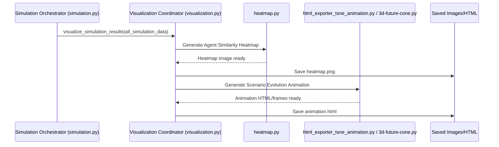

# Chapter 6: Data Visualization & Reporting

Welcome to Chapter 6! In [Chapter 5: Simulation Orchestrator](05_simulation_orchestrator_.md), we saw how `simulacra-futura` manages the entire simulation run, from setting up our digital Agents to letting them evolve their ideas about the future over many generations.

But once the simulation is done, we're left with a lot of data. How do we make sense of it all? How do we understand what really happened, what kind of futures our Agents imagined, and how their views differed or converged? That's where **Data Visualization & Reporting** comes in!

## What's the Big Idea? Making Sense of the Future

Imagine you've just run a complex scientific experiment. You've collected pages and pages of numbers and notes. Just looking at the raw data probably won't give you the full picture, right? You'd want to create charts, graphs, or maybe even a model to see the patterns and understand the results.

The Data Visualization & Reporting system in `simulacra-futura` is like the **analytics and presentation department** for our simulated futures. Its job is to:
*   Take the complex data generated by the simulation (like how Agent worldviews differ, or how their scenarios about the future changed over time).
*   Turn this data into understandable visual forms like charts, heatmaps, 3D models, and animations.

This allows us, the users, to:
*   **See patterns:** Are there clusters of Agents with similar worldviews?
*   **Compare outcomes:** Did different starting conditions lead to different kinds of future scenarios?
*   **Get insights:** What were the dominant themes in the futures imagined by the Agents?
*   **Make the invisible visible:** The simulation involves many dynamic interactions. Visualization helps us see these dynamics unfold.

In short, it helps us understand what our digital society of Agents "thought" and "created."

## The Toolkit: What Can We Visualize?

`simulacra-futura` comes with tools to generate several types of visualizations. The main coordinator for these tasks is often found in `visualization.py`, which uses other specialized modules. Let's look at a couple of key examples:

1.  **Understanding Agent Differences: The Similarity Heatmap**
    *   **Question:** How similar or different are the initial worldviews of our Agents? Are there distinct groups of Agents?
    *   **Tool:** A heatmap showing the "cosine similarity" between Agent worldviews. (Don't worry about "cosine similarity" for now – just think of it as a score of how alike two worldviews are).
    *   **Handled by:** `heatmap.py`

2.  **Watching Scenarios Evolve: Animations and 3D Plots**
    *   **Question:** How did the Agents' ideas about the future (their scenarios) change from one generation to the next? Did they converge on common ideas, or did they become more diverse?
    *   **Tool:**
        *   2D/3D plots showing the "position" of Agent scenarios in an abstract "idea space" for each generation.
        *   Animations (GIFs or interactive HTML) that string these generational plots together to show the evolution.
    *   **Handled by:** `3d-future-cone.py` (for generating the plot data and individual frames), `animation.py` (for GIF animations), and `html_exporter_tsne_animation.py` (for creating interactive HTML-based animations).

## How Visualizations Are Created: A General Flow

Typically, the visualization process kicks in after the main simulation loop (managed by the [Simulation Orchestrator](05_simulation_orchestrator_.md)) has finished.

1.  **Simulation Ends:** The `run_simulation()` function (from `simulation.py`) completes, and all agent data and scenario data across generations are available.
2.  **Visualization Triggered:** The [Simulation Orchestrator](05_simulation_orchestrator_.md) might then call a function like `visualize_simulation_results()` (also in `simulation.py`).
3.  **Coordinator Takes Over:** `visualize_simulation_results()` often calls functions within `visualization.py` (like `export_html_visualizations`).
4.  **Specific Visuals Generated:** `visualization.py` then uses helper modules (`heatmap.py`, `3d-future-cone.py`, etc.) to create the actual image files or HTML reports.
5.  **Output Saved:** These visual outputs are saved to a directory (usually `visualizations/` or `html_exports/`).

Here's a simplified diagram of this flow:



## Example 1: Peeking into Agent Minds with a Heatmap

Let's say we want to see how similar the worldviews of our starting Agents are. The `heatmap.py` module helps us do this.

**The Goal:** Create an image where each cell's color shows how similar Agent A's worldview is to Agent B's worldview. Bright colors might mean very similar, dark colors very different.

**Simplified Steps inside `heatmap.py`:**

1.  **Get Agent Worldviews:** Access the worldview data for each [Agent](03_agent_model_.md).
2.  **Convert to Numbers (`compute_embeddings`):**
    Machine learning models can't directly compare text. So, each Agent's worldview (which is text) is converted into a list of numbers called an "embedding." Think of this as a numerical fingerprint of the worldview.

    ```python
    # Simplified concept from heatmap.py
    # agents = list_of_all_agent_objects

    def simplified_compute_embeddings(agents):
        all_embeddings = []
        for agent in agents:
            # worldview_text = agent.worldview.society + agent.worldview.technology + ...
            # In reality, a complex model converts this text to numbers
            embedding = [hash(agent.worldview.society) % 100, hash(agent.worldview.technology) % 100] # Very simple example
            all_embeddings.append(embedding)
        return all_embeddings

    # agent_embeddings = simplified_compute_embeddings(agents)
    ```
    This gives us a list of numerical "fingerprints," one for each agent.

3.  **Calculate Similarity (`cosine_similarity`):**
    Now, we compare these numerical fingerprints pairwise. The `cosine_similarity` function (from a library like `scikit-learn`) is often used. It gives a score between -1 and 1 (or 0 and 1) indicating how similar two embeddings are.

    ```python
    # Simplified concept, uses a library
    # from sklearn.metrics.pairwise import cosine_similarity
    # similarity_matrix = cosine_similarity(agent_embeddings)
    ```
    This `similarity_matrix` now holds all the pairwise similarity scores.

4.  **Draw the Heatmap (`visualize_similarity_heatmap`):**
    Finally, a library like `seaborn` is used to draw the heatmap based on the `similarity_matrix`.

    ```python
    # Simplified concept from heatmap.py
    # import seaborn as sns
    # import matplotlib.pyplot as plt

    # sns.heatmap(similarity_matrix, annot=False, cmap='viridis')
    # plt.title('Agent Worldview Similarity')
    # plt.savefig("visualizations/worldview_heatmap.png")
    # plt.close()
    ```
    This saves an image file (e.g., `worldview_heatmap.png`) showing which agents are similar in their outlook.

## Example 2: Watching Ideas Evolve with Animations

We also want to see how scenarios (ideas about the future) proposed or adopted by Agents change across generations. This is often visualized as an animation of points moving in a 2D or 3D space.

**The Goal:** Create an animation (e.g., a GIF or an interactive HTML page) where each frame shows the "positions" of scenarios in "idea space" for a particular generation. Lines might connect an Agent's scenario from one generation to the next.

**Simplified Steps (involving `3d-future-cone.py` and `html_exporter_tsne_animation.py` or `animation.py`):**

1.  **For Each Generation:**
    *   **Get Scenario Data:** Collect the scenarios active in that generation.
    *   **Convert to Numbers (Embeddings):** Just like with worldviews, scenarios (which are also text-based descriptions of futures) are converted into numerical embeddings. This is done by `compute_embeddings` or `compute_all_embeddings` in `3d-future-cone.py`.
    *   **Reduce Dimensions (t-SNE):** These embeddings can be very high-dimensional (many numbers). To plot them in 2D or 3D, we use a technique like t-SNE to "squash" them down to 2 or 3 dimensions while trying to preserve their relative distances. This is done by `reduce_dimensions` in `3d-future-cone.py`.

        ```python
        # Simplified concept from 3d-future-cone.py
        # scenario_embeddings_for_gen_X = ... # Numbers for scenarios in this generation
        
        # from sklearn.manifold import TSNE
        # tsne = TSNE(n_components=2) # Reduce to 2D
        # reduced_coords = tsne.fit_transform(scenario_embeddings_for_gen_X)
        ```
        `reduced_coords` now contains 2D (x,y) coordinates for each scenario in that generation.

    *   **Plot the Frame:** Create a scatter plot of these 2D coordinates. Each point is a scenario. This is part of what `visualize_future_cone_3d` (for 3D views, generating frames) or `create_generation_tsne_plot` (in `html_exporter_tsne_animation.py` for 2D frames) does. These frames are saved as individual image files.

2.  **Create Animation:**
    *   **Collect Frames:** Gather all the saved image frames, one for each generation.
    *   **Stitch Together:**
        *   For a GIF: `animation.py` might use a library like `imageio` to combine these frames into an animated GIF.
            ```python
            # Simplified concept from animation.py
            # import imageio
            # frames_as_images = [...] # List of loaded image data for each generation
            # imageio.mimsave("visualizations/evolution_animation.gif", frames_as_images, fps=2)
            ```
        *   For HTML Animation: `html_exporter_tsne_animation.py` (specifically `create_tsne_animation_html`) takes the paths to these image frames (often generated by `3d-future-cone.py`). It then generates an HTML file that uses JavaScript to display these images sequentially, creating an interactive animation with play/pause controls.

            ```python
            # Simplified: visualization.py calls this
            # from html_exporter_tsne_animation import create_tsne_animation_html
            # from 3d-future-cone import visualize_future_cone_3d # to get image_paths

            # Assume all_generations_data contains agent lists for each generation
            # Assume reduced_embeddings_by_generation contains coordinates for each generation

            # First, 3d-future-cone.py might generate individual PNGs for each generation's 3D t-SNE plot
            # tsne_image_paths = visualize_future_cone_3d(all_generations_data, reduced_embeddings_by_generation, generate_series=True)
            
            # Then, these paths are passed to create the HTML animation
            # html_file_path = create_tsne_animation_html(all_generations_data, tsne_image_paths)
            ```
            This results in an HTML file you can open in your browser to see the scenario evolution.

## Configuration Matters

Sometimes, you might want to enable or disable certain visualizations, especially if they take a long time to generate. `simulacra-futura` allows some control through the `config.toml` file (from [Chapter 1: Configuration System](01_configuration_system_.md)).

For instance, you might see a setting like this in `config.toml`:
```toml
[visualization]
# Enable or disable HTML export for animations
html_export = true 
# More settings for specific plots could go here
```
If `html_export` is `true`, the `visualization.py` module (specifically `export_html_visualizations`) will proceed to generate the HTML-based t-SNE animations. If `false`, it might skip this step.

## What We've Learned

In this chapter, we've explored the "Data Visualization & Reporting" capabilities of `simulacra-futura`.
*   It's like an "analytics department" that turns complex simulation data into understandable visuals.
*   It helps us see patterns, compare outcomes, and understand the simulated futures.
*   Key tools include:
    *   `heatmap.py` for visualizing Agent worldview similarities.
    *   `3d-future-cone.py`, `animation.py`, and `html_exporter_tsne_animation.py` for creating animations and plots of scenario evolution.
*   The `visualization.py` module often acts as a coordinator, using these specialized modules to generate outputs like PNG images, GIFs, and interactive HTML files.
*   Some visualization settings can be controlled via the `config.toml` file.

The simulation has run, and we've seen how to visualize what happened. But what about managing all these outputs – the raw data, the saved agent states, and these beautiful visualizations? That's what we'll cover in the next chapter.

Next up: [Chapter 7: Results Management](07_results_management_.md)

---

Generated by [AI Codebase Knowledge Builder](https://github.com/The-Pocket/Tutorial-Codebase-Knowledge)