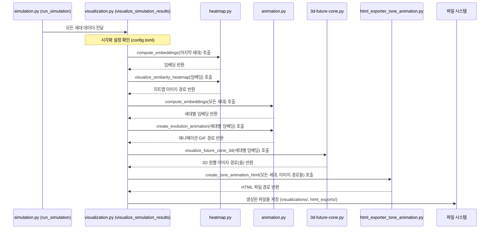

# Chapter 6: 데이터 시각화 (Data Visualization)


지난 [제 5장: 설정 관리 (Configuration Management)](05_설정_관리__configuration_management__.md)에서는 `config.toml` 파일을 통해 시뮬레이션의 다양한 작동 방식을 손쉽게 제어하는 방법을 배웠습니다. 이제 우리가 설정한 대로 시뮬레이션이 진행되고 나면, 수많은 데이터와 복잡하게 얽힌 결과들이 생성될 텐데요, 이 방대한 정보들을 어떻게 하면 효과적으로 이해하고 의미를 찾아낼 수 있을까요? 마치 탐험가가 미지의 세계를 탐험한 후 지도를 그려 다른 사람들에게 그곳의 모습을 생생하게 전달하는 것처럼, 우리도 시뮬레이션 결과를 그림이나 애니메이션으로 표현하여 한눈에 파악할 필요가 있습니다.

이번 장에서는 바로 이 '지도 그리기' 과정, 즉 **데이터 시각화(Data Visualization)**에 대해 알아보겠습니다. `simulacra-futura`가 만들어낸 에이전트들의 다양한 생각과 시뮬레이션의 복잡한 결과를 어떻게 이해하기 쉬운 형태로 보여주는지 함께 살펴봅시다!

## 데이터 시각화란 무엇이고 왜 필요할까요?

**데이터 시각화**는 복잡하게 얽힌 시뮬레이션의 결과와 에이전트들의 다양한 생각들을 이해하기 쉬운 그림이나 애니메이션 형태로 표현하는 과정입니다. 수많은 숫자와 텍스트로만 이루어진 데이터를 보는 것보다, 잘 만들어진 그래프나 차트를 보면 훨씬 빠르고 직관적으로 핵심 내용을 파악할 수 있습니다.

`simulacra-futura` 시뮬레이션을 실행하면 수십, 수백 명의 에이전트들이 각자 고유한 세계관을 가지고 다양한 미래 시나리오를 생성하고 진화시킵니다. 이 모든 정보를 글자로만 확인하려고 한다면, 마치 빼곡한 숲 속에서 길을 찾는 것처럼 어려울 수 있습니다.

데이터 시각화는 이러한 정보의 숲에서 중요한 길과 특징들을 명확하게 보여주는 '지도' 역할을 합니다. 예를 들어,
*   에이전트들의 세계관이 서로 얼마나 비슷하고 다른지 (유사도 히트맵)
*   시간이 지남에 따라 미래에 대한 생각들이 어떻게 변화하고 퍼져나가는지 (3D 미래 원뿔, 진화 애니메이션)
*   특정 에이전트 그룹이 다른 그룹과 어떻게 다른 생각을 하는지 (의미론적 거리 시각화)

이런 것들을 한눈에 보여줌으로써, 우리는 시뮬레이션 결과에 대한 깊이 있는 통찰을 얻을 수 있습니다.

## `simulacra-futura`의 주요 시각화 도구들

`simulacra-futura` 프로젝트는 시뮬레이션 결과를 다양한 각도에서 살펴볼 수 있도록 몇 가지 유용한 시각화 도구를 제공합니다. 이 도구들은 주로 `visualization.py` 파일을 중심으로 `heatmap.py`, `animation.py`, `3d-future-cone.py`, `html_exporter_tsne_animation.py` 등의 모듈과 연동하여 작동합니다.

주요 시각화 예시는 다음과 같습니다:

1.  **유사도 히트맵 (Similarity Heatmap)**: 에이전트들의 세계관이나 시나리오가 서로 얼마나 유사한지를 색깔의 농도로 표현한 지도입니다. 특정 그룹의 에이전트들이 서로 비슷한 생각을 하는지, 혹은 전체적으로 얼마나 다양한 생각들이 분포하는지를 쉽게 파악할 수 있습니다. (`heatmap.py`에서 주로 처리)
2.  **진화 애니메이션 (Evolution Animation)**: 세대가 진행됨에 따라 에이전트들의 생각(시나리오의 임베딩 공간에서의 위치)이 어떻게 변화하는지를 보여주는 동영상입니다. 아이디어들이 어떻게 수렴하거나 발산하는지, 새로운 생각의 군집이 어떻게 형성되는지를 동적으로 관찰할 수 있습니다. (`animation.py`에서 주로 처리)
3.  **3D 미래 원뿔 (3D Future Cone)**: 시나리오들이 여러 세대에 걸쳐 어떻게 분기하고 발전하는지를 3차원 공간에 원뿔 형태로 표현한 그림입니다. 초기 아이디어에서 시작하여 다양한 미래 가능성으로 뻗어나가는 모습을 입체적으로 볼 수 있습니다. (`3d-future-cone.py`에서 주로 처리)
4.  **의미론적 거리 시각화 (Semantic Distance Visualization)**: 에이전트나 시나리오들을 그 의미적 유사성에 따라 2D 공간에 점으로 표시한 그림입니다. 서로 가까이 있는 점들은 비슷한 생각을, 멀리 있는 점들은 다른 생각을 나타냅니다. (`3d-future-cone.py`에서 주로 처리)
5.  **HTML 인터랙티브 보고서 (Interactive HTML Reports)**: 위와 같은 다양한 시각화 결과들을 하나의 웹페이지에서 인터랙티브하게 탐색할 수 있도록 제공합니다. 예를 들어, t-SNE 기반의 시나리오 진화 과정을 애니메이션으로 보여주며 사용자가 직접 세대를 넘겨가며 살펴볼 수 있습니다. (`html_exporter_tsne_animation.py`에서 주로 처리)

이러한 시각화 자료들은 `simulation.py`의 `run_simulation()` 함수가 모든 시뮬레이션 과정을 마친 후, `visualize_simulation_results()` 함수를 호출함으로써 생성됩니다. 생성된 파일들은 보통 `visualizations/` 또는 `html_exports/` 폴더에 저장됩니다.

## 시각화 기능 사용하기

대부분의 경우, 여러분이 직접 시각화 코드를 수정할 필요는 없습니다. [제 5장: 설정 관리 (Configuration Management)](05_설정_관리__configuration_management__.md)에서 배운 `config.toml` 파일에서 시각화 옵션을 켜두기만 하면, 시뮬레이션이 끝날 때 자동으로 관련 시각화 자료들이 생성됩니다.

`config.toml` 파일의 예시:
```toml
# config.toml (일부)

[visualization]
visualize = true  # 시각화 기능 사용 여부 (true면 사용)
visualization_directory = "visualizations" # 이미지 파일 저장 폴더
html_export = true # HTML 보고서 생성 여부 (true면 사용)
# html_export_directory = "html_exports" # HTML 파일 저장 폴더
```
위 설정에서 `visualize = true`와 `html_export = true`로 되어 있으면, `simulation.py`의 `run_simulation` 함수가 끝날 때 `visualize_simulation_results` 함수가 호출되어 각종 시각화 자료를 만들고 지정된 폴더에 저장합니다.

`simulation.py` 내의 `visualize_simulation_results` 함수는 다음과 같이 다양한 시각화 함수들을 호출합니다:

```python
# simulation.py (visualize_simulation_results 함수 일부 개념)
# from visualization import (
#     visualize_semantic_distance,
#     visualize_similarity_heatmap,
#     create_evolution_animation,
#     visualize_future_cone_3d,
#     export_html_visualizations
# )

def visualize_simulation_results(all_generations: list):
    config = load_config()
    if not config.get("visualization", {}).get("visualize", True):
        return # 시각화 비활성화 시 종료

    last_generation_agents = all_generations[-1] # 마지막 세대 에이전트 정보

    # 1. 의미론적 거리 시각화 (마지막 세대 대상)
    # embeddings = compute_embeddings(last_generation_agents) # 에이전트 임베딩 계산
    # reduced_embeddings = reduce_dimensions(embeddings) # 차원 축소
    # visualize_semantic_distance(last_generation_agents, reduced_embeddings)

    # 2. 유사도 히트맵 (마지막 세대 대상)
    # visualize_similarity_heatmap(last_generation_agents)

    # 3. 진화 애니메이션 (모든 세대 대상)
    # embeddings_by_generation = [compute_embeddings(gen) for gen in all_generations]
    # reduced_embeddings_by_generation = [reduce_dimensions(emb) for emb in embeddings_by_generation]
    # create_evolution_animation(all_generations, reduced_embeddings_by_generation)

    # 4. 3D 미래 원뿔 (모든 세대 대상)
    # visualize_future_cone_3d(all_generations, reduced_embeddings_by_generation)
    
    # 5. HTML 보고서 생성
    # export_html_visualizations(all_generations)
    print("📊 모든 시각화 자료 생성이 완료되었습니다.")
```
위 코드는 개념적인 흐름을 보여줍니다. `visualize_simulation_results` 함수는 `all_generations` (모든 세대에 걸친 에이전트 데이터)를 입력으로 받아, 각 시각화 유형에 맞는 함수들을 호출합니다. 이때 "임베딩(embedding)"이라는 개념이 자주 등장하는데, 이는 에이전트의 세계관이나 시나리오 같은 복잡한 텍스트 정보를 컴퓨터가 다루기 쉬운 숫자 벡터(보통 다차원 공간의 한 점)로 변환한 것이라고 생각할 수 있습니다. 이렇게 변환된 임베딩 값들을 이용해 서로 얼마나 가깝거나 먼지, 혹은 어떻게 분포하는지를 시각화하는 것입니다.

## 내부 동작 살짝 엿보기: 시각화는 어떻게 만들어질까요?

시뮬레이션이 끝나고 `visualize_simulation_results` 함수가 호출되면 어떤 일들이 벌어지는지 간단한 순서도로 살펴봅시다.



위 그림처럼, `visualize_simulation_results` 함수는 일종의 '시각화 지휘자' 역할을 합니다. 각기 다른 종류의 '지도'(시각화 자료)를 만드는 전문 모듈들에게 필요한 데이터를 전달하고, 이들이 만들어낸 그림이나 애니메이션을 최종적으로 정리합니다.

각 전문 모듈들은 다음과 같은 역할을 합니다:

*   **`heatmap.py`**:
    *   `compute_embeddings()`: 에이전트들의 세계관 텍스트를 숫자 벡터(임베딩)로 변환합니다. (실제 복잡한 임베딩 생성은 외부 라이브러리나 사전 학습된 모델을 사용할 수 있지만, 여기서는 개념적으로 설명합니다.)
    *   `visualize_similarity_heatmap()`: 에이전트 임베딩들 간의 코사인 유사도(두 벡터가 얼마나 같은 방향을 가리키는지 나타내는 척도)를 계산하고, 이를 히트맵(색상 표)으로 그립니다. Python의 `matplotlib`나 `seaborn` 같은 라이브러리를 사용합니다.

    ```python
    # heatmap.py (visualize_similarity_heatmap 개념)
    # import seaborn as sns
    # import matplotlib.pyplot as plt
    # from sklearn.metrics.pairwise import cosine_similarity

    def visualize_similarity_heatmap(agents: list):
        # embeddings = compute_embeddings(agents) # 에이전트들의 세계관 임베딩
        # similarity_matrix = cosine_similarity(embeddings) # 코사인 유사도 행렬 계산
        
        # plt.figure(figsize=(10, 8))
        # sns.heatmap(similarity_matrix, annot=True, cmap="viridis") # 히트맵 그리기
        # plt.title("에이전트 세계관 유사도 히트맵")
        # plt.savefig("visualizations/similarity_heatmap.png") # 파일로 저장
        # plt.close()
        print("🎨 유사도 히트맵 생성 (개념)")
    ```

*   **`animation.py`**:
    *   `create_evolution_animation()`: 세대별로 에이전트 분포(주로 t-SNE나 PCA로 차원 축소된 임베딩)를 2D 평면에 점으로 찍어 여러 장의 이미지를 만듭니다. 이 이미지들을 순서대로 합쳐 GIF 애니메이션 파일로 만듭니다. `imageio` 같은 라이브러리가 사용될 수 있습니다.

    ```python
    # animation.py (create_evolution_animation 개념)
    # import imageio
    # import matplotlib.pyplot as plt

    def create_evolution_animation(all_generations_data: list, reduced_embeddings_by_generation: list):
        frames = []
        for gen_idx, embeddings_2d in enumerate(reduced_embeddings_by_generation):
            # fig, ax = plt.subplots()
            # ax.scatter(embeddings_2d[:, 0], embeddings_2d[:, 1]) # 2D 공간에 점 찍기
            # ax.set_title(f"세대 {gen_idx} 에이전트 분포")
            # fig.canvas.draw() # 그림을 버퍼에 그림
            # image = np.frombuffer(fig.canvas.tostring_rgb(), dtype='uint8')
            # image = image.reshape(fig.canvas.get_width_height()[::-1] + (3,))
            # frames.append(image)
            # plt.close(fig)
        # imageio.mimsave("visualizations/evolution_animation.gif", frames, fps=2)
        print("🎬 진화 애니메이션 생성 (개념)")
    ```

*   **`3d-future-cone.py`**:
    *   `visualize_future_cone_3d()`: 세대(x축), 차원 축소된 임베딩의 두 축(y, z축)을 사용하여 3차원 공간에 에이전트의 시나리오들을 점으로 표시합니다. 같은 에이전트로부터 파생된 시나리오들을 선으로 연결하여 생각의 흐름을 보여줍니다. `matplotlib`의 3D 플로팅 기능을 사용합니다. 또한, 각 세대까지의 누적된 모습을 t-SNE 이미지로 생성하여 `html_exporter_tsne_animation.py`가 사용할 수 있도록 합니다.

    ```python
    # 3d-future-cone.py (visualize_future_cone_3d 개념)
    # import matplotlib.pyplot as plt
    # from mpl_toolkits.mplot3d import Axes3D

    def visualize_future_cone_3d(all_generations_data: list, reduced_embeddings_by_generation: list):
        # fig = plt.figure()
        # ax = fig.add_subplot(111, projection='3d')
        # for gen_idx, embeddings_2d in enumerate(reduced_embeddings_by_generation):
        #     # x축은 세대, y,z 축은 2D 임베딩 좌표 사용
        #     ax.scatter(gen_idx, embeddings_2d[:, 0], embeddings_2d[:, 1])
        #     # ... (에이전트 경로 연결 로직) ...
        # ax.set_xlabel("세대")
        # ax.set_ylabel("차원 1"); ax.set_zlabel("차원 2")
        # plt.savefig("visualizations/future_cone_3d.png")
        # plt.close(fig)
        print("🧊 3D 미래 원뿔 생성 (개념)")
        # 각 세대별 t-SNE 이미지도 생성하여 경로 리스트 반환
        # return ["visualizations/tsne_gen_0.png", "visualizations/tsne_gen_1.png", ...] 
    ```

*   **`html_exporter_tsne_animation.py`**:
    *   `create_tsne_animation_html()`: `3d-future-cone.py` 등에서 생성된 일련의 이미지들(예: 세대별 t-SNE 분포도)을 입력으로 받아, 이를 웹 브라우저에서 순차적으로 보여주는 HTML 파일을 생성합니다. JavaScript를 사용하여 재생, 정지, 이전/다음 프레임 보기 같은 컨트롤 기능을 추가할 수 있습니다.

    ```python
    # html_exporter_tsne_animation.py (create_tsne_animation_html 개념)
    def create_tsne_animation_html(all_generations: list, tsne_image_paths: list):
        # html_content = "<html><body><h1>t-SNE 진화 애니메이션</h1>"
        # for img_path in tsne_image_paths:
        #     # 이미지를 base64로 인코딩하여 HTML에 직접 삽입하거나, 파일 경로 사용
        #     html_content += f""
        # html_content += "<button onclick='play()'>재생</button>"
        # html_content += "<script> /* ... 애니메이션 제어 스크립트 ... */ </script>"
        # html_content += "</body></html>"
        # with open("html_exports/tsne_animation.html", "w") as f:
        #     f.write(html_content)
        print("📄 HTML 인터랙티브 보고서 생성 (개념)")
    ```

이처럼 여러 모듈이 협력하여 텍스트 기반의 시뮬레이션 데이터를 사람이 이해하기 쉬운 시각적 정보로 변환해줍니다. 이를 통해 우리는 `simulacra-futura`가 탐험한 미래의 모습을 더욱 풍부하게 이해할 수 있게 됩니다.

## 정리하며

이번 장에서는 `simulacra-futura` 프로젝트가 시뮬레이션의 복잡한 결과를 어떻게 **데이터 시각화**를 통해 이해하기 쉽게 만드는지 살펴보았습니다.

*   데이터 시각화는 방대한 시뮬레이션 결과를 그림이나 애니메이션으로 표현하여 직관적인 이해를 돕습니다.
*   `simulacra-futura`는 유사도 히트맵, 진화 애니메이션, 3D 미래 원뿔, HTML 인터랙티브 보고서 등 다양한 시각화 도구를 제공합니다.
*   이러한 시각화는 주로 `visualization.py` 모듈과 그 하위 모듈들(`heatmap.py`, `animation.py` 등)에 의해 생성되며, `config.toml` 파일 설정을 통해 제어할 수 있습니다.
*   에이전트의 생각(세계관, 시나리오)은 '임베딩'이라는 숫자 벡터로 변환되어 시각화에 활용됩니다.

마치 탐험가가 지도를 통해 새로운 땅의 모습을 공유하듯, 데이터 시각화는 우리가 시뮬레이션 속 미래 세계를 탐험하고 그 결과를 다른 사람들과 공유하는 데 필수적인 도구입니다.

이제 시뮬레이션 결과를 멋지게 시각화하는 방법까지 알게 되었습니다. 그렇다면 이 모든 결과물, 즉 에이전트 정보, 시나리오, 그리고 생성된 시각화 파일 정보 등을 어떻게 체계적으로 저장하고 관리할 수 있을까요? 다음 장에서는 **결과 저장** 방법에 대해 자세히 알아보겠습니다.

➡️ [제 7장: 결과 저장 (Result Exporting)](07_결과_저장__result_exporting__.md)

---

Generated by [AI Codebase Knowledge Builder](https://github.com/The-Pocket/Tutorial-Codebase-Knowledge)