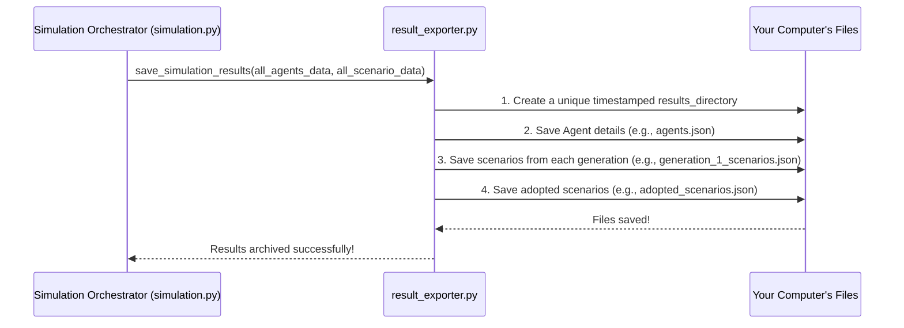

# Chapter 7: Results Management

Welcome to the final chapter of our beginner's guide to `simulacra-futura`! In [Chapter 6: Data Visualization & Reporting](06_data_visualization___reporting_.md), we saw how the simulation's outputs can be transformed into insightful charts, heatmaps, and animations, helping us understand the complex dynamics and the futures envisioned by our digital Agents.

But what happens to all that raw data generated during the simulation? The initial details of our Agents, the many scenarios they brainstormed, and the ones they finally adopted – all this information is incredibly valuable. How do we make sure it's not lost and is stored in a way that we can easily access it later for deeper analysis, review, or even to re-run visualizations? This is where **Results Management** comes into play.

## What's the Big Idea? The Simulation's "Archivist"

Imagine a scientist meticulously conducting an experiment. They wouldn't just look at the final outcome and throw away all their notes, measurements, and observations. They'd carefully record everything in a lab notebook. Or think of a librarian who carefully catalogs every book and document so it can be found and used later.

The Results Management system in `simulacra-futura` acts like the **chief archivist or a digital lab notebook** for our simulation. Its main job is to:
*   Carefully save all important data generated during a simulation run.
*   Organize this data in a structured way.
*   Ensure that the valuable output is preserved for future use.

This is crucial because you might want to:
*   **Analyze the data later:** Perhaps you want to run statistical analyses on the scenarios or Agent demographics.
*   **Review a specific run:** You might want to go back and see exactly what happened in a particular simulation.
*   **Reproduce results:** Having the initial conditions and outputs saved helps in verifying or reproducing the simulation.
*   **Re-visualize:** You might want to create different visualizations or re-run the [Data Visualization & Reporting](06_data_visualization___reporting_.md) step without re-computing the entire simulation, which can save a lot of time.

## What Gets Saved? The Simulation's Treasures

The Results Management system ensures several key pieces of information are preserved. Think of these as the "treasures" from our simulation journey:

1.  **Initial Agent Details:** Information about each [Agent](03_agent_model_.md) at the start of the simulation, including:
    *   Their unique ID.
    *   Their demographic profile (age, occupation, location, etc., from [Persona Profile Creation](02_persona_profile_creation_.md)).
    *   Their initial worldview (how they see society, technology, etc.).
2.  **Scenarios Created in Each Generation:** As our Agents participate in [Scenario Dynamics](04_scenario_dynamics_.md), they generate many ideas (scenarios) about the future. The system saves the scenarios that were part of each "generation" or round of the simulation.
3.  **Adopted Scenarios:** At the end of the simulation (or sometimes, at the end of each generation), Agents might "adopt" or select a scenario that best aligns with their perspective. These adopted scenarios are also recorded.

Typically, all this data is saved in **JSON (JavaScript Object Notation) files**. JSON is a human-readable text format that's also easy for computers to parse and use.

## How It Works: The `result_exporter.py` Module

The main component responsible for saving all this data is the `result_exporter.py` module. When the [Simulation Orchestrator](05_simulation_orchestrator_.md) (specifically, the `run_simulation()` function in `simulation.py`) finishes its work, it calls upon `result_exporter.py` to archive the results.

Let's see the general flow:


The `simulation.py` module gathers all the necessary data throughout the simulation and then hands it over to `result_exporter.py` for organized saving.

### Step 1: Creating a Tidy Home for Your Results (`ensure_results_dir`)

To keep things organized and prevent results from different simulation runs from overwriting each other, `result_exporter.py` first creates a unique directory for each run. This directory often includes a timestamp in its name.

The `ensure_results_dir()` function in `result_exporter.py` handles this. The base directory name (e.g., `simulation_results` or `test_results`) can often be configured in your `config.toml` file (from [Chapter 1: Configuration System](01_configuration_system_.md)).

```python
# Simplified from result_exporter.py
import os
import datetime

# CONFIG might come from config_loader.py, reading config.toml
# TEST_MODE = CONFIG.get("algorithm", {}).get("test_mode", False)
# BASE_DIR = "test_results" if TEST_MODE else "simulation_results"

def simplified_ensure_results_dir(base_dir_name):
    timestamp = datetime.datetime.now().strftime("%Y%m%d_%H%M%S") # e.g., 20231027_143000
    results_dir = os.path.join(base_dir_name, timestamp)

    if not os.path.exists(results_dir):
        os.makedirs(results_dir, exist_ok=True) # Create directory if it doesn't exist
    print(f"Results will be saved in: {results_dir}")
    return results_dir

# Usage:
# my_run_directory = simplified_ensure_results_dir(BASE_DIR)
```
This function creates a folder like `simulation_results/20231027_143000/`, ensuring each simulation run has its own dedicated space.

### Step 2: Saving Agent Information (`save_agents`)

The `save_agents()` function takes the list of [Agent](03_agent_model_.md) objects and writes their details into a JSON file, typically named `agents.json` within the run-specific directory.

```python
# Simplified from result_exporter.py
import json

# def simplified_save_agents(agents_list, directory_path):
#     file_path = os.path.join(directory_path, "agents.json")
#     agents_data_to_save = []
#     for agent in agents_list:
#         # Convert agent object to a dictionary (simplified)
#         agent_dict = {"id": agent.agent_id, "demographics": agent.demographic, "worldview": agent.worldview.to_dict()}
#         agents_data_to_save.append(agent_dict)

#     with open(file_path, 'w', encoding='utf-8') as f:
#         json.dump(agents_data_to_save, f, ensure_ascii=False, indent=2)
#     print(f"Agent data saved to {file_path}")

# Assume 'agents' is a list of Agent objects and 'my_run_directory' from above
# simplified_save_agents(agents, my_run_directory)
```
This creates `agents.json` containing something like:
```json
[
  {
    "id": 1,
    "demographics": {"age": "30s", "occupation": "Engineer"},
    "worldview": {"society": "Optimistic", "technology": "Progressive"}
  },
  {
    "id": 2,
    "demographics": {"age": "50s", "occupation": "Artist"},
    "worldview": {"society": "Reflective", "technology": "Cautious"}
  }
  // ... more agents
]
```

### Step 3: Saving Scenarios from Each Generation (`save_generation_scenarios`)

For each generation of the simulation, the scenarios that were part of the "pool" (as discussed in [Chapter 4: Scenario Dynamics](04_scenario_dynamics_.md)) are saved. The `save_generation_scenarios()` function handles this, creating files like `generation_1_scenarios.json`, `generation_2_scenarios.json`, etc.

```python
# Simplified from result_exporter.py

# def simplified_save_gen_scenarios(generation_number, scenarios_list, directory_path):
#     file_name = f"generation_{generation_number}_scenarios.json"
#     file_path = os.path.join(directory_path, file_name)
#     scenarios_data_to_save = []
#     for scenario in scenarios_list:
#         # Convert scenario object to a dictionary (simplified)
#         scenarios_data_to_save.append(scenario.to_dict()) # Assumes Scenario has a to_dict()

#     with open(file_path, 'w', encoding='utf-8') as f:
#         json.dump(scenarios_data_to_save, f, ensure_ascii=False, indent=2)
#     print(f"Generation {generation_number} scenarios saved to {file_path}")

# Assume 'gen1_scenarios' is a list of Scenario objects from generation 1
# simplified_save_gen_scenarios(1, gen1_scenarios, my_run_directory)
```
Each of these files will contain a list of scenario objects, detailing their content (society, technology aspects, etc.) and who proposed them.

### Step 4: Saving Adopted Scenarios (`save_adopted_scenarios`)

If your simulation involves Agents explicitly "adopting" a final scenario, these choices are also saved, often in a file named `adopted_scenarios.json`.

```python
# Simplified from result_exporter.py

# def simplified_save_adopted_scenarios(agents_list, directory_path):
#     file_path = os.path.join(directory_path, "adopted_scenarios.json")
#     adopted_scenarios_data = []
#     for agent in agents_list:
#         if agent.adopted_scenario: # If the agent has an adopted scenario
#             # Simplified data structure
#             data = {"agent_id": agent.agent_id, "scenario": agent.adopted_scenario.to_dict()}
#             adopted_scenarios_data.append(data)
    
#     with open(file_path, 'w', encoding='utf-8') as f:
#         json.dump(adopted_scenarios_data, f, ensure_ascii=False, indent=2)
#     print(f"Adopted scenarios saved to {file_path}")

# simplified_save_adopted_scenarios(agents, my_run_directory)
```
This file would list which agent adopted which scenario.

### The Conductor of Saving: `save_simulation_results`

All these individual saving functions (`save_agents`, `save_generation_scenarios`, etc.) are typically called by a main coordinating function within `result_exporter.py`, also named `save_simulation_results`.

This function is, in turn, called by `run_simulation()` in `simulation.py` at the end of the simulation.

```python
# In simulation.py (simplified)
# from result_exporter import save_simulation_results as export_the_results

# def run_simulation():
    # ... (all simulation steps: initialize_agents, generate_scenarios_for_agents, evolve_generation loop) ...
    # agents = ... (final list of agents)
    # all_generation_scenarios_data = ... (dictionary of scenarios per generation)

    # Now, call the exporter to save everything
#     results_directory = export_the_results(agents, all_generation_scenarios_data)
#     print(f"All simulation results archived in: {results_directory}")
#     return all_generations_data # For visualization

# In result_exporter.py (simplified)
# def save_simulation_results(final_agents_list, scenarios_by_generation_dict):
#     results_dir = simplified_ensure_results_dir("simulation_results") # Or from CONFIG
    
#     simplified_save_agents(final_agents_list, results_dir)
    
#     for gen_num, gen_scenarios in scenarios_by_generation_dict.items():
#         simplified_save_gen_scenarios(gen_num, gen_scenarios, results_dir)
        
#     simplified_save_adopted_scenarios(final_agents_list, results_dir)
#     return results_dir
```
This shows how the `simulation.py` module hands off the data to `result_exporter.py` to handle the actual file writing and organization.

## What You'll Find in Your Results Folder

After a simulation run, you can navigate to the output directory (e.g., `simulation_results/YYYYMMDD_HHMMSS/`) and find:
*   `agents.json`: Details of all initial agents.
*   `generation_0_scenarios.json`, `generation_1_scenarios.json`, ...: Scenarios from each respective generation.
*   `adopted_scenarios.json`: Scenarios that agents ultimately chose or converged on (if applicable to your simulation setup).

This organized structure makes it easy to find specific data from any particular run.

## Why This Careful Archiving Matters

*   **No Data Lost:** Your simulation's hard work and valuable insights are safely stored.
*   **Reproducibility:** If you share your `config.toml` and your results folder, others can understand and potentially replicate your simulation.
*   **Long-Term Analysis:** You can come back to the data weeks or months later for new analyses or comparisons with other simulations.
*   **Efficiency:** You don't need to re-run the entire simulation if you just want to re-generate visualizations or look at specific raw data.

## What We've Learned: Your Simulation's Legacy

In this chapter, we've explored **Results Management**, the crucial "archivist" system in `simulacra-futura`.
*   It's responsible for carefully saving all important data generated during a simulation, like initial agent details, scenarios from each generation, and adopted scenarios.
*   This is primarily handled by the `result_exporter.py` module, which organizes data into timestamped directories and saves it in human-readable JSON files.
*   Key functions like `ensure_results_dir`, `save_agents`, `save_generation_scenarios`, and `save_adopted_scenarios` work together under the coordination of `save_simulation_results` to preserve the simulation's output.
*   This careful management ensures that data is available for later analysis, review, reproducibility, and efficient re-visualization.

---

And with that, we conclude our introductory journey through the core concepts of `simulacra-futura`! We started with understanding how to set up simulations using the [Configuration System](01_configuration_system_.md), delved into creating diverse digital individuals with [Persona Profile Creation](02_persona_profile_creation_.md) and the [Agent Model](03_agent_model_.md), watched their ideas evolve through [Scenario Dynamics](04_scenario_dynamics_.md), saw how the entire process is managed by the [Simulation Orchestrator](05_simulation_orchestrator_.md), learned how to make sense of the outputs with [Data Visualization & Reporting](06_data_visualization___reporting_.md), and finally, understood how all these valuable results are carefully preserved through Results Management.

You now have a foundational understanding of how `simulacra-futura` works to explore potential futures. We encourage you to dive into the code, experiment with the `config.toml` settings, and see what kinds of fascinating futures your own simulations can generate. Happy exploring!

---

Generated by [AI Codebase Knowledge Builder](https://github.com/The-Pocket/Tutorial-Codebase-Knowledge)