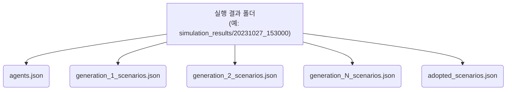
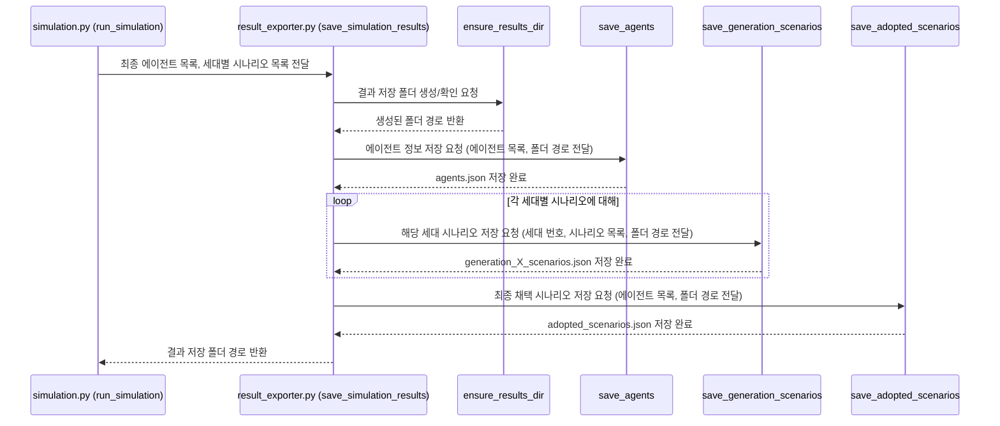

# Chapter 7: 결과 저장 (Result Exporting)


지난 [제 6장: 데이터 시각화 (Data Visualization)](06_데이터_시각화__data_visualization__.md)에서는 `simulacra-futura`가 만들어낸 복잡한 시뮬레이션 결과를 그림이나 애니메이션으로 멋지게 표현하는 방법을 배웠습니다. 이제 우리는 에이전트들의 다양한 생각과 그 변화 과정을 한눈에 볼 수 있게 되었죠! 하지만 이렇게 생성된 귀중한 데이터와 시각화 자료들을 제대로 보관하지 않는다면 어떨까요? 마치 열심히 실험하고도 실험 노트를 작성하지 않아 모든 과정과 결과를 잊어버리는 것과 같을 겁니다.

이번 장에서는 시뮬레이션의 모든 중요한 산출물을 체계적으로 파일에 기록하고 보관하는 **결과 저장 (Result Exporting)** 기능에 대해 알아보겠습니다. 이 기능을 통해 우리는 시뮬레이션 결과를 나중에 다시 분석하거나 다른 사람들과 공유할 수 있게 됩니다.

## 실험 노트처럼, 시뮬레이션 결과도 꼼꼼하게!

과학자가 실험을 마치면 모든 과정, 관찰 내용, 그리고 최종 결과를 실험 노트에 상세히 기록합니다. 왜 그럴까요? 나중에 결과를 다시 검토하고, 다른 연구의 기초 자료로 활용하거나, 동료 과학자들과 공유하여 더 큰 발견으로 이어지게 하기 위해서입니다.

`simulacra-futura`의 결과 저장 기능도 바로 이 '실험 노트'와 같은 역할을 합니다. 시뮬레이션이 완료되면, 다음과 같은 중요한 정보들이 파일로 저장됩니다:

1.  **에이전트 기본 정보**: 시뮬레이션에 참여한 각 에이전트의 고유 ID, 인구통계학적 배경(나이, 직업 등), 그리고 세상을 바라보는 초기 관점(세계관). 이 정보는 각 에이전트가 왜 특정한 방식으로 생각하는지 이해하는 데 도움을 줍니다.
2.  **세대별 시나리오 기록**: 시뮬레이션이 진행되는 각 세대(generation)마다 에이전트들이 생성하고 발전시킨 모든 시나리오들. 어떤 에이전트가 어떤 아이디어를 냈고, 그 아이디어가 어떻게 변화했는지 추적할 수 있습니다.
3.  **최종 선택된 시나리오**: 여러 세대에 걸친 진화 끝에, 각 에이전트가 최종적으로 "이것이 나의 생각이다!"라고 채택한 시나리오. 시뮬레이션의 최종 결과물이라고 할 수 있습니다.

이 모든 데이터는 주로 **JSON (JavaScript Object Notation)** 형식으로 저장됩니다. JSON은 사람이 읽고 이해하기 쉬우면서도, 컴퓨터 프로그램이 분석하고 처리하기에도 편리한 데이터 형식입니다.

이렇게 저장된 결과는 다음과 같은 용도로 활용될 수 있습니다:
*   **심층 분석**: 저장된 데이터를 통계적으로 분석하거나, 특정 패턴을 찾아내어 시뮬레이션 결과에 대한 더 깊은 통찰을 얻을 수 있습니다.
*   **재현성 확보**: 동일한 조건에서 시뮬레이션을 다시 실행했을 때 비슷한 결과가 나오는지 확인하거나, 특정 시점의 데이터를 바탕으로 추가적인 실험을 진행할 수 있습니다.
*   **결과 공유**: 시뮬레이션 결과를 다른 연구자나 팀원들과 쉽게 공유하여 협업을 촉진할 수 있습니다.

## 결과는 어디에, 어떻게 저장될까요?

`simulacra-futura`에서 결과 저장은 주로 `result_exporter.py` 파일에 정의된 함수들에 의해 처리됩니다. [제 4장: 시뮬레이션 총괄 (Simulation Orchestration)](04_시뮬레이션_총괄__simulation_orchestration__.md)에서 배운 `simulation.py`의 `run_simulation()` 함수는 시뮬레이션의 모든 과정이 끝난 후, 이 `result_exporter.py`의 `save_simulation_results()` 함수를 호출하여 모든 데이터를 저장합니다.

결과 파일들은 보통 `simulation_results/` 또는 `test_results/` (테스트 모드일 경우) 폴더 안에, 시뮬레이션이 실행된 날짜와 시간을 이름으로 하는 하위 폴더에 저장됩니다. 예를 들면 `simulation_results/20231027_153000/` 와 같은 식입니다. 이렇게 하면 여러 번 시뮬레이션을 실행해도 결과가 덮어쓰이지 않고 각 실행 결과를 따로 관리할 수 있습니다.

이 폴더 안에는 다음과 같은 주요 JSON 파일들이 생성됩니다:

*   `agents.json`: 모든 에이전트의 기본 정보 (ID, 인구통계, 세계관)
*   `generation_{세대번호}_scenarios.json`: 각 세대별로 생성된 모든 시나리오 목록 (예: `generation_1_scenarios.json`, `generation_2_scenarios.json`)
*   `adopted_scenarios.json`: 모든 에이전트가 최종적으로 채택한 시나리오 목록



이제 각 파일에 어떤 내용이 담기는지 좀 더 자세히 살펴보겠습니다.

### 1. 에이전트 정보 (`agents.json`)

이 파일에는 시뮬레이션에 참여한 모든 에이전트의 상세 정보가 리스트 형태로 저장됩니다. 각 에이전트 정보는 다음과 같은 구조를 가집니다.

```json
[
  {
    "id": 1,
    "demographic": {
      "나이": "30대",
      "직업": "개발자",
      "관심사": ["인공지능", "환경"]
    },
    "worldview": {
      "society": "사회는 협력을 통해 발전해야 한다.",
      "technology": "기술은 인류의 삶을 풍요롭게 한다.",
      "environment": "환경 보호는 미래 세대를 위한 책임이다.",
      "population": "인구 변화는 사회 구조에 큰 영향을 미친다.",
      "politics": "정치는 시민의 목소리를 반영해야 한다.",
      "economics": "경제는 공정한 분배를 추구해야 한다.",
      "resources": "자원은 효율적으로 사용되어야 한다."
    }
  },
  {
    "id": 2,
    "demographic": { /* ... 에이전트 2의 인구통계 정보 ... */ },
    "worldview": { /* ... 에이전트 2의 세계관 정보 ... */ }
  }
  // ... 다른 에이전트 정보들 ...
]
```
*   `id`: 에이전트의 고유 번호입니다.
*   `demographic`: 에이전트의 인구통계학적 특징을 담고 있는 객체입니다.
*   `worldview`: 에이전트의 초기 세계관을 담고 있는 객체입니다. 각 항목(society, technology 등)은 해당 영역에 대한 에이전트의 기본적인 생각을 나타냅니다.

이 파일을 통해 각 에이전트가 어떤 배경과 생각을 가지고 시뮬레이션에 참여했는지 알 수 있습니다.

### 2. 세대별 시나리오 (`generation_{세대번호}_scenarios.json`)

각 세대에서 생성된 모든 시나리오가 이 파일에 저장됩니다. 예를 들어 `generation_1_scenarios.json` 파일은 첫 번째 세대에서 나온 모든 시나리오를 담고 있습니다.

```json
[
  {
    "scenario_id": 1,
    "generation": 1,
    "agent_id": "1", // 이 시나리오를 생성(또는 현재 채택 중인) 에이전트 ID
    "selected": true, // 이 시나리오가 해당 에이전트에 의해 선택(채택)되었는지 여부
    "society": "미래 사회에서는 AI가 일상적인 업무를 대체할 것이다.",
    "technology": "AI 기술은 더욱 발전하여 인간과 유사한 수준의 지능을 갖출 것이다.",
    // ... environment, population 등 다른 관점의 시나리오 내용 ...
    "timestamp": "2023-10-27T15:30:05.123Z" // 시나리오 생성(또는 업데이트) 시간
  },
  {
    "scenario_id": 2,
    "generation": 1,
    "agent_id": "2",
    "selected": true,
    "society": "AI 발전으로 인해 새로운 형태의 사회 불평등이 발생할 수 있다.",
    // ... 다른 내용 ...
  }
  // ... 해당 세대의 다른 시나리오들 ...
]
```
*   `scenario_id`: 해당 파일 내에서 시나리오의 임의의 순번입니다.
*   `generation`: 이 시나리오가 생성된 세대 번호입니다.
*   `agent_id`: 이 시나리오를 생성했거나 현재 이 시나리오를 대표로 생각하고 있는 에이전트의 ID입니다.
*   `selected`: 이 시나리오가 해당 에이전트에 의해 '채택된' 상태인지를 나타냅니다.
*   각 관점 (`society`, `technology` 등): 해당 관점에 대한 구체적인 시나리오 내용입니다.
*   `timestamp`: 시나리오가 기록된 시간입니다.

이 파일을 통해 각 세대별로 어떤 다양한 아이디어들이 나왔는지, 그리고 그 아이디어들이 어떻게 분포되어 있는지를 파악할 수 있습니다.

### 3. 최종 채택 시나리오 (`adopted_scenarios.json`)

시뮬레이션의 모든 세대가 끝난 후, 각 에이전트가 최종적으로 어떤 시나리오를 자신의 대표적인 생각으로 채택했는지를 보여줍니다.

```json
[
  {
    "agent_id": "1",
    "society": "AI와 인간이 협력하여 더 나은 사회를 만들 것이다.",
    "technology": "AI 기술은 인간의 창의성을 보조하는 방향으로 발전할 것이다.",
    // ... 다른 관점의 최종 채택 시나리오 내용 ...
    "adoption_reason": "이 시나리오가 나의 가치관과 가장 잘 부합하며, 현실적인 대안을 제시한다고 생각한다." // (선택적) 채택 이유
  },
  {
    "agent_id": "2",
    "society": "AI로 인한 일자리 감소 문제에 대한 사회적 대비가 시급하다.",
    // ... 다른 내용 ...
  }
  // ... 다른 에이전트들의 최종 채택 시나리오 ...
]
```
*   `agent_id`: 해당 시나리오를 최종적으로 채택한 에이전트의 ID입니다.
*   각 관점 (`society`, `technology` 등): 최종적으로 채택된 시나리오의 구체적인 내용입니다.
*   `adoption_reason`: (선택적으로) 에이전트가 이 시나리오를 채택한 이유에 대한 설명이 포함될 수 있습니다.

이 파일은 시뮬레이션의 '결론'에 해당하는 다양한 생각들을 모아 보여줍니다.

## 결과 저장 과정 엿보기 (`result_exporter.py`)

그렇다면 `simulacra-futura`는 이 모든 정보를 어떻게 파일로 저장하는 걸까요? 핵심은 `result_exporter.py` 파일에 있습니다. 이 파일의 주요 함수들과 그 역할을 간단히 살펴보겠습니다.

[제 4장: 시뮬레이션 총괄 (Simulation Orchestration)](04_시뮬레이션_총괄__simulation_orchestration__.md)에서 설명했듯이, `simulation.py`의 `run_simulation()` 함수는 시뮬레이션이 모두 완료된 후 `result_exporter.py`의 `save_simulation_results()` 함수를 호출합니다.

```python
# simulation.py (run_simulation 함수 일부)

# ... (시뮬레이션 진행) ...

# from result_exporter import save_simulation_results
# results_dir = save_simulation_results(agents, all_generation_scenarios)
# print(f"모든 시뮬레이션 결과가 {results_dir}에 저장되었습니다.")
```

`save_simulation_results()` 함수는 다음과 같은 순서로 다른 저장 함수들을 호출하여 작업을 완료합니다.



### 1. 결과 저장 폴더 준비: `ensure_results_dir()`

가장 먼저, 결과를 저장할 고유한 폴더를 만듭니다. 이 함수는 현재 시간을 기준으로 폴더 이름을 생성하여 (예: `20231027_153000`), 각 시뮬레이션 실행 결과가 섞이지 않도록 합니다.

```python
# result_exporter.py (ensure_results_dir 일부 개념)
import os
import datetime

# TEST_MODE = False # 설정 파일에서 읽어옴
# SIMULATION_RESULTS_DIR = "simulation_results" # 설정 파일에서 읽어옴

def ensure_results_dir() -> str:
    base_dir = SIMULATION_RESULTS_DIR # 테스트 모드에 따라 변경 가능
    timestamp = datetime.datetime.now().strftime("%Y%m%d_%H%M%S")
    results_dir = os.path.join(base_dir, timestamp)
    os.makedirs(results_dir, exist_ok=True) # 폴더가 없으면 생성
    print(f"결과 저장 폴더: {results_dir}")
    return results_dir
```
이 함수는 설정된 기본 결과 폴더 (`simulation_results` 또는 `test_results`) 아래에 타임스탬프가 찍힌 하위 폴더를 만들고 그 경로를 반환합니다.

### 2. 에이전트 정보 저장: `save_agents()`

에이전트 객체 목록을 받아 각 에이전트의 ID, 인구통계 정보, 초기 세계관 정보를 `agents.json` 파일에 저장합니다.

```python
# result_exporter.py (save_agents 일부 개념)
# from agent import Agent # Agent 클래스 가져오기
import json

def save_agents_simplified(agents: list, file_path: str):
    agents_data = []
    for agent in agents:
        agent_dict = { # 에이전트 객체를 딕셔너리로 변환
            "id": agent.agent_id,
            "demographic": agent.demographic,
            "worldview": agent.worldview.to_dict() # Worldview 객체도 딕셔너리로
        }
        agents_data.append(agent_dict)
    
    with open(file_path, 'w', encoding='utf-8') as f:
        json.dump(agents_data, f, ensure_ascii=False, indent=2) # JSON으로 저장
    print(f"에이전트 정보가 {file_path}에 저장됨.")

# 사용 예시 (save_simulation_results 내부에서 호출될 때)
# results_dir = ensure_results_dir()
# agent_file_path = os.path.join(results_dir, "agents.json")
# save_agents_simplified(list_of_agents, agent_file_path)
```
각 `Agent` 객체의 `to_dict()` 메서드(또는 유사한 로직)를 사용하여 필요한 정보만 추출하고, 이를 리스트에 담아 JSON 파일로 저장합니다.

### 3. 세대별 시나리오 저장: `save_generation_scenarios()`

특정 세대의 모든 시나리오 목록을 받아 `generation_{세대번호}_scenarios.json` 파일에 저장합니다.

```python
# result_exporter.py (save_generation_scenarios 일부 개념)
# from agent import Scenario # Scenario 클래스 가져오기

def save_generation_scenarios_simplified(gen_num: int, scenarios: list, file_path: str):
    scenarios_data = []
    for i, scenario in enumerate(scenarios):
        scenario_dict = scenario.to_dict() # 시나리오 객체를 딕셔너리로
        scenario_dict["scenario_id"] = i + 1 # 파일 내 순번 추가
        scenario_dict["generation"] = gen_num # 세대 정보 추가
        # scenario_dict["selected"]는 이미 scenario.to_dict()에 포함될 수 있음
        scenarios_data.append(scenario_dict)

    with open(file_path, 'w', encoding='utf-8') as f:
        json.dump(scenarios_data, f, ensure_ascii=False, indent=2)
    print(f"세대 {gen_num} 시나리오가 {file_path}에 저장됨.")

# 사용 예시 (save_simulation_results 내부에서 호출될 때)
# for gen_num, scenarios_in_gen in all_generation_scenarios.items():
#    filename = f"generation_{gen_num}_scenarios.json"
#    scenario_file_path = os.path.join(results_dir, filename)
#    save_generation_scenarios_simplified(gen_num, scenarios_in_gen, scenario_file_path)
```
각 `Scenario` 객체도 `to_dict()` 메서드를 통해 딕셔너리로 변환되고, 추가적인 메타데이터(세대 번호, 시나리오 ID 등)와 함께 JSON 파일로 저장됩니다.

### 4. 최종 채택 시나리오 저장: `save_adopted_scenarios()`

모든 에이전트가 최종적으로 채택한 시나리오들을 `adopted_scenarios.json` 파일에 저장합니다.

```python
# result_exporter.py (save_adopted_scenarios 일부 개념)

def save_adopted_scenarios_simplified(agents: list, file_path: str):
    adopted_data = []
    for agent in agents:
        if agent.adopted_scenario: # 채택한 시나리오가 있는 경우
            scenario_dict = agent.adopted_scenario.to_dict()
            scenario_dict["agent_id"] = agent.agent_id # 어떤 에이전트가 채택했는지 명시
            # if agent.adoption_reason: # 채택 이유가 있다면 추가
            #    scenario_dict["adoption_reason"] = agent.adoption_reason
            adopted_data.append(scenario_dict)
            
    with open(file_path, 'w', encoding='utf-8') as f:
        json.dump(adopted_data, f, ensure_ascii=False, indent=2)
    print(f"최종 채택 시나리오가 {file_path}에 저장됨.")

# 사용 예시 (save_simulation_results 내부에서 호출될 때)
# adopted_file_path = os.path.join(results_dir, "adopted_scenarios.json")
# save_adopted_scenarios_simplified(final_agents_list, adopted_file_path)
```
각 에이전트의 `adopted_scenario` 속성을 확인하여, 채택된 시나리오가 있다면 그 내용을 딕셔너리로 변환하여 저장합니다. 이때 어떤 에이전트가 채택했는지 알 수 있도록 `agent_id`를 함께 기록합니다.

이처럼 `result_exporter.py`는 시뮬레이션 과정에서 생성된 다양한 데이터를 체계적으로 분류하고 JSON 파일 형태로 저장하여, 이후의 분석과 활용을 용이하게 만듭니다.

## 정리하며

이번 장에서는 `simulacra-futura` 프로젝트의 모든 중요한 결과물을 안전하게 보관하는 **결과 저장** 기능에 대해 배웠습니다.

*   시뮬레이션 결과는 **에이전트 정보, 세대별 시나리오, 최종 채택 시나리오** 등으로 나뉘어 저장됩니다.
*   모든 데이터는 주로 **JSON 형식**으로, 타임스탬프가 찍힌 고유한 폴더에 저장되어 관리됩니다.
*   이러한 저장은 `result_exporter.py` 모듈의 함수들을 통해 이루어지며, 시뮬레이션이 끝날 때 자동으로 실행됩니다.
*   저장된 결과는 추후 심층 분석, 시뮬레이션 재현, 결과 공유 등 다양한 용도로 활용될 수 있습니다.

마치 고고학자가 발굴한 유물을 소중히 기록하고 보관하듯, `simulacra-futura`는 시뮬레이션을 통해 발견한 미래의 가능성들을 꼼꼼하게 저장합니다. 이를 통해 우리는 언제든지 과거의 탐험을 되돌아보고, 새로운 통찰을 얻거나 다음 탐험을 계획할 수 있습니다.

이것으로 `simulacra-futura` 튜토리얼 시리즈를 마칩니다. 지금까지 에이전트 생성부터 세계관 구축, 시나리오 진화, 시뮬레이션 총괄, 설정 관리, 데이터 시각화, 그리고 결과 저장까지 `simulacra-futura`의 핵심 기능들을 함께 살펴보았습니다. 이 지식을 바탕으로 여러분도 다양한 미래를 탐색하고 창의적인 아이디어를 발굴하는 즐거움을 누리시길 바랍니다!

---

Generated by [AI Codebase Knowledge Builder](https://github.com/The-Pocket/Tutorial-Codebase-Knowledge)