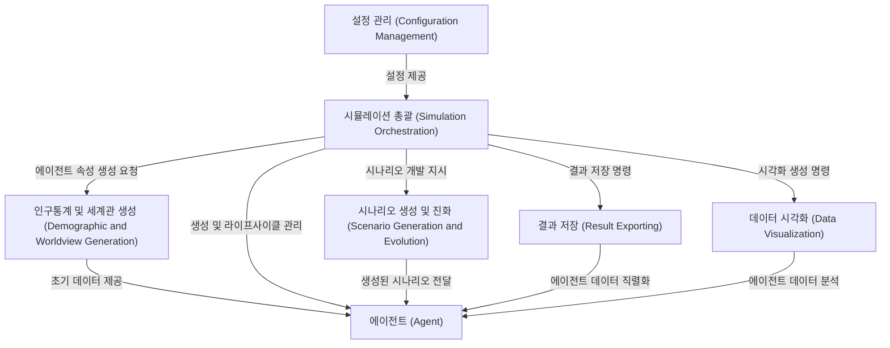

# Tutorial: simulacra-futura

이 프로젝트는 **가상의 개인들(에이전트)**을 만들어 특정 주제에 대한 *미래 시나리오*를 함께 구상하고 발전시키는 시뮬레이션입니다. 각 에이전트는 자신만의 인구통계학적 특징과 세상을 보는 관점(세계관)을 가지며, 이를 바탕으로 다양한 미래 모습을 탐색하고, 그 결과를 *시각적으로 표현*하여 이해를 돕습니다.

**Source Repository:** [None](None)

## Chapters

1. [에이전트 (Agent)
](01_에이전트__agent__.md ':preview')
2. [인구통계 및 세계관 생성 (Demographic and Worldview Generation)
](02_인구통계_및_세계관_생성__demographic_and_worldview_generation__.md ':preview')
3. [시나리오 생성 및 진화 (Scenario Generation and Evolution)
](03_시나리오_생성_및_진화__scenario_generation_and_evolution__.md ':preview')
4. [시뮬레이션 총괄 (Simulation Orchestration)
](04_시뮬레이션_총괄__simulation_orchestration__.md ':preview')
5. [설정 관리 (Configuration Management)
](05_설정_관리__configuration_management__.md ':preview')
6. [데이터 시각화 (Data Visualization)
](06_데이터_시각화__data_visualization__.md ':preview')
7. [결과 저장 (Result Exporting)
](07_결과_저장__result_exporting__.md ':preview')

---

Generated by [AI Codebase Knowledge Builder](https://github.com/The-Pocket/Tutorial-Codebase-Knowledge)